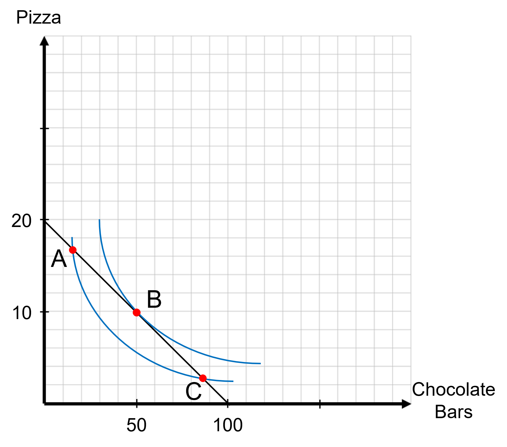
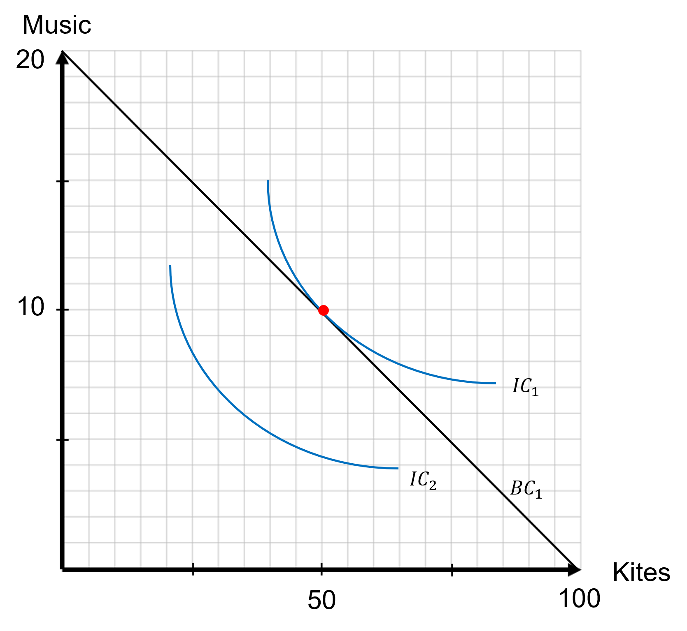
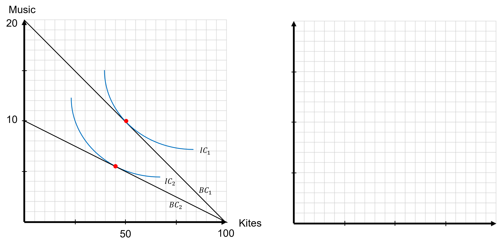
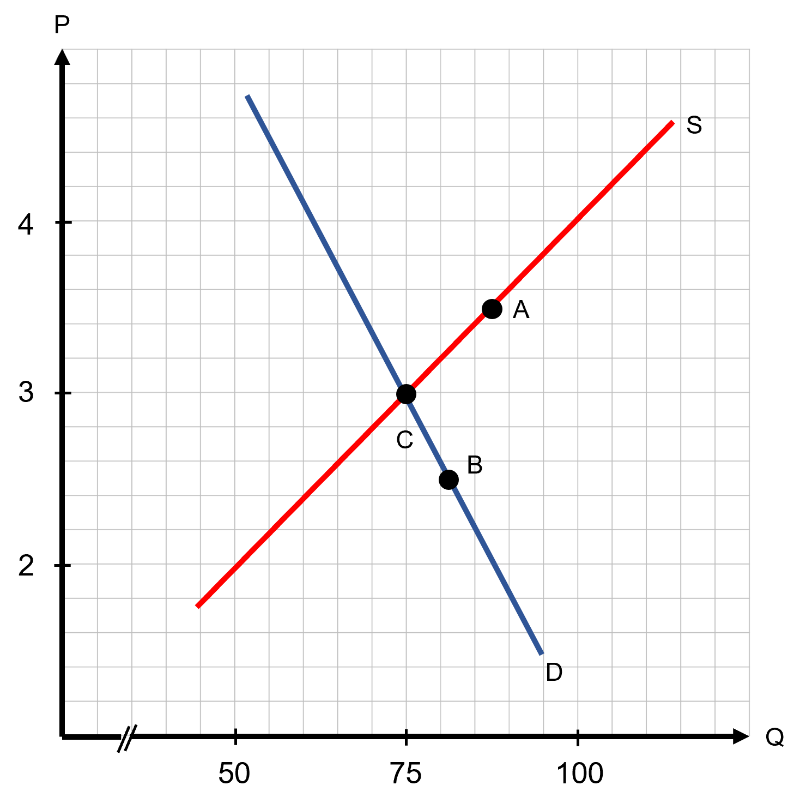

```{r setup, include=FALSE}
knitr::opts_chunk$set(
	cache = TRUE, 
	echo = FALSE, 
	warning = FALSE,
	message = FALSE,
	fig.align = 'center',
	out.width = '100%',
	dpi=300
	)
```

```{r libs, cache=FALSE, message=FALSE}
library(data.table)
library(ggplot2)
library(forcats)
library(kableExtra)
```


\fancyhf{}
\begin{center}
    \Large
    \textbf{
    \textit{SS201: Principles of Economics} \\ 
    STAP 3 (AY 23-5) \\ 
    }
    Lesson 2: Consumer Choice Theory, Demand, Supply, and Equilibrium
\end{center}
\fancyfoot[C]{\thepage}

# Consumer Choice Theory {#sec:bluf2}
Individuals are constrained optimizers who maximize their own happiness subject to their preferences and resources available. **More is always better, but** with any individual good, **just not as good as the previous one.**

## Utility {#sec:prod}
Before we produce a model of an individual's preferences, let's first build some intuition for how an individual values any good. One student will consume, and after each unit consumed, he or she will assign a value of how happy that unit made them from 0-100. That student will continue eating until the unit gives them zero additional happiness. Rather than use the word "happiness," we will now refer to this as "utility." Throughout this process, we will fill in the tables, and build the graphs below of the consumer's "marginal utility" (the utility they gain from consuming each additional unit), and the "total utility," (the total amount of utility from all consumption). We will graph marginal utility on the left and total utility on the right. Place utility on the vertical axis and the number of units consumed on the horizontal axis.

\begin{center}
  \footnotesize
  \begin{tabular}{c|c|c}
    Number & Marginal Utility & Total Utility \\ \hline
    1 & & \\ \hline
    2 & & \\ \hline
    3 & & \\ \hline
    4 & & \\ \hline
    5 & & \\ \hline
    6 & & \\ \hline
    7 & & \\ \hline
    8 & & \\ \hline
    9 & & \\ \hline
    10 & & \\ \hline
    11 & & \\ \hline
    12 & & \\ \hline
    13 & & \\ \hline
  \end{tabular}
\end{center}

\vspace{1cm}

```{r g19, out.width='80%', fig.align='center'}

```

\pagebreak

## Decision Making Guidelines {#sec:cst}
You (should) make decisions based off two criteria:

- Preferences: What you enjoy and makes you happiest, or what brings you the most "utility."

- Scarcity: What is available and what you can afford.

\begin{center}
  \textit{The best decisions evaluate tradeoffs at the margin. These decisions allocate where you should spend your next     dollar or minute of your time.}
\end{center}

### Preferences - The Utility Function {#sec:pref}
\begin{minipage}[t]{0.45\textwidth}
    \vspace{0pt}
    To help us develop our model of how consumers choose which goods to consume subject to their resources, allow me to introduce our friend Lawrence. He loves Domino's pizza and Baby Ruth chocolate bars. He does not view them as perfect substitutes or complements, but values them similarly. He's only a teenager, doesn't have a job, and also enjoys riding bikes with his friends around Astoria, Oregon.
\end{minipage}
\hfill
\begin{minipage}[t]{0.45\textwidth}
    \vspace{0pt}
    \centering
    \includegraphics[width=.45\linewidth]{img/chunk.jpg}
\end{minipage}

Two graphs of Lawrence's indifference curves are given below. His utility function is $U(c, p) = p^\frac{1}{2}c^\frac{1}{2}$, and is what we refer to as "Cobb-Douglas Utility" in economics. Good 1 in this instance are chocolate bars and are located on the horizontal axis on the graph on the right. Good 2 in this instance is pizza and is on the vertical axis on the graph on the right. 

\begin{center}
\includegraphics[width=\textwidth]{img/cd_util.png}
\end{center} 
\pagebreak

1. What are the four properties of indifference curves, and what are the reasons behind these?
\vspace{3cm}

2. Say Lawrence's preferences change to where he prefers pizza twice as much as candy bars. How does this change what Lawrence's indifference curves look like? Draw them below. Keep chocolate bars on the horizontal axis and pizza on the vertical axis. 

```{r g30, out.width='50%', fig.align='center'}
knitr::include_graphics("img/grid.png")
``` 

3. Let's now talk about the slopes of our indifference curves. What do we call this in economics, and what does it represent? 

\pagebreak

### Scarcity - The Budget Constraint {#sec:scar}
Lawrence is lucky and has generous parents. They give him an allowance each week of \$100. Pizza costs \$5 a slice and chocolate bars cost \$1.

1. Write out the equation of Lawrence's Budget Constraint, graph it below, and shade in the area of all the combinations he can afford (his feasible set). Keep chocolate bars on the horizontal axis and pizza on the vertical axis.

```{r g4, out.width='50%', fig.align='left'}
knitr::include_graphics("img/grid.png")
``` 

2. What happens to our budget constraint within each of the following situations below:

    a. Lawrence's parents double his allowance. \vspace{2cm}
    b. The price of chocolate bars rises to \$5 per bar. \vspace{2cm}
    c. Lawrence's allowance, the price of chocolate bars, and the price of pizza all increases by 10%. \vspace{2cm}

\pagebreak
### Constrained Optimization - Finding The Optimal Bundle {#sec:optimal}
Given below is a graph of Lawrence's budget constraint along with a couple of his indifference curves.

1. When faced with the decision of how to spend his allowance, at what point below will Lawrence choose? Why?

```{r ob, out.width='70%', fig.align='left'}

``` 

2. Given your answer above, what is the expression that enables individuals to choose their optimal bundles for any income level $I$? What does this expression mean and how do I translate it?

\pagebreak

## Income and Substitution Effects {#sec:inc}
\begin{minipage}[t]{0.45\textwidth}
    \vspace{0pt}
    \centering
    \includegraphics[width=.45\linewidth]{img/brennan.png}
\end{minipage}
\hfill
\begin{minipage}[t]{0.45\textwidth}
\vspace{0pt}
    Meet our new friend Brennan Huff. He has been told by some that he is the ``song-bird of his generation," with his voice sounding something like a mix between Fergie and Jesus. As such, Brennan loves purchasing digital music and kites. Similar to our old pal Lawrence, Brennan does not view kites and music as perfect substitutes or complements, but values them similarly. 
\end{minipage}

Below is a graph of Brennan's indifference curves, his budget constraint, and his optimal bundle. His mom is a total enabler and gives him an allowance of \$100 a week. Let us assume that on average, each music purchase Brennan makes costs \$5 and that he only prefers dollar-store kites, so these cost \$1.

1. Write out the equation for Brennan's budget constraint.

```{r brenan_ic2, out.width='70%', fig.align='left'}

```

2. The price of digital music has sky-rocketed, and as a result, Brennan's music purchases now cost double (\$10 per purchase). Brennan thinks that this sucks, and as a result, his house has turned into a prison! Despite the price increase, however, Brennan still loves music and refuses to completely substitute away. Write the new equation of the budget constraint and draw it on the above graph.
\vspace{3cm}

3. How does Brennan's new bundle compare to the old? How do the income and substitution effects explain this change?
\vspace{3cm}


4. So what type of good is music? If the price of it increased, and Brennan purchased fewer, then it must be a...
    a. Normal Good \vspace{1cm}
    b. Inferior Good \vspace{1cm}
    c. Giffen Good \vspace{1cm}

5. Now that I have two points of Brennan's preference over a good, what can I now produce? Graph that function below and write out the equation.

```{r dcurve, out.width='100%', fig.align='center'}

```

\pagebreak

# Supply and Demand {#sec:bluf}
Comparative advantage and differing opportunity costs explain why individuals would want to trade and how they can become better off. Consumer Choice Theory models how individuals make choices to optimize their happiness with scarce resources. Markets are now the central force which harnesses the two models above so that a heterogeneous group of individuals can trade goods to optimize their happiness. We will build a simple model that has surprisingly powerful predictive capability.

## Let's play a little game! {#sec:game}

```{r game, out.width='80%', fig.align='center'}

```

Before we get into the lesson, we are going to set up and play around in a perfectly competitive market for maple syrup. Some people will be buyers, and the rest will be sellers. I will now give each buyer and seller a numbered playing card. Some cards have been removed from the deck(s), and all remaining cards have a number. Please hold your card so that others do not see the number. The *buyers* cards are *black (clubs or spades)*, and the *sellers* cards are *red (hearts or diamonds)*. Each card represents one "unit" of an unspecified commodity that can be bought by buyers or sold by sellers. 

**Sellers**: You can each sell a single unit of the commodity during a trading period. You are not required to sell. The number on your card is the dollar cost that you incur if you make a sale. You will be required to sell at a price that is no lower than the cost number on the card. Your earnings on the sale are calculated as the difference between the price that you negotiate and the cost number on the card. If you do not make a sale, you do not earn anything or incur any cost in that period. Suppose that your card is a 2 of diamonds and you negotiate a sale price of $3.50. Then you would earn: $3.50 - $2 = $1.50. You would not be allowed to sell at a price below $2 with this card (2 of diamonds). If you mistakenly agree to a price that is below your cost, then the trade will be invalidated when you come to the front desk.

**Buyers**: You can each buy a single unit of the commodity during a trading period. You are not required to buy.  The number on your card is your valuation (in dollars) of one unit of the good.  You cannot purchase more than one unit of the good.  You will be required to buy at a price that is no higher than the value number on the card. Your earnings on the purchase are calculated as the difference between the value number on the card and the price that you negotiate. If you do not make a purchase, you do not earn anything in the period. Suppose that your card is a 9 of Clubs and you negotiate a purchase price of $4. Then you would earn: $9 - $4 = $5. You would not be allowed to buy at a price above $9 with this card (9 of Clubs). If you mistakenly agree to a price that is above your value, then the trade will be invalidated when you come to the front desk.

**Trading**: Buyers and sellers will meet in the center of the room and negotiate during a 2-minute, public (pit-market) trading period. Prices must be multiples of 50 cents. When a buyer and a seller agree on a price, they will come together to the front of the room to report the price, which will be announced to all and recorded on the blackboard. Then, the buyer and seller will turn in their cards, return to their original seats, and wait for the trading period to end. There will be several market periods.

**Recording Earnings**: Some sellers with high costs and some buyers with low values may not be able to negotiate a trade, but do not be discouraged since new cards will be passed out at the beginning of the next period. Remember that earnings are zero for any unit not bought or sold (sellers incur no cost and buyers receive no value). When the period ends, I will collect cards for the units not traded, and you can calculate your earnings while I shuffle and redistribute the cards. Your total earnings equal the sum of your earnings in each period (value – sale price for buyers; sale price – cost for sellers).  Please record your earnings in each round below:


\begin{table}[ht]
\begin{center}
\begin{tabular}{|c|c|c|c|c|}
\hline
Round & Buyer or Seller & Valuation / Cost & Sale Price & Earnings \\
\hline
1 & & & & \\
\hline
2 & & & & \\
\hline
3 & & & & \\
\hline
4 & & & & \\
\hline
5 & & & & \\
\hline
\end{tabular}
\end{center}
\end{table}

Now that we've played the game, let's model it. Plot the supply and demand curves below and the prices at which trades took place each period.

```{r g10, out.width='50%', fig.align='center'}
knitr::include_graphics("img/grid.png")
```

## Competitive Markets (Perfect Competition) {#sec:markets}

\begin{minipage}[t]{0.45\textwidth}
    \vspace{0pt}
    \centering
    \includegraphics[width=.60\linewidth]{img/vince.png}
\end{minipage}
\hfill
\begin{minipage}[t]{0.45\textwidth}
\vspace{0pt}
  Mediator Jeremy Gray claims to love maple syrup. In fact, he knows everything there is to know about maple syrup. He loves it on pancakes! He loves it on pizza! He even loves to take maple syrup and put a little bit in his hair when he is having a rough week. Some times he even claims that he could fool people into believing that he's the head of an emerging maple syrup conglomerate. Jeremy claims that because the market for maple syrup is perfectly competitive market that it's no problem to understand.
\end{minipage}

1. Let's assume that Jeremy is correct in his assumption about maple syrup. What are the characteristics of these markets? These are the assumptions that will define the relationship between buyers and sellers.
\vspace{3cm}

\pagebreak
    
## Demand {#sec:demand}

```{r sis, out.width='80%', fig.align='center'}

```

Now let's talk about the **DEMAND** for maple syrup. The Cleary sisters, Gloria and Claire, have the demand schedules for quarts of maple syrup listed below.

\begin{table}[ht]
\begin{center}
\begin{tabular}{|c|c|c|}
\hline
Price ($P$) & Gloria's $Q_d$ & Claire's $Q_d$: $Q_d = 13 - 2P$ \\
\hline
2 & 4 &  \\
\hline
4 & 3 &  \\
\hline
6 & 2 &  \\
\hline
8 & 1 &  \\
\hline
10 & 0 &  \\
\hline
\end{tabular}
\end{center}
\end{table}

1. Fill in Claire's Demand Schedule \vspace{0.5cm}

2. What is Gloria's willingness to pay for her first quart of maple syrup? What about for two quarts of maple syrup? Why are these different? \vspace{2cm}

3. Why does Gloria’s individual demand curve slope downward? What is the Law of Demand? \vspace{2cm}

\pagebreak

4. Gloria is kind of a clinger, and just will not let you go after you start talking with her. She just keeps rattling on about how the market for maple syrup has been changing. You being in SS201, just loving economics, and having learned how to model demand and where it comes from, just can't help but start to imagine what's actually happening to the curve as Gloria discusses the shocks. List below for each shock what happens to the demand curve.

    a. The price of honey decreases.  \vspace{1cm}
    b. The price of pancakes skyrockets!  \vspace{1cm}
    c. New York just instituted a mandatory pancake breakfast the fourth Monday of every month.  \vspace{1cm}
    d. The government just announced another stimulus plan for all citizens. \vspace{1cm}

\pagebreak

## Supply {#sec:supply}

1. Now let's talk about the other half of our market, and the **SUPPLY** for maple syrup. Suppose that the supply curve for maple syrup in New York is $Q_s = -1000 + 500 P_s$. Plot the supply curve below with price on the vertical axis and quantity on the horizontal axis.

```{r g3, out.width='50%', fig.align='left'}
knitr::include_graphics("img/grid.png")
```
      
2. Why does the supply curve slope upward? What is the Law of Supply? \vspace{3cm}

3. List four different supply shifters and give examples for how these would apply for the market for maple syrup.

\pagebreak

# Equilibrium {#sec:bluf3}
Markets are everywhere and use prices to as a mechanism to allocate scarce resources. We leverage their power to maximize efficiency, yet sometimes they do not result in the most equitable outcomes. Branching is now a market. Your future assignments within the Army (after your first post) will be decided through a market. Understanding how these work (or at least are supposed to) and being able to communicate your preferences through them can help you in the future!

## Equilibrium Price and Quantity {#sec:equil}

The graph below depicts the demand and supply for helicopter rides across the Grand Canyon. Price on the vertical axis is given in $100 intervals.

```{r brenan_ic, out.width='80%', fig.align='center'}

```

1. Suppose the price starts out at $400. What is the quantity of helicopter rides sold? What is the quantity of rides available for sale?
\vspace{3cm}

\pagebreak

\hspace{0.5cm}  \begin{minipage}[t]{0.55\textwidth}
    \vspace{0pt}
2. Suppose the market price is \$400. Jake Preston, a former Apache helicopter pilot, currently charges \$350 per ride and is represented by point A on the graph. Is he willing to sell a ride at the market price? Is able to sell a ride at the market price? What might he do as a seller facing this market? What will happen to the market price?
    
\end{minipage}
\hfill
\begin{minipage}[t]{0.35\textwidth}
    \vspace{0pt}
    \centering
    \includegraphics[width=\linewidth]{img/preston.png}
\end{minipage}

\vspace{3cm}

3. Suppose the price is instead $200. What is the quantity of rides sold now? \vspace{3cm}

\begin{minipage}[t]{0.35\textwidth}
    \vspace{0pt}
    \centering
    \includegraphics[width=\linewidth]{img/young.png}
\end{minipage}
\hfill
\begin{minipage}[t]{0.55\textwidth}
    \vspace{0pt}
4. Suppose the market price is \$200. Sean Young, a former OH-60 Kiowa pilot, says she will pay \$250 for a ride just to feel the thrill again and is represented by point B on the graph. Is she willing to buy a ride at the market price? Is she able to buy a ride at the market price? What might she do as a buyer facing this market? What will happen to the market price?
\end{minipage}

\pagebreak

5. Suppose the price is instead $300. What is the quantity of rides sold? Are any willing sellers unable to sell? Are any willing buyers unwilling to buy?
\vspace{3cm}

6. How is the price of $300 different from all other prices? What do we call this price?
\vspace{3cm}
