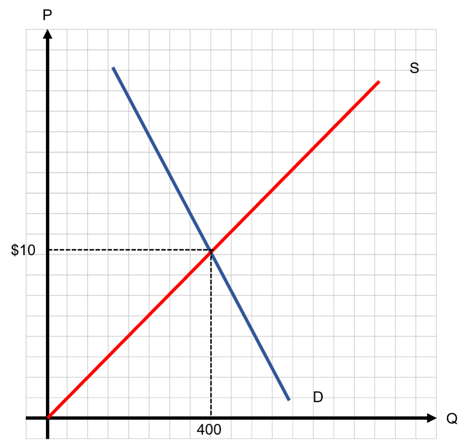
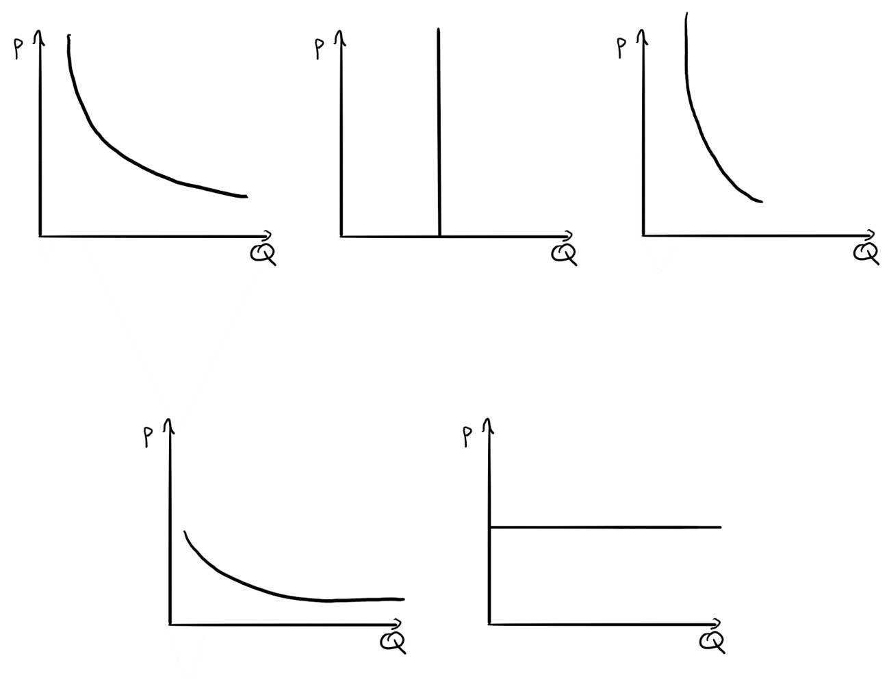
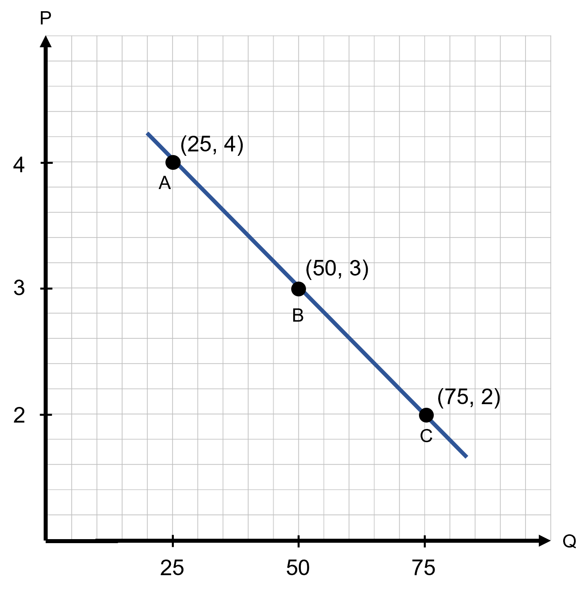
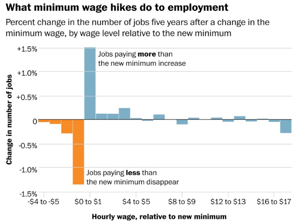
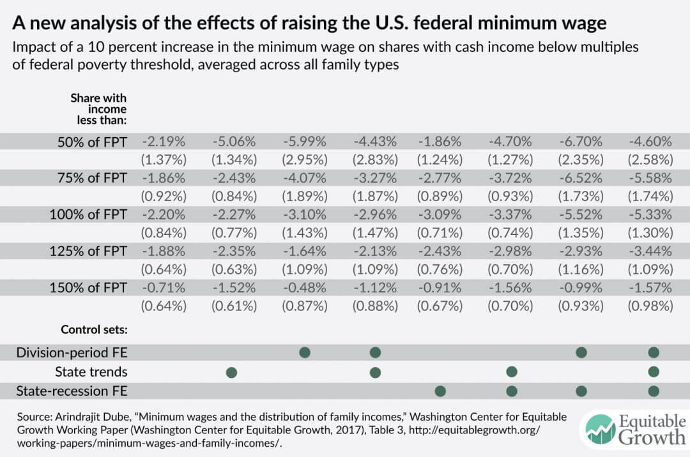

```{r setup, include=FALSE}
knitr::opts_chunk$set(
	cache = TRUE, 
	echo = FALSE, 
	warning = FALSE,
	message = FALSE,
	fig.align = 'center',
	out.width = '100%',
	dpi=300
	)
```

```{r libs, cache=FALSE, message=FALSE}
library(data.table)
library(ggplot2)
library(forcats)
library(kableExtra)
```


\fancyhf{}
\begin{center}
    \Large
    \textbf{
    \textit{SS201: Principles of Economics} \\ 
    STAP 3 (AY 23-5) \\ 
    }
    Lesson 3: Welfare, Elasticity, and Government Intervention
\end{center}
\fancyfoot[C]{\thepage}

# Review {#sec:comps}

The figure below depicts the market for sunglasses in West Point, NY. Suppose that the cost of plastic for the glasses drops dramatically.

```{r sg1, out.width='60%', fig.align='center'}

```

1. Describe and draw the market shock on the graph above. Was the shock a determinant of supply or demand? \vspace{2cm}
 
2. Describe what happens now at the initial equilibrium price. Is it an excess, surplus, shortage, etc.? Explain the price adjustment / price pressure. \vspace{2cm}

3. How do the new equilibrium price and quantity compare to the original? Label the initial equilibrium Quantity $Q_1$ and Price $P_1$. Label the final equilibrium Quantity $Q_2$ and Price $P_2$. 

\pagebreak

# Elasticity {#sec:bluf2}
We have supply, demand, and equilibrium, but how do we measure the intensity in changes in these? Elasticities help us understand exactly how responsive demand and supply are to price changes.

## Definitions {#sec:elast}

1. The mathematical definition of an elasticity is $\epsilon = \frac{\%\Delta Y}{\%\Delta X}$. What does this mean in English?
\vspace{3cm}

2. What are three formulas that calculate elasticities? Which is most accurate?
\vspace{5cm}

## Price Elasticity of Demand {#sec:demand}

1. Write down the equation for the price elasticity of demand. What sign does the elasticity of demand have?
\vspace{3cm}

\hspace{0.5cm}  \begin{minipage}[t]{0.55\textwidth}
    \vspace{0pt}
2. Squints Palladorous needs some help with his economics homework. His teacher gave him the graphs of 5 different demand curves for 5 different goods below with the following instructions:
    
    \hspace{0.75cm} a. Below each graph, label the graph with a description of the type of elasticity demand shown: perfectly elastic, elastic, unit elastic, inelastic, perfectly inelastic (there is exactly one graph of each type).

    \hspace{0.75cm} b. Below each graph, write down the value or range of values for elasticity that correspond to this type of demand elasticity.

    \hspace{0.75cm} c. Each graph pertains to one of the following goods: Babe Ruth Baseball Cards, home appliances, insulin, eggs, and beef. Match each graph to a good that fits the picture best, assuming that each good matches one picture.

\end{minipage}
\hfill
\begin{minipage}[t]{0.35\textwidth}
    \vspace{0pt}
    \centering
    \includegraphics[width=\linewidth]{img/squints.jpg}
\end{minipage}

\vspace{1cm}

```{r elast, out.width='100%', fig.align='center'}

```

\pagebreak

3. Squints is now confused. His teacher told him that an elasticity was not a slope, but each answer he gave in the previous problem seemed to depend on the slope of the demand curve. You being well versed in elasticities tell him to calculate the following elasticities using the graph below.

```{r elast_slope, out.width='70%', fig.align='center'}

```

\hspace{2cm} a. Calculate the elasticities from points A to B and from points B to C using the Midpoint Method. \vspace{3cm}
    
\hspace{2cm} b. Calculate the elasticities at points A, B, and C using the Point Method. \vspace{3cm}

\pagebreak

\hspace{0.5cm}  \begin{minipage}[t]{0.55\textwidth}
    \vspace{0pt}
The head lifeguard of a swimming pool decides to try to increase revenue by increasing the price of a ticket from \$7.50 to \$10.00. At a price of \$7.50, she sold 1500 tickets.

\end{minipage}
\hfill
\begin{minipage}[t]{0.35\textwidth}
    \vspace{0pt}
    \centering
    \includegraphics[width=\linewidth]{img/wendy.jpg}
\end{minipage}

\vspace{1cm}

4. If the price elasticity of demand for tickets is 0.24 over this price range, how many tickets will the lifeguard sell at a price of $10.00? Use the midpoint method. \vspace{3cm}

5. What was the lifeguard’s revenue at the old price? At the new price? Does the higher or lower price earn the lifeguard more revenue. \vspace{3cm}

6. The maximum capacity of the pool is 1,800 people. The lifeguard derives the following for demand based on her experiment: $Q_d =1800 - 40P$. Calculate the point elasticity at a price of \$10. \vspace{3cm}

7. Using your answer from question 6, what would you advise the lifeguard to do if she wants to raise more money? \vspace{3cm}


\pagebreak
## Other Elasticities {#sec:other}

1. What is the price elasticity of supply? What is its sign? \vspace{3cm}

2. Suppose $Q_s = -5 + 2P$. What is the price elasticity of supply at $Q_s=1$? \vspace{3cm}

3. What is income elasticity? \vspace{3cm}

    a. Suppose that, with an average state income of 75,000/year, consumers in the US buy 12 million baseballs. Now, suppose the average income in US jumps to 85,000/year and consumers buy 14 million baseballs. What is the income elasticity of demand for baseballs? Use the midpoint method. 
    \vspace{3cm}
    b. What does the sign of the income elasticity for baseballs tell us about them? Could some goods have the opposite sign of elasticity?
    \vspace{3cm}
4. What is Cross-Price Elasticity? What is its sign?

\pagebreak

# Economic Welfare and Government Intervention {#sec:bluf}
Consumer and producer surplus are terms that help us understand market efficiency and a group’s overall economic well-being. Price floors and ceilings are policy initiatives that, when binding, make free markets less efficient and reduce economic well-being. Depending on who or what group the government is trying to help, policy initiatives such as the minimum wage or rent controls may hurt overall economic well-being for the benefit of select individuals.

## Welfare Economics {#sec:welfare}

\hspace{0.5cm}  \begin{minipage}[t]{0.55\textwidth}
    \vspace{0pt}
Andy Dufresne really likes listening to opera music. Suppose that the market for opera music records is modeled by the equations below:
    
$$Q_D = 100-5P$$
$$Q_S = -10+P$$
\end{minipage}
\hfill
\begin{minipage}[t]{0.35\textwidth}
    \vspace{0pt}
    \centering
    \includegraphics[width=\linewidth]{img/andy.jpg}
\end{minipage}

\vspace{1cm}

1. Graph the market below, solve for equilibrium price, and quantity and shade in producer and consumer surplus.

```{r g1, out.width='50%', fig.align='left'}
knitr::include_graphics("img/grid.png")
```

2. Which group, consumers or producers, fairs better within this market? \vspace{3cm}

\pagebreak

## Rent Controls {#sec:pc}

\hspace{0.5cm}  \begin{minipage}[t]{0.55\textwidth}
    \vspace{0pt}
Brooks Hatlen just got released from prision. To help transitioning prisoners, the state introduced a rent control policy which states that landlords can't charge over \$600 per month for apartments. Suppose the market supply and demand are modeled by the equations below:

$$Q_D = 1300-P$$

$$Q_S = -300+P$$
\end{minipage}
\hfill
\begin{minipage}[t]{0.35\textwidth}
    \vspace{0pt}
    \centering
    \includegraphics[width=\linewidth]{img/brooks.jpg}
\end{minipage}

\vspace{1cm}

1. Graph the market below, solve for equilibrium price, quantity, and shade in producer and consumer surplus.

```{r g2, out.width='50%', fig.align='left'}
knitr::include_graphics("img/grid.png")
```

2. Now draw in the rent control. Is it binding? Does it create a shortage or surplus? Solve for the equilibrium price and quantity of aparments that will be provided at this price. Is this a price floor or ceiling?  \vspace{3cm}

\pagebreak

## Minimum Wage {#sec:pf}

\hspace{0.5cm}  \begin{minipage}[t]{0.55\textwidth}
    \vspace{0pt}
Tommy Williams just got out of jail and recently received his GED. He takes up a job at a local paper mill where the market equilibrium wage is given below:
    
$$Q_{LD}= \frac{-400}{3}W+2600$$
$$Q_{LS} = \frac{400}{3}W-600$$
\end{minipage}
\hfill
\begin{minipage}[t]{0.35\textwidth}
    \vspace{0pt}
    \centering
    \includegraphics[width=\linewidth]{img/tommy.jpg}
\end{minipage}

\vspace{1cm}

1. Graph the market below, solve for equilibrium price, quantity, and shade in producer and consumer surplus.

```{r g3, out.width='50%', fig.align='left'}
knitr::include_graphics("img/grid.png")
```

2. b.	Maine (the state our movie takes place in), just implemented a minimum wage of $15. Is it binding? Does it create a labor shortage or surplus? Solve for the actual employment (labor supply) at this price. Is this a price floor or ceiling?  \vspace{3cm}

\pagebreak

## Does the model hold? {#sec:mw}

### Jobs
```{r mw_pov, out.width='80%', fig.align='center'}

```


### Worker Welfare
```{r mw_j, out.width='80%', fig.align='center'}

```