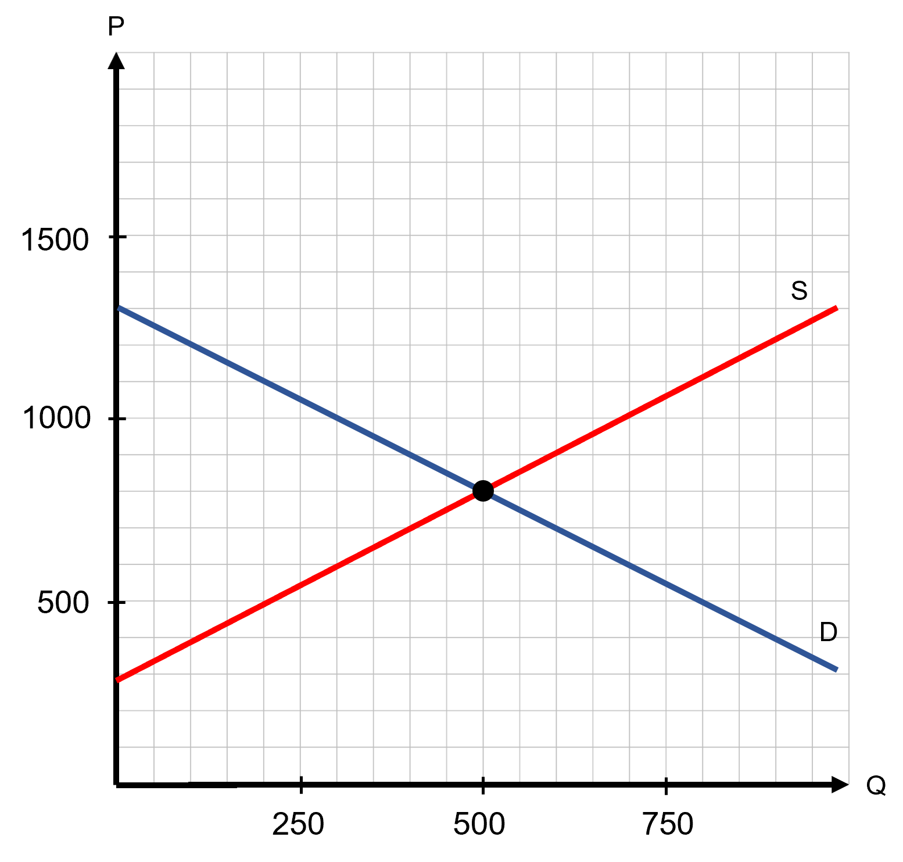
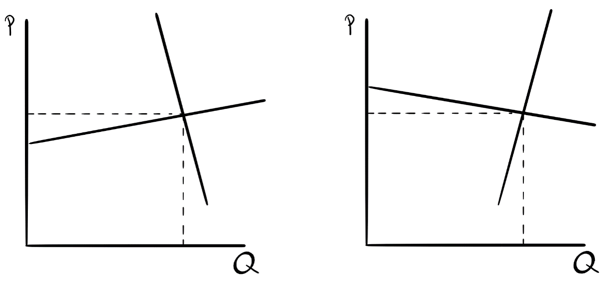
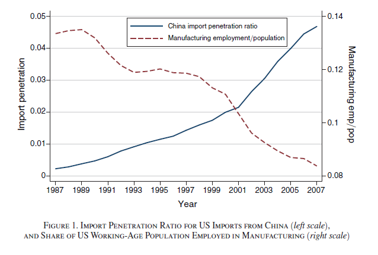
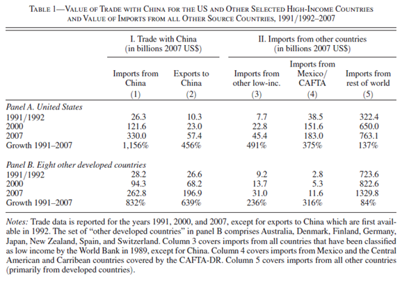
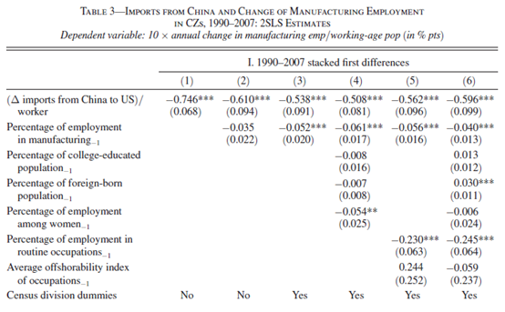

```{r setup, include=FALSE}
knitr::opts_chunk$set(
	cache = TRUE, 
	echo = FALSE, 
	warning = FALSE,
	message = FALSE,
	fig.align = 'center',
	out.width = '100%',
	dpi=300
	)
```

```{r libs, cache=FALSE, message=FALSE}
library(data.table)
library(ggplot2)
library(forcats)
library(kableExtra)
```


\fancyhf{}
\begin{center}
    \Large
    \textbf{
    \textit{SS201: Principles of Economics} \\ 
    STAP 3 (AY 23-5) \\ 
    }
    Lesson 4: Taxes and Trade
\end{center}
\fancyfoot[C]{\thepage}

# Review {#sec:review}

Indicate the answer choice that best completes the statement or answers the question.

1. The slope of the Production Possibilities Frontier represents
    a. the price ratio a consumer faces.
    b. the opportunity cost of production. 
    c. the marginal rate of substitution.
    d. the absolute advantage a producer has.

\vspace{0.5cm}

2. Consumers are happiest when
    a. they consume any bundle along their budget constraint.
    b. the slope of their budget constraint is less than their indifference curve.
    c. the slope of their budget constraint is greater than their indifference curve.
    d. the slope of their budget constraint is equal to the slope of their indifference curve.

\vspace{0.5cm}

3. Which of the below is true? 
    a. The substitution effect explains movements to different indifference curves.
    b. The income effect always dominates the substitution effect.
    c. The substitution effect explains movements along an indifference curve.
    d. The income effect explains why a consumer's ratio of consumption may change after a relative price change.

\vspace{0.5cm}

4. Suppose that a person can either produce 800 golf clubs or 400 golf bags. Assume the PPF is graphed with golf bags on the horizontal axis and 800 golf clubs on the vertical axis. For this individual, the opportunity cost of producing each golf bag is
    a. The slope of the PPF, or $\frac{-1}{2}$ golf clubs.
    b. The reciprocal of the slope of the PPF, or $-2$ golf clubs. 
    c. The absolute value of the slope of the PPF, or $\frac{1}{2}$ golf clubs.
    d. The absolute value of the slope of the PPF, or $2$ golf clubs.

\vspace{0.5cm}

5. Declare whether the statement below is either True or False, and briefly justify your answer in the space below (one or two sentences maximum). 

\begin{center}
\begin{minipage}{0.8\textwidth}
The price of apples just skyrocketed, and they are close substitutes for bananas. Scientists just discovered a new fertilizer that improves the production of bananas. In the market for bananas, both the new equilibrium price and quantity are higher than before.
\end{minipage}
\end{center}


\pagebreak

# Taxes {#sec:bluf2}
Taxes affect both consumers and producers. Despite the government taxing a consumer or producer, who ultimately pays the most of that tax resides with which side is more inelastic.

## Buyers vs. Seller Taxes {#sec:bstax}

\hspace{0.5cm}  \begin{minipage}[t]{0.55\textwidth}
    \vspace{0pt}
Joseph Cooper is a former NASA pilot that now owns and operates a corn farm. He models the market for corn with the equations:
    
$$Q_D = 1300-P$$
$$Q_S = -300+P$$
\end{minipage}
\hfill
\begin{minipage}[t]{0.35\textwidth}
    \vspace{0pt}
    \centering
    \includegraphics[width=\linewidth]{img/interstellar.png}
\end{minipage}

\vspace{1cm}

1. Graph this market below. Label your axes and all intercepts. Solve for the equilibrium price and quantity and show it on the graph.

```{r g1, out.width='50%', fig.align='left'}
knitr::include_graphics("img/grid.png")
```

2. Calculate the consumer, producer, and total surplus. \vspace{3cm}

\pagebreak

3. Now suppose that the government applied a \$200 per unit tax on the *sellers* of corn. Draw a small graph below to show which curve shifts in response to this tax. Solve algebraically for the after-tax price received by the sellers, the price paid by buyers, and quantity sold.

```{r g2, out.width='50%', fig.align='left'}
knitr::include_graphics("img/grid.png")
```

4. Now suppose that the government applied a \$200 per unit tax on the *buyers* of corn. Draw a small graph below to show which curve shifts in response to this tax. Solve algebraically for the after-tax price received by the sellers, the price paid by buyers, and quantity sold.

```{r g3, out.width='50%', fig.align='left'}
knitr::include_graphics("img/grid.png")
```

\pagebreak

5. Using the tax-wedge method, show the impact of a $200 tax on the market for corn on your figure from part 1 (given below). Label the values of the after-tax quantity, the price buyers pay, and the price sellers receive. Calculate and identify on the graph consumer surplus, producer surplus, and government tax revenue. Calculate the total social surplus.

```{r g4, out.width='100%', fig.align='center'}

```

\pagebreak

6. Why is the total social surplus different in questions 1 and 5? What do we call this difference? Label the area of the graph associated with this difference. \vspace{3cm}

7. Define tax incidence. What is the tax incidence on buyers and sellers in this market? Who bears the larger burden of the tax? \vspace{3cm}

\pagebreak

## Taxes and Elasticity {#sec:taxelast}

```{r taxelast, out.width='100%', fig.align='center'}

```

1. Who bears the greater burden of the tax in the market on the left? On the right? \vspace{3cm}

2. Complete the statement: ``The tax burden will fall more heavily on buyers when..'' \vspace{3cm}

Suppose the market for drones is given by the equations:
$$Q_D = 20-2P$$

\pagebreak

# Trade {#sec:bluf}
Everyone does not benefit from trade. Our model predicts definite winners and losers. For policy and decision-makers, knowing who these agents are and the relative magnitudes are critical for effective decision-making.

## Trade and Government Intervention {#sec:trade}

\hspace{0.5cm}  \begin{minipage}[t]{0.55\textwidth}
    \vspace{0pt}
Will Hunting loves apples and caramels. Suppose that the market for caramels sold in 1 lb packages is given by the equations below:
    
$$Q_D = 10,000-400P$$
$$Q_S = \frac{400p-2000}{3}$$
\end{minipage}
\hfill
\begin{minipage}[t]{0.35\textwidth}
    \vspace{0pt}
    \centering
    \includegraphics[width=\linewidth]{img/will.jpg}
\end{minipage}

\vspace{1cm}

1. Solve for the market equilibrium, price, and calculate the point elasticities for supply and demand at this equilibrium. \vspace{5cm}

\pagebreak

2. Let’s assume now that the world price for these caramels is \$20. Plot the graph of this market below, with the domestic equilibrium price and quantity, world price, and discuss who wins and loses from trade.

```{r g10, out.width='50%', fig.align='left'}
knitr::include_graphics("img/grid.png")
```

3. Let’s assume now that the world price for these caramels is \$16. Plot the graph of this market below, with the domestic equilibrium price and quantity, world price, and discuss who wins and loses from trade.

```{r g20, out.width='50%', fig.align='left'}
knitr::include_graphics("img/grid.png")
```

\pagebreak

4. The U.S. caramel industry has a surprisingly powerful lobby and can push through legislation that promotes protectionism. Ultimately, they lobby for a $2 tariff on imported caramel. Draw this tariff on the graph above for question 3, and label the government revenue, deadweight loss, producer surplus, and consumer surplus. Who are the winners and losers from this tariff? \vspace{6cm}

5. Solve for the amount of caramels imported before and after the tariff. \vspace{8cm}
 
6. Say instead, the government wants to consider implementing an import quota on caramels instead. How is this different and similar to a tariff? 

\pagebreak 

7. Now let’s assume that the government is considering whether to raise money through a tariff or a quota. With a quota, the government is going to sell licenses to sellers willing to pay for the right to import caramel. Assume that the government is only going to allow 1,000 lbs of caramel to be imported and they are going to sell licenses that enable producers to import 10 lbs of caramel. How much would the government have to charge to be just as well off as the $4 tariff? Could the government just charge the tariff price that the quota predicts? Graph how this quota would look below.

```{r g30, out.width='50%', fig.align='left'}
knitr::include_graphics("img/grid.png")
```

\pagebreak

## How does trade affect labor markets? {#sec:labor}

**Autor, Dorn, and Hansen (2013)** - *The China Syndrome: Local Labor Market Effects of Import Competition in the United States*

```{r adh1, out.width='80%', fig.align='center'}

```

```{r adh2, out.width='80%', fig.align='center'}

```

```{r adh3, out.width='100%', fig.align='center'}

```