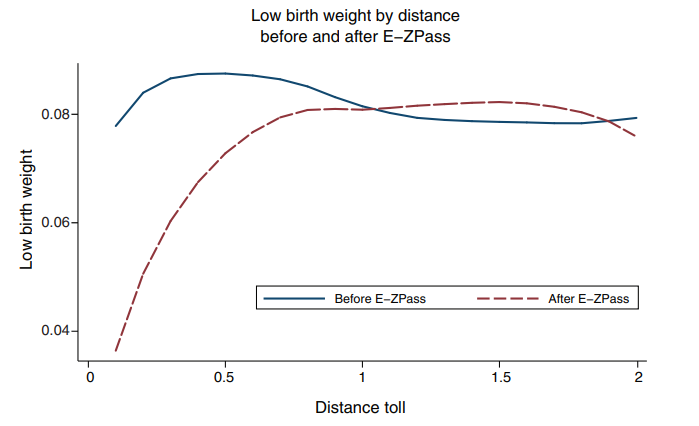
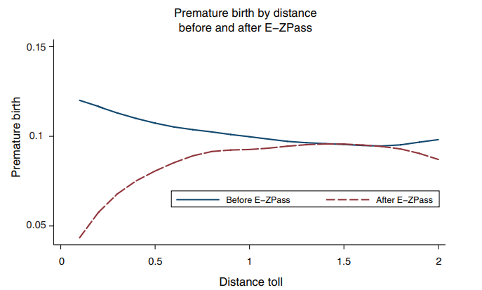

```{r setup, include=FALSE}
knitr::opts_chunk$set(
	cache = TRUE, 
	echo = FALSE, 
	warning = FALSE,
	message = FALSE,
	fig.align = 'center',
	out.width = '100%',
	dpi=300
	)
```

```{r libs, cache=FALSE, message=FALSE}
library(data.table)
library(ggplot2)
library(forcats)
library(kableExtra)
```


\fancyhf{}
\begin{center}
    \Large
    \textbf{
    \textit{SS201: Principles of Economics} \\ 
    STAP 3 (AY 23-5) \\ 
    }
    Lesson 5: Externalities, Public Goods, and Common Resources
\end{center}
\fancyfoot[C]{\thepage}

# Review {#sec:review}

For each question below, declare whether it is either True or False, and briefly justify your answer in the space provided (one or two sentences maximum). 

\begin{center}
True \hspace{3cm} False
\end{center}

1. If the demand for a good is elastic, then a firm can raise prices and increase revenue.

  \vspace{2cm}

\begin{center}
True \hspace{3cm} False
\end{center}

2. If a price ceiling is binding, then the original market equilibrium price is beneath this value.

  \vspace{2cm}

\begin{center}
True \hspace{3cm} False
\end{center}

3. Total surplus within a market is the sum of the value to buyers minus the cost to sellers.

  \vspace{2cm}

Indicate the answer choice that best completes the statement or answers the question.

4. This concept forms the basis for trade.
    a. Substitution Effect
    b. Price Elasticity of Demand
    c. Absolute Advantage
    d. Comparative Advantage

\vspace{0.5cm}

5. Minimum wage is an example of a 
    a. Tax on Consumers
    b. Price Floor
    c. Price Ceiling
    d. Rent Subsidy
    
\pagebreak

# Externalities {#sec:bluf2}
Free markets are efficient, but they sometimes promote unintended consequences called externalities. Under certain circumstances, some inefficiencies introduced into a market can correct for negative and encourage positive externalities. Ultimately, being able to assign societal value to various goods is often the most important consideration for developing these policies.

## Some Intuition {#sec:intuitx}

1. Would you care if the cadets next door to you...

    a. Purchased a new couch?
    
    b. Purchased a microwave?
    
    c. Purchased a car?
    
    d. Purchased an Alexa, Google dot, or another smart device that can play music?
    
    e. Had a really loud alarm clock that they ``snoozed''?
    
    f. Smoked cigarettes?
   
   \vspace{0.5cm}

2. Define an externality. What is it and how does this add to our model of consumer choice theory? \vspace{3cm}


3. Graph a market with positive externalities below. What new curve do we add to this and from who's perspective is it?

```{r g1, out.width='45%', fig.align='left'}
knitr::include_graphics("img/grid.png")
```

\pagebreak

4. Graph a market with negative externalities below. What new curve do we add to this and from who's perspective is it?

```{r g2, out.width='45%', fig.align='left'}
knitr::include_graphics("img/grid.png")
```

## Correcting Externalities {#sec:correct}

I always hated studying in the barracks because it was so loud. Upperclass cadets were always running around screaming or doing dumb things. Heaven forbid some cadet decided to go streaking across Central or North Area; the barracks would erupt!

Let's say that in order to correct the noisiness in the barracks, you get to be the Comm for a day and you are considering the following policies:

\hspace{0.5cm}  \begin{minipage}[t]{0.45\textwidth}
    \vspace{0pt}
- Restricting all cadets to their rooms during ESP.\vspace{0.5cm}

- Making cadets pay for the right to leave their rooms and talk outside of them during ESP.\vspace{0.5cm}

- Giving each cadet two ``hall passes" per week where they can leave their room during ESP.\vspace{0.5cm}

- Allow cadets of all classes to rent spaces/rooms in the barracks or library and set their own rules during ESP.\vspace{0.5cm}
\end{minipage}
\hfill
\begin{minipage}[t]{0.35\textwidth}
    \vspace{0pt}
\end{minipage}


1. Classify each of the following as either a command and control policy, pigouvian tax, cap and trade system, or as a private solution. \vspace{0.5cm}

2. Which policy does the Coase Theorem apply? What does this theorem say? \vspace{3cm}

\pagebreak

## Externalities in Practice {#sec:board}

Say the market for jet-skis in Gotham Harbor are represented by the equations below:
$$Q_D=80-P$$
$$Q_s=20+P$$

1. Graph this market below. What is the private market equilibrium price and quantity?

```{r g3, out.width='50%', fig.align='left'}
knitr::include_graphics("img/grid.png")
```

2. Suppose that each day of jet-ski use incurs $20 per unit cost on society through pollution, noise, and scaring fish away from nearby fishermen. Label the social value and social cost curves, drawing any new curves needed. \vspace{0.5cm}

3. What is the efficient quantity of jet skis rented? Is there deadweight loss? If so, shade it in on the figure you have drawn and calculate its dollar value. \vspace{3cm}


4. Suppose the Gotham City government imposed a $30 per unit tax on jet ski rentals. What is the quantity sold now, and how does it compare to the private market's original equilibrium? Is there a deadweight loss? And if so, what is its dollar value?  \vspace{3cm}

\pagebreak

Now let's talk about pollution. Each of the four firms below wishes to dump two barrels’ worth of waste chemicals in Gotham Harbor. The price each firm would incur to avoid polluting is represented by the below table:

\begin{center}
\begin{tabular}{c|c}
Firm &	Cost per 1 Barrel \\
\hline
Firm A	& \$ 9 million \\
Firm B	& \$ 4 million \\
Firm C	& \$ 1 million \\
Firm D	& \$ 6 million \\
\end{tabular}
\end{center}

5. Suppose the government wishes to impose a tax in order reduce the total amount of pollution by half. At what level should the government set the tax? What is the total cost of firms to avoid polluting? \vspace{3cm}

6. Suppose the government gives each firm a permit to dump one barrel of waste into the river, but allows the firms to trade these permits at any price among themselves. At what price will the permits trade? Which firms will end up with the permits? What will be the total cost of pollution avoidance? \vspace{3cm}

7. Suppose instead the government gives each firm one permit, but does not allow them to trade. What is the total cost of pollution avoidance in this case? \vspace{3cm}

8. What policy would you choose as a government planner and why? \vspace{3cm}

\pagebreak

## Are there really pollution externalities?

\begin{center}
Currie and Reed (2011) - \textit{``Traffic Congestion and Infant Health: Evidence from E-ZPass"}

```{r ext1, out.width='100%', fig.align='center'}

```

```{r ext2, out.width='100%', fig.align='center'}

```
\end{center}

\pagebreak

# Public Goods and Common Resources {#sec:bluf}
Markets do not do well at allocating goods without prices. Without prices, goods are abused, overused, and under-provided. Governments, in these instances, can enforce property rights, allocate prices, and help improve market efficiency and allocation of these goods.

## A Public Goods Game {#sec:intuitx2}

Each of you will be given four cards: two of these cards are red (hearts or diamonds), and two of these cards are black (clubs or spades). All of your cards will be the same number. The exercise will consist of a number of rounds. When a round begins, I will come to each of you in order, and you will play two of your four cards by placing these two cards face down on top of the stack in my hand. 

In each round, for each red card that you keep you will earn four points for the round, and for each black card that you keep you will earn nothing. Red cards that are placed on the stack affect everyone's points in the following manner. I will count up the total number of red cards in the stack and everyone will earn this amount of points. Black cards placed on the stack have no effect on the count. When the cards are counted, I will not reveal who made which decisions. 

Everyone will start each round with two red and two black cards.

We will play as many rounds as I see fit, and have a quick discussion as a class afterwards. At the end of the game, everyone will earn a piece of candy for every 10 points they earned.

Record your earnings below:

\begin{center}
\resizebox{0.9\textwidth}{!}{
\begin{tabular}{c|c|c|c|c}
Round &	Red Cards Kept (A) & Red Cards in Class Stack (B) & Earnings this Round (4*A + B) & Cumulative Earnings \\
\hline
1	& & & & \\
2	& & & & \\
3	& & & & \\
4	& & & & \\
5 & & & & \\
6 & & & & \\
7 & & & & \\
8 & & & & \\
\end{tabular}}
\end{center}
Questions for discussion:

1. How much candy would everyone gotten if no-one contributed? If everyone contributed every round? What actually happened? \vspace{1cm}

2. What is the \textit{socially efficient} outcome of the game? \vspace{2cm}

3. What is the \textit{equilibrium} outcome of the game? \vspace{2cm}

4. What do we call people who earn points from their classmates’ contributions but don’t contribute? \vspace{1cm}

\pagebreak

## Definitions {#sec:terms}

1. Define an excludable good. \vspace{2cm}

2. Define a rival good. \vspace{2cm}

3. Fill in the table below with the type of good that it is and two examples.

```{r goods, out.width='80%', fig.align='center'}

```


4. Define the “Free Rider Problem” and give two examples, one from Cadet-Life and one that exists outside of the gates of West Point. \vspace{2cm}

5. Define the “Tragedy of the Commons” and give two examples, one from Cadet-Life and one that exists outside of the gates of West Point. \vspace{2cm}

\pagebreak

## Board Problem {#sec:boards}

\hspace{0.5cm}  \begin{minipage}[t]{0.55\textwidth}
    \vspace{0pt}
In Silvertown, there are a lot of fireworks stands. The state allows everyone and anyone to shoot off fireworks all year round.  Due to the noise, the fires they cause, and the overall pollution, the city council models the social cost of these fireworks with the following equation:

$$Q_{SMC} = 40P - 520$$
    
\end{minipage}
\hfill
\begin{minipage}[t]{0.35\textwidth}
    \vspace{0pt}
    \centering
    \includegraphics[width=\linewidth]{img/dirt.jpg}
\end{minipage}


1. Assuming the supply and demand curves for fireworks kits are modeled by the equations below, graph and label the following within this market: 

    a. Private Marginal Cost Curve
    b. Social Marginal Cost Curve
    c. Private Marginal Benefit Curve
    d. Social Marginal Benefit Curve
    e. Deadweight Loss

$$Q_D = -4P+140$$
$$Q_s = 25P-150$$

```{r g30, out.width='50%', fig.align='left'}
knitr::include_graphics("img/grid.png")
```

\pagebreak

2. Calculate and label the market equilibrium price ($P_M$) and quantity ($Q_M$) and the socially efficient price ($P_{SOC}$) and quantity ($Q_{SOC}$). \vspace{3cm}

3. Calculate the point elasticity at the market equilibrium. Should fireworks stands increase the price of a kit if they wanted to increase revenue? \vspace{3cm}


4. Calculate the area of the deadweight loss. What does this area to society represent?  \vspace{3cm}

5. Let's assume that Silvertown wanted to correct for this negative externality using a Pigouvian Tax. How much would they have to tax each fireworks kit to reach the desirable social outcome? Who bears more of this tax burden, consumers or producers? \vspace{3cm}

6. In weighing their options, Silvertown now wants to look at selling permits to allow fireworks stands to operate. How many permits should they offer, and at what price should they sell these to achieve the social outcome? \vspace{3cm}