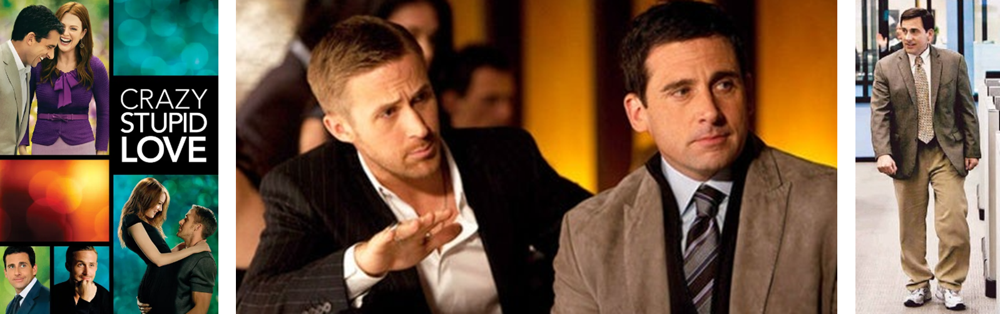

```{r setup, include=FALSE}
knitr::opts_chunk$set(
	cache = TRUE, 
	echo = FALSE, 
	warning = FALSE,
	message = FALSE,
	fig.align = 'center',
	out.width = '100%',
	dpi=300
	)
```

```{r libs, cache=FALSE, message=FALSE}
library(data.table)
library(ggplot2)
library(forcats)
library(kableExtra)
```


\fancyhf{}
\begin{center}
    \Large
    \textbf{
    \textit{SS201: Principles of Economics} \\ 
    STAP 3 (AY 23-5) \\ 
    }
    Lesson 6: Profit Maximization, Perfect Competition, and Monopoly
\end{center}
\fancyfoot[C]{\thepage}

# Review {#sec:review}

For each question below, select either True, False, or Uncertain. Then in the space provided, briefly justify your answer (one or two sentences maximum).


\begin{center}
True \hspace{3cm} False \hspace{3cm} Uncertain
\end{center}

1. Excludable goods are those which people cannot be prevented from using.

  \vspace{2.5cm}

\begin{center}
True \hspace{3cm} False \hspace{3cm} Uncertain
\end{center}

2.	Private goods and common resources are goods which are considered rival in consumption.

  \vspace{2.5cm}

\begin{center}
True \hspace{3cm} False \hspace{3cm} Uncertain
\end{center}

3. Whichever agent, consumers or producers, that is more elastic bears more of the tax burden when an ad valorem tax is implemented.

  \vspace{2.5cm}

\begin{center}
True \hspace{3cm} False \hspace{3cm} Uncertain
\end{center}

4. The United States and Brazil both produce t-shirts and leather belts. The United States has the absolute advantage in producing both goods; therefore, the United States should not trade with Brazil for either of these goods.

  \vspace{2.5cm}

\pagebreak

# Profit Maximization {#sec:bluf}
Economists look at costs differently. There are implicit, and explicit which inform how decisions bring about economic versus accounting profit. This lesson focuses on a firm’s costs and provides a foundation for how they model their cost structure. Firms also seek to maximize profit, producing to the point where marginal revenue equals marginal cost.

## Costs

### A Marginal Product of Labor Game {#sec:intuitx}

Congratulations! You all now work in my SS201 Forge! My Uncle Argyle recently passed and my friends Hamish, William, Stephen, and I recently inherited this blacksmith forge. I do not know much about running one of these things, so I first want to see how efficient we can be at making swords, and what the optimal number of laborers is. To make a sword, the iron must be taken from the ground and placed in the forge. 

```{r bh2, out.width='100%', fig.align='center'}
knitr::include_graphics("img/braveheart.jpg")
```

We will experiment with how many workers are optimal for this process. I am going to start with 1 and progress to 10. We will have 30 second rounds to see how many swords we can make. We will record and plot the results below.
\hspace{0.5cm}  \begin{minipage}[t]{0.45\textwidth}
    \begin{center}    
    \vspace{0pt}
    \begin{tabular}{c|c}
    Workers &	Swords \\
    \hline
    1	&  \\
    2	&  \\
    3	&  \\
    4	&  \\
    5 &  \\
    6 &  \\
    7 &  \\
    8 &  \\
    9 & \\
    10 & \\
    \end{tabular}
    \end{center}
\end{minipage}
\hfill
\begin{minipage}[t]{0.45\textwidth}
    \vspace{0pt}
    \centering
    \includegraphics[width=.8\linewidth]{img/grid.png}
\end{minipage}
\vspace{0.5cm}

1. Why did our \textit{production function} of swords have this shape? Why does this make sense? \vspace{3cm}


2. Assuming we pay each laborer the same wage, what would our \textit{total cost curve} look like? What shape would it have? Graph it below.

```{r grid, out.width='50%', fig.align='center'}
knitr::include_graphics("img/grid.png")
```

\pagebreak

### Cost Terminology {#sec:costs}

Define the following and give an example of each for our blacksmith forge.

1. Fixed Cost (FC) & Average Fixed Cost (AFC) \vspace{2cm}

2. Variable Cost (VC) & Average Variable Cost (AVC)  \vspace{2cm}

3. Total Costs (TC) & Average Total Cost (ATC)  \vspace{2cm}

3. Marginal Cost (MC)  \vspace{2cm}

4. Sunk Cost  \vspace{2cm}

Let's simplify the cost structure of the blacksmith forge. Assume that the weekly rent on our space is \$500, and that this is our only fixed cost. Assume that labor is our only variable cost, and we can hire workers at \$10 an hour. Weekly sword production as a function of workers is given below. 

5. Complete the table.

\begin{center}
\resizebox{0.95\textwidth}{!}{
                \begin{tabular}{C{.08\linewidth}|C{.08\linewidth}|C{.08\linewidth}|C{.08\linewidth}|C{.08\linewidth}|C{.08\linewidth}|C{.08\linewidth}|C{.08\linewidth}|C{.08\linewidth}|C{.08\linewidth}}
Labor & \multicolumn{1}{p{1.5cm}|}{\centering Q \\ (in 100's)} & \multicolumn{1}{p{1.5cm}|}{\centering FC \\ (in \$100)} & VC & TC & AFC & AVC & ATC & MC & MC (Calculus) \\
\hline
0	& 0 & & & &--- &--- &--- & ---& 0 \\
10	& 1 & & & & & & & &  1 \\
40	& 2 & & & & & & & &  6 \\
150	& 3 & & & & & & & &  17 \\
400 & 4 & & & & & & & &  34 \\
850 & 5 & & & & & & & &  57 \\
\end{tabular}}
\end{center}
\pagebreak 

6. What pattern do you observe in the MC column? How does this relate to question 1 on the front page? \vspace{2cm}

7. The table above was generated from the total cost function: $TC= Q^3- 2Q^2+ 2Q+5$. Using this function, derive expressions (in terms of Q) for ATC, AVC, AFC, and MC. \vspace{3cm}

8. A graph of our cost equations is given below. Label each curve (ATC, AVC, AFC, and MC).

```{r costs, out.width='100%', fig.align='center'}
knitr::include_graphics("img/costs.png")
```


9. Describe the shape of the ATC. Why does it have this shape? \vspace{2cm}

10.	What is the relationship between AFC, AVC, and ATC? \vspace{2cm}

11. Where does the MC curve cross the ATC curve? Why does this make sense?

\hspace{1.0cm}\begin{minipage}{0.9\textwidth}
Using your academic GPA as an example:

\begin{enumerate}
  \item If your GPA is a 3.5 and you get an A in this course, your GPA will go up / down.
  \item If your GPA is a 3.5 and you get a B in this course, your GPA will go up / down.
  \item If your GPA is a 2.5 and you get a B in this course, your GPA will go up / down.
\end{enumerate}

\vspace{1cm}

By the same logic, when MC $<$ ATC, ATC is \rule{4cm}{0.15mm} and when MC $>$ ATC, ATC is \rule{4cm}{0.15mm}. Thus, the MC always intersects the ATC at the \rule{4cm}{0.15mm}.
\end{minipage}

## Profit {#sec:profit}

Now let's develop some intuition as to where firm's should produce at to maximized profit. COL Benjamin Martin really likes making rocking chairs. By and large, these chairs are all very similar and have a price of \$600 per chair. To make these chairs, COL Martin rents a facility to do this wood-working, buys supplies, and hires labor.

```{r bh, out.width='100%', fig.align='center'}
knitr::include_graphics("img/colmartin.png")
```

1. While his marksmanship is impeccable (``aim-small, miss-small"), his bookkeeping is not all that great. Below are some of his costs, revenue, and profit. Complete the table below.

\begin{center}
\resizebox{0.95\textwidth}{!}{
                \begin{tabular}{C{.02\linewidth}|C{.08\linewidth}|C{.08\linewidth}|C{.08\linewidth}|C{.08\linewidth}|C{.08\linewidth}|C{.08\linewidth}|C{.08\linewidth}|C{.08\linewidth}}
Q & \multicolumn{1}{p{1.5cm}|}{\centering Total \\ Revenue} & \multicolumn{1}{p{1.5cm}|}{\centering Marginal \\ Revenue} & \multicolumn{1}{p{1.5cm}|}{\centering Variable \\ Cost} & \multicolumn{1}{p{1.5cm}|}{\centering Fixed \\ Cost} & \multicolumn{1}{p{1.5cm}|}{\centering Total \\ Cost} & \multicolumn{1}{p{1.5cm}|}{\centering Marginal \\ Cost} & Profit & \multicolumn{1}{p{1.5cm}}{\centering Marginal \\ Profit} \\
\hline
0	&  & --- & 0 & 3 & 3 &--- &--- & ---\\
\hline
1	&  & & 2 & 3 & 5 & & & \\
\hline
2	&  & &  &  & 8 & & & \\
\hline
3	&  & & 9 &  &  & & & \\
\hline
4   &  & &  &  & 17 & & & \\
\hline
5   &  & & 20 &  &  & & & \\
\hline
6   &  & &  &  & 30 & & & \\
\hline
7   &  & & 35 &  &  & & & \\
\end{tabular}}
\end{center}


2. What level should COL Martin produce at? Why? \vspace{3cm}

\pagebreak

3. Write down an equation for profit. Why does the above intuition make sense mathematically? \vspace{4cm}

4. After seeing the table you completed above. COL Martin retools his production process, becoming more efficient, and models his Average Total Cost curve below. If he can sell a chair for \$600, depict the profit on the graph below if he sells at the profit-maximizing quantity from question 1.

```{r prof2, out.width='70%', fig.align='center'}

```

5. From the depiction above, what is another mathematically equivalent equation for $\pi = P*Q - TC(Q)$? \pagebreak


# Perfect Competition and Monopoly
We now enhance our market model with various forms of competition to predict firm behavior. Certain market structures make some markets more efficient than others and also influence whether firms enter, exit, or temporarily shut down. We will begin our discussion of competition with the two extremes, perfect competition and monopoly. Ultimately, perfect competition is the simplest case where firms can freely enter and exit, with little differentiation in goods and no effect on price. As opposed to (perfectly) competitive markets, monopolies are markets with one seller who can control the price. Monopolies afford great incentives for innovation within countries that allow them, yet they are not efficient markets, and do not maximize societal welfare.

## Perfect Competition / Competitive Markets {#sec:perf}
1. What are the characteristics of a competitive market? \vspace{5cm}


2. Short-Run vs. Long-Run. How do we draw the distinction between these two time periods? \pagebreak


\begin{minipage}[t]{0.45\textwidth}
    \vspace{0pt}
    \centering
    \includegraphics[width=.45\linewidth]{img/charlotte.jpg}
\end{minipage}
\hfill
\begin{minipage}[t]{0.55\textwidth}
\vspace{0pt}
Charlotte Selton is in charge of a large wheat farm. The current market price per ton of wheat is \$1,000. Her farm's cost curves are depicted below. 
\end{minipage}

```{r perf1, out.width='80%', fig.align='center'}
knitr::include_graphics("img/perf1.png")
```

3. Label the cost curves above and plot Charlotte's marginal revenue curve.\vspace{0.5cm}

4. How many tons of wheat should Charlotte produce? \pagebreak

5. There have been many farmers that move into Charlotte's region and the projected price of wheat per ton has dropped to \$500 per ton. She has already paid her property taxes for the year (\$10,000) and owns all her own equipment, so she has no other fixed costs. After running a wheat farm on this land for the past 20 years, she knows her average variable cost is roughly \$325 per ton and average fixed cost is \$300 per ton. Should she plant for the upcoming season or not? Graphically depict this decision on the cost curves below.

```{r perf2, out.width='80%', fig.align='left'}
knitr::include_graphics("img/perf1.png")
```

6. What is the long-run price per ton that would force Charlotte to give up her wheat farm and exit the market? \pagebreak

7. Is there any chance for long-run economic profit for Charlotte? Why? Use the two graphs below to explain. 

```{r perf3, out.width='100%', fig.align='center'}
knitr::include_graphics("img/perf2.png")
```

```{r perf4, out.width='100%', fig.align='center'}
knitr::include_graphics("img/perf3.png")
```

## The Monopolist's Problem {#sec:mprob}

```{r bh10, out.width='100%', fig.align='center'}

```

Our friend Cal Weaver loves mid-calf plain white socks. He tells you that he wears them, and his plain white briefs with literally every outfit. Upon hearing that you immediately tune out of the conversation, but for some reason can’t get these plain white socks out of your head. These were the same the Army issued you during Cadet Basic Training. While daydreaming, you ponder the following:


1. What does the demand curve for these plain white socks look like? What shape/elasticity would you expect it to have? Draw that, the total market supply curve, and plot the equilibrium price below.

```{r g10, out.width='40%', fig.align='left'}
knitr::include_graphics("img/grid.png")
```

\pagebreak

2. What if the government stepped in and said that Hanes was the only brand that was allowed to make these plain white socks? How would that change the above diagram? Draw the same figure below.

```{r g20, out.width='40%', fig.align='left'}
knitr::include_graphics("img/grid.png")
```

Let’s assume that the above scenario holds. Hanes is the sole producer of mid-calf white socks. Assume the demand curve they face is $Q_D=18-P$. 

3. What does the profit equation look like for this firm? Let’s assume they have a total cost function of $TC(Q)= Q^2-6Q+12$. Derive Hanes’ profit function in terms of Q.\vspace{5cm}


4. Despite this firm being a monopoly, does this firm still produce where marginal revenue equals marginal cost like the perfectly competitive firm? Show this mathematically below.

\pagebreak

5. Below is a graph of Hanes' ATC. Plot the firm’s demand, marginal revenue, and marginal cost functions below.

```{r atc, out.width='80%', fig.align='center'}

```

6. What level of output Q does Hanes produce at? What price do they charge? Shade in the profit on the graph above.  \vspace{4cm}

7. Is this market efficient? Shade in the deadweight loss, if any, and explain why this market structure either maximizes or does not maximize societal welfare. \vspace{3cm}

\pagebreak

8. What policies can the government use to regulate monopolies? \vspace{4cm}

9. Is there profit in the long run for monopolies? What characteristic of this market structure allows for this? \vspace{3cm}

\pagebreak

## Competition Overview {#sec:cover}
\vspace{1cm}

\begin{center}
\begin{tblr}{
  colspec = {X[c,m]X[c]X[c]X[c]X[c]},
  stretch = 0,
  hlines = {1pt},
  vlines = {1pt},
  row{1} = {10pt},
  row{2-Z} = {40pt},
}
 & (Perfectly) Competitive  & Monopolistic Competition & Oligopoly  & Monopoly \\
\# of Firms &  & &  & \\
Type of Product	&  & &  & \\
Price vs. MR	&  & &  & \\
Price vs. MC 	&  & &  & \\
Entry  &  & &  & \\
LR Profits 	&  & &  & \\
Efficient  	&  & &  & \\
\end{tblr}
\end{center}
