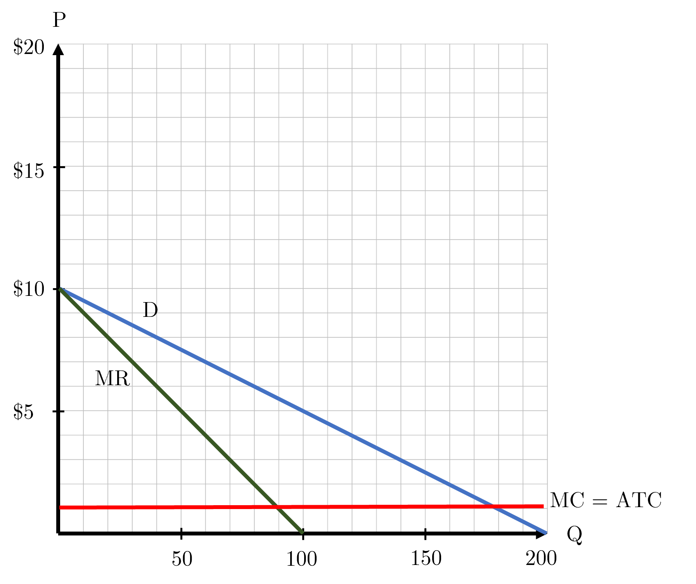
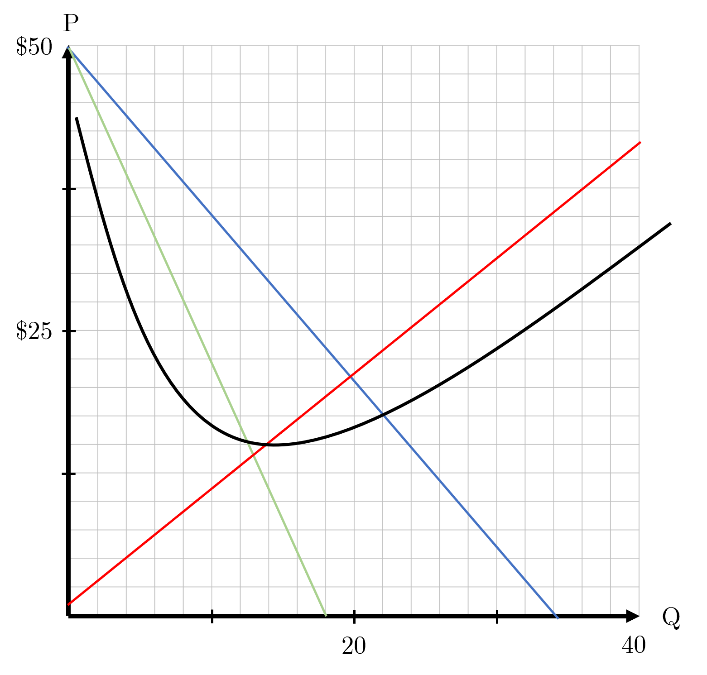
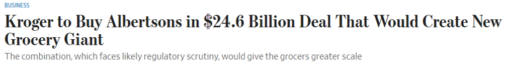

```{r setup, include=FALSE}
knitr::opts_chunk$set(
	cache = TRUE, 
	echo = FALSE, 
	warning = FALSE,
	message = FALSE,
	fig.align = 'center',
	out.width = '100%',
	dpi=300
	)
```

```{r libs, cache=FALSE, message=FALSE}
library(data.table)
library(ggplot2)
library(forcats)
library(kableExtra)
```


\fancyhf{}
\begin{center}
    \Large
    \textbf{
    \textit{SS201: Principles of Economics} \\ 
    STAP 3 (AY 23-5) \\ 
    }
    Lesson 8: Oligopoly / Monopolistic Competition
\end{center}
\fancyfoot[C]{\thepage}
# Review {#sec:review}

Indicate the answer choice that best completes the statement or answers the question.

1. What is the main market failure associated with common resources? 
    a. Tragedy of the Commons
    b. The Free Rider Problem
    c. Deadweight Loss
    d. None of the above.

\vspace{0.5cm}

2. What is the main market failure associated with public goods?
    a. Negative Externalities
    b. Tragedy of the Commons
    c. The Free-Rider Problem
    d. Pollution

\vspace{0.5cm}

3. Jamie runs a coffee shop that makes \$200,000 a year in revenue. Jamie pays \$50,000 a year to lease the shop space, \$40,000 a year on supplies, and \$35,000 a year on part-time worker wages. If she wasn’t running the coffee shop, she would earn $100,000 a year working as a lawyer. What are Jamie’s accounting profits? What are her economic profits?
    a. -\$25,000 Accounting, \$75,000 Economic
    b. $200,000 Accounting, \$100,000 Economic
    c. $75,000 Accounting, -\$25,000 Economic
    d. None of the above.

\vspace{0.5cm}

4. Which below is not a method for correcting negative externalities?
    a. Pigouvian Taxes
    b. Cap and Trade Systems
    c. Patent Protection
    d. Regulation

\vspace{0.5cm}

Declare whether the statement below is either True, False or Uncertain, and briefly justify your answer in the space provided (one or two sentences maximum).

\begin{center}
True \hspace{3cm} False \hspace{3cm} Uncertain
\end{center}

5. A monopolist's ability to perfectly price discriminate increases total social surplus and market efficiency.

  \vspace{2cm}


\pagebreak

# Competition Overview {#sec:cover}
\vspace{1cm}

\begin{center}
\begin{tblr}{
  colspec = {X[c,m]X[c]X[c]X[c]X[c]},
  stretch = 0,
  hlines = {1pt},
  vlines = {1pt},
  row{1} = {10pt},
  row{2-Z} = {40pt},
}
 & (Perfectly) Competitive  & Monopolistic Competition & Oligopoly  & Monopoly \\
\# of Firms &  & &  & \\
Type of Product	&  & &  & \\
Price vs. MR	&  & &  & \\
Price vs. MC 	&  & &  & \\
Entry  &  & &  & \\
LR Profits 	&  & &  & \\
Efficient  	&  & &  & \\
\end{tblr}
\end{center}

\pagebreak

# Oligopoly {#sec:bluf}
Between monopolistic competition and a monopoly, oligopolies exist as markets with very few players. In this scenario, we assume barriers to entry within these markets and that firms produce differentiated products. Due to the smaller number of firms in this market, we are able to apply game theory and models of strategic interaction that help us understand how these firms operate.

## Game Theory {#sec:gt}

```{r abm, out.width='100%', fig.align='center'}

```
\vspace{1cm}
1.	What is a dominant strategy? \vspace{3cm}

2.	How does a dominant strategy differ from a Nash Equilibrium? \vspace{3cm}

\pagebreak

For each of the following games, identify each player’s dominant strategy (if they have one) and the Nash Equilibrium of the game.  

3. Fake Friends
\begin{table}[h!]
\centering
  \setlength{\extrarowheight}{12pt}
  \begin{tabular}{cc|c|c|}
    \multicolumn{2}{c}{} & \multicolumn{2}{c}{Commandant}\\
    \multicolumn{1}{c}{} &  & Dean's Hour  & Comm's Hour \\\cline{2-4}
    \multirow{2}*{Dean}  & Dean's Hour & $(2,0)$ & $(2,1)$ \\\cline{2-4}
    & Comm's Hour & $(3,0)$ & $(1,2)$ \\\cline{2-4}
  \end{tabular}
\end{table}

4. Battle of the Sexes
\begin{table}[h!]
\centering
  \setlength{\extrarowheight}{12pt}
  \begin{tabular}{cc|c|c|}
    \multicolumn{2}{c}{} & \multicolumn{2}{c}{Ms. Homme}\\
    \multicolumn{1}{c}{} &  & Restaurant  & Eat at Home \\\cline{2-4}
    \multirow{2}*{MAJ Homme}  & Restaurant & $(2,1)$ & $(0,0)$ \\\cline{2-4}
    & Eat at Home & $(0,0)$ & $(1,2)$ \\\cline{2-4}
  \end{tabular}
\end{table}
\vspace{2cm}

5. The Prisoner's Dilemma
\begin{table}[h!]
\centering
  \setlength{\extrarowheight}{12pt}
  \begin{tabular}{cc|c|c|}
    \multicolumn{2}{c}{} & \multicolumn{2}{c}{Get Stitches}\\
    \multicolumn{1}{c}{} &  & Confess  & Silence \\\cline{2-4}
    \multirow{2}*{Snitches}  & Confess & $(-10,-10)$ & $(0,-20)$ \\\cline{2-4}
    & Silence & $(-20,0)$ & $(-1,-1)$ \\\cline{2-4}
  \end{tabular}
\end{table}

\pagebreak

## Cournot Duopoly {#sec:cd}

Suppose that the demand for ice cream at West Point is given by the equation $Q_D=200-20P$. Ben and Jerry are the only two makers of ice cream licensed by DCA (and supported by the local businesses in Highland Falls) to make and sell ice cream here, and they both have a constant marginal cost and average total cost of $1 for producing an additional ice cream cone. Below is a graph of this market.

```{r g1, out.width='60%', fig.align='center'}

```


1.	Let’s assume that within this market Ben and Jerry are cooperating. Together they will choose a total quantity of ice cream to produce to maximize total profits, then split those profits two ways. How many cones does each produce? What is the profit of each shop? \vspace{3cm}

2. Let’s say now that Ben and Jerry get into a big fight over whether "Cherry Garcia" is better than "Everything but the Kitchen Sink," and now they no longer cooperate on how much ice cream to produce and sell. Ben is thinking about producing an additional 15 ice cream cones. What will the market price of ice cream cones be if he does? What will be Ben’s profit? What about Jerry’s profit? 

\pagebreak

3. Assume now that Ben and Jerry have these two strategies at their disposal: they can either produce at the level in question 1 or produce an additional 15 ice cream cones. Fill in the game theory payoff matrix below:

\begin{table}[h]
\centering
  \setlength{\extrarowheight}{12pt}
  \begin{tabular}{cc|c|c|}
    \multicolumn{2}{c}{} & \multicolumn{2}{c}{Jerry}\\
    \multicolumn{1}{c}{} &  & Produce \rule{1cm}{0.15mm}  & Produce \rule{1cm}{0.15mm} \\\cline{2-4}
    \multirow{2}*{Ben}  & Produce \rule{1cm}{0.15mm} &  &  \\\cline{2-4}
    & Produce \rule{1cm}{0.15mm} &  &  \\\cline{2-4}
  \end{tabular}
\end{table}

4. What is each player’s dominant strategy? What is the Nash Equilibrium of this game? \vspace{3cm}

5. Should Ben and Jerry try to make up and collude? If they do, who wins and who loses? What would society prefer? How likely is it that collusion between Ben and Jerry is sustainable? \vspace{3cm}

6. Now assume it was easy to enter the ice cream market in West Point and produce with the same cost structure and quality of product as Ben and Jerry. What would be the market quantity and price? What type of market structure does this resemble? 

\pagebreak

# Improving Monopoly Market Efficiency - Price Discrimination {#sec:mprob}

```{r bh, out.width='100%', fig.align='center'}
knitr::include_graphics("img/10things.png")
```

Bianca Stratford, Cat’s younger sister, loves sunglasses. She rarely gets to wear them out in Seattle, but when the sun is out, she just can’t be without. Suppose that there is a sole supplier of sunglasses within this market. The graph below represents this monopolist’s market. Below is a graph of the firm’s demand, marginal revenue, marginal cost, and ATC functions.

```{r pd, out.width='80%', fig.align='center'}
knitr::include_graphics("img/pd.png")
```

1. Where does the monopolist produce within this market? Is this point efficient (socially optimal)? \vspace{3cm}

2. Now let’s assume that the monopolist now knows each consumer’s willingness to pay for sunglasses and can charge different prices to different consumers. What will this monopolist do in this case to maximize profits? \vspace{3cm}

3. What is consumer surplus, profit, and total surplus in this scenario? Is this socially efficient? \vspace{3cm}

\pagebreak

# Monopolistic Competition
Within a monopolistic competition market structure, firms retain some ability to influence the price. They sell differentiated products, but are unable to reap long-run profit as the monopolist can. With many firms freely entering and exiting the market responding to the price, this freedom drives demand toward tangency with a firms’ Average Total Cost Curve and leads to no long-run profits.

High-schoolers (and me) love their shoes. Let’s explore Nike’s cost curves for a second. Suppose that Nike has a total cost curve of $TC(Q)=100+2Q+\frac{1}{2}Q^2$ and faces a demand curve of $P=50-\frac{3}{2}Q_D$. Below is a graph of Nike's cost and marginal revenue curves within the market for shoes.

```{r g2, out.width='80%', fig.align='center'}

```

1.	Label the curves and axes on the above graph. \vspace{0.5cm}
 
2.	Calculate the number of sneakers Nike will produce and the price they will charge, then label these on the graph above.\vspace{3cm}

3.	Draw and label Nike’s profit / loss. What do other shoe firms have an incentive to do within this market? What happens to Nike’s demand curve as a result? \vspace{3cm}

4. Is this market in long-run equilibrium? Why? What should happen in the long run? \vspace{3cm}

```{r perf3, out.width='100%', fig.align='center'}
knitr::include_graphics("img/monop_lr.png")
```

\pagebreak

# Application {#sec:policy}

```{r headline, out.width='100%', fig.align='center'}

```

\hspace{0.5cm}  \begin{minipage}[t]{0.5\textwidth}
    \vspace{0pt}
  \includegraphics[width=.9\linewidth]{img/grocer_market_share.png}
\end{minipage}
\hfill
\begin{minipage}[t]{0.5\textwidth}
    \vspace{0pt} “It allows us to do things we are doing in an accelerated way,” Kroger Chief Executive Rodney McMullen, who will serve as CEO and chairman of the combined company, said in an interview. \\ \\
    The companies said Kroger plans to invest in lowering prices for consumers and expects to direct about \$500 million in anticipated cost savings toward that goal. \\ \\
    Combined, the companies said they would have a bigger network of stores, distributors and suppliers, in addition to a national reach and greater manufacturing footprint. Integrating their supply chains would shorten the time it takes products to hit store shelves, executives said on a call with analysts. Pooling customer data would help the companies engage better with shoppers, such as offering personalized promotions, they said. \\ \\
    Creating a strong No. 2 behind Walmart could give the combined entity more leverage in negotiations with vendors and help it push back on price increases, they wrote, though they expect regulators to focus more on the enlarged company’s regional influence versus its national share.
\vspace{0.5cm}
\end{minipage}
\begin{center}
\textit{https://www.wsj.com/articles/kroger-to-merge-with-albertsons-in-a-24-6-billion-deal-11665745735}
\end{center}

\vspace{0.5cm}

\pagebreak

1. What type of market does the grocery industry represent? \vspace{3cm}

2. If Kroger and Albertsons successfully merge to become the second largest grocer, what changes could be expected in the domestic food market’s price and quantity? \vspace{3cm}

3. Evaluate the following proposal’s impact regarding consumer pricing and address if you would make any changes.
\begin{center}
\begin{minipage}[t]{0.8\textwidth}
\textit{The merger should be allowed to occur as it will increase grocer efficiency with little to no effect on consumer prices.}
\end{minipage}
\end{center}