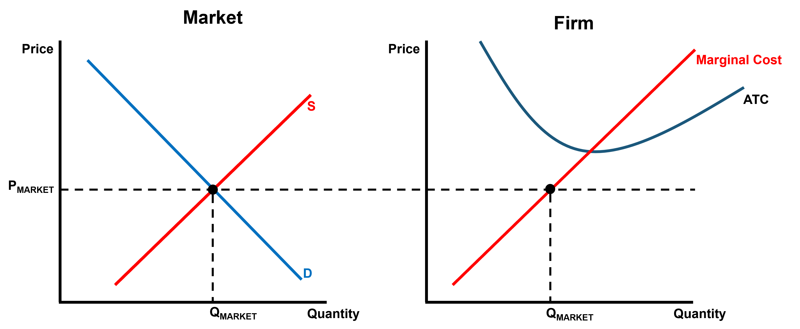
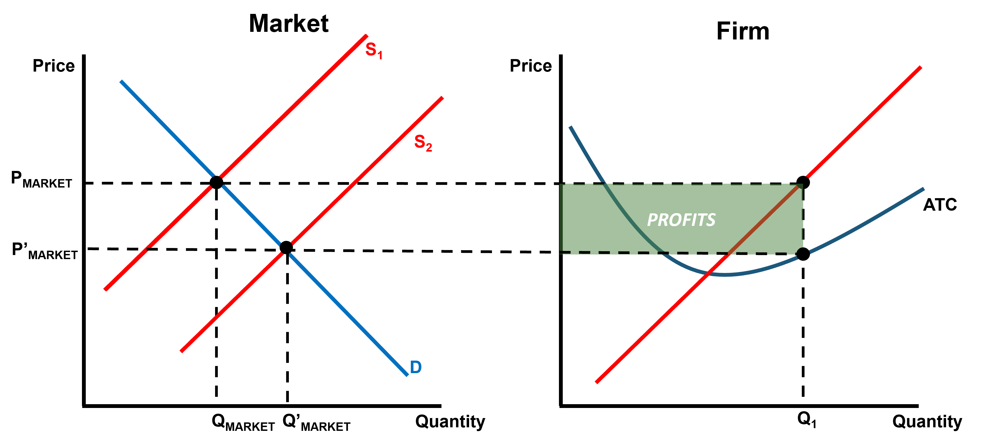
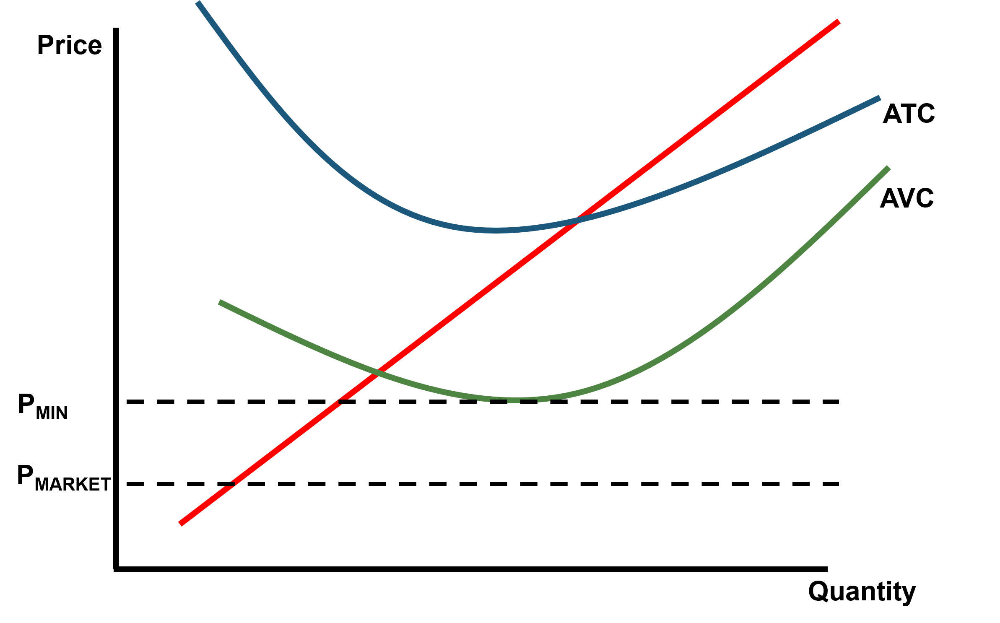
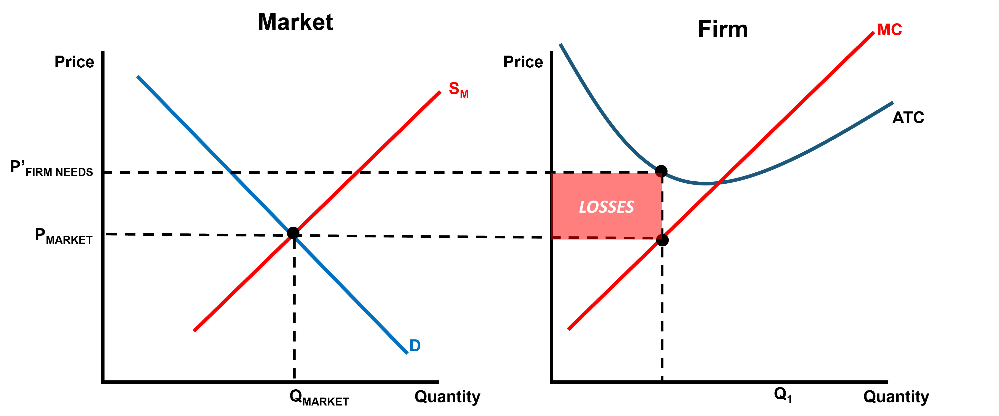
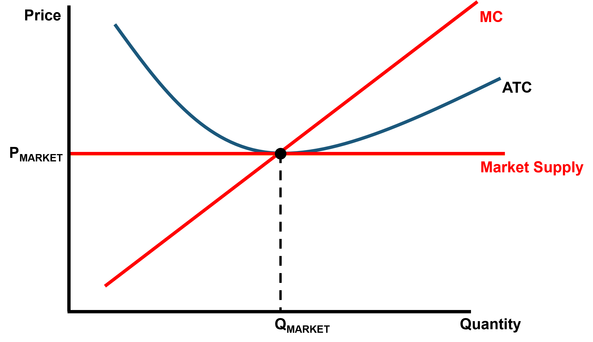

```{r setup, include=FALSE} 
knitr::opts_chunk$set(
  cache = TRUE,
  echo = FALSE,
  warning = FALSE, 
  message = FALSE,
  fig.align = 'center')
options(htmltools.dir.version = FALSE)
```

```{r load_refs, include=FALSE, cache=FALSE}
library(RefManageR)
BibOptions(check.entries = FALSE,
           bib.style = "authoryear",
           style = "markdown",
           hyperlink = FALSE,
           dashed = TRUE)
bib <- ReadBib("references.bib", check = FALSE)

print_bib_rmd <- function(bib, .opts = list(), start = 1, stop = NULL, decreasing = FALSE) {

    bib <- sort(bib, decreasing = FALSE)

    if (!length(bib)) {
        return(bib)
    }

    if (identical(class(bib), "bibentry")) {
        bib <- as.BibEntry(bib)
    }

    keys <- unlist(bib$key)
    ind <- keys %in% names(.cites$indices)

    if (!any(ind)) {
        message("You haven't cited any references in this bibliography yet.")
        return()
    }

    if (length(.opts$bib.style)) {
      bibstyle <- .opts$bib.style
    } else {
      bibstyle <- .BibOptions$bib.style
    }

    if (length(.opts$cite.style)) {
      citestyle <- .opts$cite.style
    } else {
      citestyle <- .BibOptions$cite.style
    }

    if (length(.opts$style)) {
      style <- .opts$style
    } else {
      style <- .BibOptions$style
    }

    bib <- bib[[ind]] # gets citations to print

    if (bibstyle == citestyle) {
        if (bibstyle == "numeric") {
            if (length(bib) == length(.cites$labs)) {
                bib <- bib[[names(.cites$labs)]]
                .opts$sorting <- "none"
                bib$.index <- structure(.cites$labs, names = NULL)
            }
        } else { 
          bib$.index <- .cites$labs[keys[ind]]
        }
    }

    if (length(.opts)) {
        old.opts <- BibOptions(.opts)
        on.exit(BibOptions(old.opts))
    }

    if (style == "yaml") {
        cat("\n---\nnocite:", sQuote(paste0(paste0("@", names(.cites$indices)), 
            collapse = ", ")))
        cat("\n...  \n\n")
    }
    if (is.null(stop)) {
      stop <- length(bib)
    } 
    bib <- bib[start:stop]
    print(bib)
}

environment(print_bib_rmd) <- asNamespace("RefManageR")

```

```{r libs, include=FALSE, cache=FALSE, message=FALSE}
library(data.table)
library(tidyverse)
library(ggplot2)
library(pdftools)
library(huxtable)
```


# Agenda
- Admin

- Review

- Competition

  - A Firm's Supply Curve
  - Entry / Exit Decision
  
- Talk is Cheap? The Threat of Entry in the Airlines

???

Feel:   Enlightened about different costs
Know:   How to model cost structures, Sunk Costs
Do:     Identify perfectly competitive markets, model costs and supply

---


# Course Admin

- 17/18JUL Problem Set #3 DUE

- 18/19JUL Problem Set #4 DUE

- 19JUL WPR 2

<!-- .center[] -->

---
class: inverse, center, middle


# Questions from last lessons?

---

# Review

<iframe width="823" height="463" src="https://www.youtube.com/embed/Y7KD9CM_PjM?t" title="Work Together and Survive | Gladiator | All Action" frameborder="0" allow="accelerometer; autoplay; clipboard-write; encrypted-media; gyroscope; picture-in-picture" allowfullscreen data-external="1"></iframe>

---

# Review

- Costs, Revenues, and Profits

- Marginal Costs, Marginal Products

- Economies of Scale
  - Constant
  - Diseconomies

.center[.black[Profit seeking motive drives efficiency!!]]

---

# Economics is awesome because...

- Allows us a useful framework to think about the world

- Doesn't teach us "what" to think, but a "way" to think

- Today, we're going to play around with the notion of "competition" and how it applies to firms and their decision making

---

# Let's develop a model of competition...

#### Assumptions

1. Many buyers, utility maximizing

2. Many firms, producing identical units, profit maximizing

3. Firms have no market power or ability to influence prices (Price Takers)

4. Firms can freely enter and exit the market (No bureaucracy)

5. No gains from buying or selling in bulk

6. There are three time frames: present, short run, and long run

7. Perfect Information (in the present and short run)

---

# Some Questions that follow...

- What does a firm's cost structure look like?

- How much should a firm produce?

- When should a firm enter or exit a market?

- When does a firm temporarily shut down?

- What does profit look like in this market?


---

# How much should a firm produce?

Economic Leader Principle # 2

Where do leaders make decisions?

--

.center[AT THE MARGIN!]

--

.center[Marginal Benefit = Marginal Cost]

--

Consumer Theory told us that we optimize between two goods where:

$$\frac{MU_{x_1}}{MU_{x_2}} = \frac{P_1}{P_2}$$

--

.center[What about firms?]

---
# How much should a firm produce?

Marginal Benefit = Marginal Revenue = Price of Good Sold = P

Marginal Cost = MC

.center[
$\therefore$ firms should produce where P = MC]


```{r market}

```

---
# When should a firm enter or exit a market?

```{r entry}

```


---
class: middle

# When does a firm temporarily shut down?

.pull-left[.center[**Derivation**]
$$TR < VC$$
</br>
$$\frac{TR}{Q} < \frac{VC}{Q}$$</br>

$$AR < AVC$$</br>

$$P < AVC$$
]


.pull-right[
</br></br></br></br>
```{r shutdown, out.width='120%'}

```
]
---
# What does profit look like in this market?
```{r exit, out.width='70%'}

```

.center[**+**]

```{r entry2, out.width='70%'}

```

---
# What does profit look like in this market?
</br></br>

```{r lr}

```

---
# Great! We've got a model!

.center["Essentially, all models are wrong, but some are useful."

*George E.P. Box*]

```{r box, out.width = '80%'}
knitr::include_graphics("img/box.jpg")
```

---
# So where is this useful?

Examples of Perfectly Competitive Markets

--

- Agriculture

- Oil

- Currencies

- Airlines

---
# Airline Example

```{r airlines, out.width = '60%'}

```

---
# Next time...


---


# References
```{r refs, echo=FALSE, results="asis"}
PrintBibliography(bib)
```

---


# Audiovisual

https://media3.giphy.com/media/BpGWitbFZflfSUYuZ9/giphy.gif?cid=ecf05e4735qzvc6v0h1qqye2lw9ti8w19zhsk3jvfnpp8c94&rid=giphy.gif&ct=g

https://www.youtube.com/embed/Y7KD9CM_PjM?t