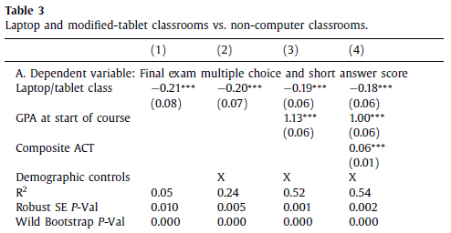

```{r setup, include=FALSE} 
knitr::opts_chunk$set(
  cache = TRUE,
  echo = FALSE,
  warning = FALSE, 
  message = FALSE,
  fig.align = 'center')
options(htmltools.dir.version = FALSE)
```

```{r load_refs, include=FALSE, cache=FALSE}
library(RefManageR)
BibOptions(check.entries = FALSE,
           bib.style = "authoryear",
           style = "markdown",
           hyperlink = FALSE,
           dashed = TRUE)
bib <- ReadBib("references.bib", check = FALSE)

print_bib_rmd <- function(bib, .opts = list(), start = 1, stop = NULL, decreasing = FALSE) {

    bib <- sort(bib, decreasing = FALSE)

    if (!length(bib)) {
        return(bib)
    }

    if (identical(class(bib), "bibentry")) {
        bib <- as.BibEntry(bib)
    }

    keys <- unlist(bib$key)
    ind <- keys %in% names(.cites$indices)

    if (!any(ind)) {
        message("You haven't cited any references in this bibliography yet.")
        return()
    }

    if (length(.opts$bib.style)) {
      bibstyle <- .opts$bib.style
    } else {
      bibstyle <- .BibOptions$bib.style
    }

    if (length(.opts$cite.style)) {
      citestyle <- .opts$cite.style
    } else {
      citestyle <- .BibOptions$cite.style
    }

    if (length(.opts$style)) {
      style <- .opts$style
    } else {
      style <- .BibOptions$style
    }

    bib <- bib[[ind]] # gets citations to print

    if (bibstyle == citestyle) {
        if (bibstyle == "numeric") {
            if (length(bib) == length(.cites$labs)) {
                bib <- bib[[names(.cites$labs)]]
                .opts$sorting <- "none"
                bib$.index <- structure(.cites$labs, names = NULL)
            }
        } else { 
          bib$.index <- .cites$labs[keys[ind]]
        }
    }

    if (length(.opts)) {
        old.opts <- BibOptions(.opts)
        on.exit(BibOptions(old.opts))
    }

    if (style == "yaml") {
        cat("\n---\nnocite:", sQuote(paste0(paste0("@", names(.cites$indices)), 
            collapse = ", ")))
        cat("\n...  \n\n")
    }
    if (is.null(stop)) {
      stop <- length(bib)
    } 
    bib <- bib[start:stop]
    print(bib)
}

environment(print_bib_rmd) <- asNamespace("RefManageR")

```

```{r libs, include=FALSE, cache=FALSE, message=FALSE}
library(data.table)
library(tidyverse)
library(ggplot2)
library(pdftools)
library(huxtable)
```


# Agenda
- Why No Computers?

- Course Admin

- Review

- Model Building 101

- Talk is Cheap? The Threat of Entry in the Airlines

???

Feel:   Enlightened about different costs
Know:   How to model cost structures, Sunk Costs
Do:     Identify perfectly competitive markets, model costs and supply

---
# Why no computers in the classroom?

--

- Everyone cares about education. Economists call this "human capital"

--

- Common belief is more education leads to more income

--

- More efficient education produces more income

--
</br></br>


.big[.center[Technology improves everything, right?]]

---
# Why no computers in the classroom?

.black[.center[`r Citet(bib, "carter2017_eer")` test this...]]

--

Randomly assigned all cadets taking SS201 to three groups:
  1. Unfettered Computer / Tablet Access
  2. Computer / Tablet Access if "Face-Up"
  3. No tech

--
</br></br>

.center[**Does technology improve learning and retention?**]

---
# Why no computers in the classroom?

```{r stranger, out.width='80%'}

```

--

.small[
- Values given in standard deviations.

- Comparison being made between classes that allowed computers versus those that did not.

- Standard deviation is an average of how far scores were from the average.

- EX. The Standard Deviation of WPR 1 was 11.59%. Being in a "computer allowed" classroom would imply that these cadets would have done **2.3% worse** on average.]

---

# Course Admin

- 17/18JUL Problem Set #3 DUE

- 18/19JUL Problem Set #4 DUE

- Tuesday, 19JUL, WPR 2

- Sunday, 24JUL, Issue Analysis Essay DUE

<!-- .center[] -->

---
class: inverse, center, middle


# Questions from last lessons?

---
class: middle

<iframe width="823" height="463" src="https://www.youtube.com/embed/Y7KD9CM_PjM?t" title="Work Together and Survive | Gladiator | All Action" frameborder="0" allow="accelerometer; autoplay; clipboard-write; encrypted-media; gyroscope; picture-in-picture" allowfullscreen data-external="1"></iframe>

---

# Review

- Costs, Revenues, and Profits

- Marginal Revenue, Marginal Cost

- Economies of Scale

.center[.black[Profit seeking motive drives efficiency!!]]

---

# Economics is awesome because...

- Allows us a useful framework to think about the world

- Doesn't teach us "what" to think, but a "way" to think

- There's an art and a science to it

- Today, we're going to play around with the notion of "competition" and how it applies to firms and their decision making

- We're going to start simple and build over the next couple lessons...

---

# DISCLAIMER

```{r box, out.width = '80%'}
knitr::include_graphics("img/box.jpg")
```

.center["Essentially, all models are wrong, but some are useful."

*George E.P. Box*]

---

# Model Building 101

1. Get an Idea

2. List the players

3. List assumptions

4. Gather Predictions

5. Reassess and Rebuild

---
# 1. Get an idea

**Question:** How do firms make decisions within a market?

--

# 2. List the Players

- Consumers
- Firms

---
# 3. Make Assumptions - KISS

1. Many buyers, utility maximizing

2. Many firms, producing identical units, profit maximizing

3. Firms have no market power or ability to influence prices

4. Firms can freely enter and exit the market

5. There are two time frames: short run, and long run
  - Short Run = Firm has already paid fixed costs
  - Long Run = Firm can change/respond to fixed costs

6. Perfect Information (in the short run)
  - Cannot see future, but can see prices, other firms, etc.

---
# 4. Gather Predictions

- What does a firm's revenue and cost structure look like?

- How much should a firm produce?

- When does a firm temporarily shut down?

- When should a firm enter or exit a market?

---

## What does a firm's revenue and cost structure look like?

Say a firm's total cost function is 

$$TC(q) = a*q^3+b*q^2+c*q+d$$

</br>
Derive the following functions:
.pull-left[
ATC
</br></br></br>
AVC
</br></br></br>
AFC
]

.pull-right[
MC
</br></br></br>
VC
</br></br></br>
FC
]

---
## What does a firm's revenue and cost structure look like?

Write down the firm's profit function, $\pi(q)$

---
## How much should a firm produce?

If consumer's optimize where marginal benefit = marginal cost, then shouldn't firms do the same?

So produce where Marginal Revenue = Marginal Cost?

.center[Price = Marginal Cost]

```{r market}

```

.center[**But are you sure that's right?**]

---
## How much should a firm produce?

Recall from calculus how to find minimums or maximums from functions.

*Step 1* - Find where the first derivative equals zero.
  - First derivative tells us slope, or how fast function is changing

*Step 2* - Find what sign of second derivative at optimum to confirm max or min.
  - Second derivative tells us shape, whether function is concave or convex
  
*Step 3* - Ensure no corner solutions.
  - Just because we find a value where first derivative equals zero does not mean it is the "global" max or min

---
## How much should a firm produce?

---
## When does a firm temporarily shut down?

```{r shutdown, out.width='80%'}

```

---

## When should a firm enter a market?

```{r entry}

```

---
## When should a firm exit a market?

```{r exit3}

```

---
# So where is this useful?

Examples of Perfectly Competitive Markets:


???

Agriculture
Currency
Oil
Airlines

---
# Airlines?

```{r airlines, out.width = '60%'}

```


---
# Okay CEO... What Would You Do?

Setup is as follows:

- You're the CEO of United Airlines
- Southwest has a presence at both Dulles Airport in DC and Cleveland and is starting to run its mouth about flying that route.
- A year ago it entered a market that only Delta flew in previously and Delta has been losing money on that route ever since
- What do you do and how do you think about this problem?

```{r air, out.width = '60%'}

```

---
# Turns out, this simplified model works

.center[`r Citet(bib, "goolsbee2008_qje")`]

```{r airtab, out.width = '60%'}

```

---
# Next time...

We relax some assumptions within our model...

We visit our old friend...

```{r monop}

```

---
# References
```{r refs, echo=FALSE, results="asis"}
PrintBibliography(bib)
```

---
# Audiovisual

https://media3.giphy.com/media/BpGWitbFZflfSUYuZ9/giphy.gif?cid=ecf05e4735qzvc6v0h1qqye2lw9ti8w19zhsk3jvfnpp8c94&rid=giphy.gif&ct=g

https://www.youtube.com/embed/Y7KD9CM_PjM?t