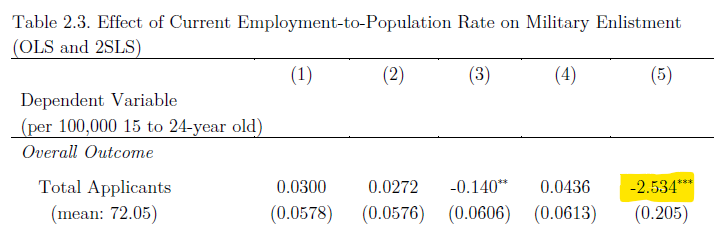
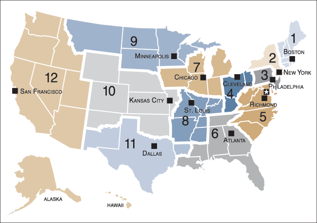
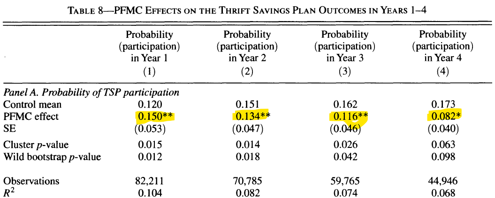

```{r setup, include=FALSE} 
options(htmltools.dir.version = FALSE)
library(knitr)
library(tidyverse)
library(huxtable)
library(data.table)
library(xaringanExtra)
library(NHSRtheme)
library(NHSRdatasets)
library(icons)
# set default options
opts_chunk$set(echo=FALSE,
               collapse = TRUE,
               fig.width = 7.252,
               fig.height = 4,
               dpi = 300)

# set engines
knitr::knit_engines$set("markdown")

xaringanExtra::use_tile_view()
xaringanExtra::use_panelset()
xaringanExtra::use_clipboard()
xaringanExtra::use_webcam()
xaringanExtra::use_broadcast()
xaringanExtra::use_share_again()
xaringanExtra::style_share_again(
  share_buttons = c("twitter", "linkedin", "pocket")
)
```

```{r load_refs, include=FALSE, cache=FALSE}
library(RefManageR)
BibOptions(check.entries = FALSE,
           bib.style = "authoryear",
           style = "markdown",
           hyperlink = FALSE,
           dashed = TRUE)
bib <- ReadBib("references.bib", check = FALSE)

print_bib_rmd <- function(bib, .opts = list(), start = 1, stop = NULL, decreasing = FALSE) {

    bib <- sort(bib, decreasing = FALSE)

    if (!length(bib)) {
        return(bib)
    }

    if (identical(class(bib), "bibentry")) {
        bib <- as.BibEntry(bib)
    }

    keys <- unlist(bib$key)
    ind <- keys %in% names(.cites$indices)

    if (!any(ind)) {
        message("You haven't cited any references in this bibliography yet.")
        return()
    }

    if (length(.opts$bib.style)) {
      bibstyle <- .opts$bib.style
    } else {
      bibstyle <- .BibOptions$bib.style
    }

    if (length(.opts$cite.style)) {
      citestyle <- .opts$cite.style
    } else {
      citestyle <- .BibOptions$cite.style
    }

    if (length(.opts$style)) {
      style <- .opts$style
    } else {
      style <- .BibOptions$style
    }

    bib <- bib[[ind]] # gets citations to print

    if (bibstyle == citestyle) {
        if (bibstyle == "numeric") {
            if (length(bib) == length(.cites$labs)) {
                bib <- bib[[names(.cites$labs)]]
                .opts$sorting <- "none"
                bib$.index <- structure(.cites$labs, names = NULL)
            }
        } else { 
          bib$.index <- .cites$labs[keys[ind]]
        }
    }

    if (length(.opts)) {
        old.opts <- BibOptions(.opts)
        on.exit(BibOptions(old.opts))
    }

    if (style == "yaml") {
        cat("\n---\nnocite:", sQuote(paste0(paste0("@", names(.cites$indices)), 
            collapse = ", ")))
        cat("\n...  \n\n")
    }
    if (is.null(stop)) {
      stop <- length(bib)
    } 
    bib <- bib[start:stop]
    print(bib)
}

environment(print_bib_rmd) <- asNamespace("RefManageR")

```

# Roadmap
.pull-left[
- Course Admin

- Unemployment Review

- Show me the Mone(tary) System!
  - Defining Money
  - Banking
  - The Federal Reserve System
  - Quantity Theory of Money
  - Inflation and Its Costs

- If you educate, they will save?
]

--

.pull-right[.center[

]]

???

Feel:   Confident when thinking about money
Know:   Money is not neutral
Do:     

---
# Course Admin

- ECON PACKED WEEKEND!
  - Problem Set 5 DUE 24/25 JUL
  - Problem Set 6 DUE 25/26 JUL
  - Essay DUE 24 JUL

- WPR Tuesday, 26 JUL

- TEE Thursday, 28 JUL

---
# Unemployment Review

.panelset[
.panel[.panel-name[Calculations]

Fill in the missing values

|                                                |     September   2020    |     September   2021    |
|------------------------------------------------|:-------------------------:|:-------------------------:|
|     Civilian Non-Institutional   Population    |     260,752             |                         |
|     Civilian Labor Force                       |                         |     161,392             |
|     Participation Rate                         |     61.4                |                         |
|     Employed                                   |     147,796             |                         |
|     Unemployed                                 |     12,277              |                         |
|     Unemployment Rate                          |                         |     4.6                 |
|     Not in Labor Force                         |                         |     100,373             | 

]<!---->
.panel[.panel-name[Effects]

Are the following policies likely to increase or decrease unemployment?

1.	Increasing the dollar amount of unemployment insurance payments.

2.	Providing relocation assistance to laid-off workers in economically distressed regions.

3.	Decreasing the length of time a worker can receive unemployment insurance payments.

4.	Providing career counseling services to individuals receiving unemployment insurance.

5.	Increasing the minimum wage in a competitive labor market.

6.	Offering free community college to workers who lose jobs due to outsourcing.

]<!---->
.panel[.panel-name[So what?]

- All-Volunteer Force (AVF)

- Do labor market conditions affect enlistments?

- Understand the economy not only affects our well-being, but also our national security...

.center[
.pull-left[

]
.pull-right[
]
]


]<!---->
.panel[.panel-name[Crow (2019)]

.center[

]

- For every 1% increase in the employment-to-population ratio, there are 2.5 fewer applicants

- Goes on later to show that improved labor markets also result in lower quality applicants

]<!---->
]<!----End of Panel Set--->

---
# Show me the Mone(tary) System!
## Defining Money

.panelset[
.panel[.panel-name[Functions]

- Medium of Exchange </br>

- Unit of Account </br>

- Store of Value </br>

]<!---->
.panel[.panel-name[Kinds]

- Commodity Money </br>

- Fiat Money </br>

  - Demand Deposits </br>
  
  - Currency


]<!---->
.panel[.panel-name[Liquidity]

Rank the following assets in terms of liquidity:

- The money in your checking account linked to an ATM Card

- A 3-year-old F150

- A House

- A US Treasury Savings Bond

- 1 Share of Google Stock

- 1 Share of an Exchange Traded Fund of an S&P 500

- A $20 Bill

- 30 grams of pure gold

]<!---->
]<!----End of Panel Set--->

---
# Show me the Mone(tary) System!
## Banking

.panelset[
.panel[.panel-name[Key Terms]

- Fractional-Reserve Banking

- Reserve Ratio

- Money Multiplier

- FDIC Insured

]<!---->
.panel[.panel-name[Application]

- USAA accepts $1,000 in deposits from all cadets. The Bank plans to use these deposits to make loans to transitioning officers looking to become entrepreneurs. Assuming the reserve ratio of the bank is 20%, sketch out the balance sheet of the bank.

- How much does USAA loan out? What happens to that money?

- What is the relationship between the reserve ratio and the money multiplier?

- How much money will the $1,000 of deposited cash generate through the banking system?

]<!---->
]<!----End of Panel Set--->

---
# Show me the Mone(tary) System!
## The Federal Reserve System

.panelset[
.panel[.panel-name[Who]
- Central Bank of the United States

- 12 Districts
  - Board Resides in Washington D.C.

- Ran by 7 Governors (including 1 Chair)
  - Each Appointed by President, confirmed by Senate
  - Chair serves 4-year terms (offset of 2 years of presidential cycle)
  
- Intended to be apolitical and objective
]<!---->
.panel[.panel-name[What]

- Mission is to regulate the money supply and standardize banking across the United States

]<!---->
.panel[.panel-name[Where]

.center[

]

]<!---->
.panel[.panel-name[When / How]

- Established 1913

- List and define the tools the Fed uses to affect money supply.

]<!---->
]<!----End of Panel Set--->

---
# Show me the Mone(tary) System!
## Quantity Theory of Money

Suppose that you woke up tomorrow and cadet pay was double the amount of dollars… but also all prices you pay (the PX, stores in Highland Falls, Netflix subscriptions, etc.) also doubled.

  - Would anything about your daily life or what you choose to buy change? What do we call this concept in economics?

  - If the price level is 100 today, what will be the price level tomorrow? What has happened to the value of each dollar in your pocket?

  - Graph equilibrium in the market for money. Who defines the demand for money, and what shape does demand have? Who defines the supply of money, and what shape does supply have?

  - On the graph above, draw the effect of the FED buying many government bonds. What happens to the value of money? What about the Price level?

  - What is the velocity of money? What is the relationship between velocity, the price level, the money supply, and GDP?

  - Assuming the velocity of money is stable, explain what happens in the long run when the FED takes action above.


---
# Show me the Mone(tary) System!
## Inflation and the Money Supply

- "All models are wrong, but some are useful."

- Key Takeaway is that our model assumes money neutrality

- If firms and consumers can all act with perfect information, then purchasing power or "real variables" are unaffected. **Inflation, in this sense, is not bad**.

- Relaxing the above assumption, however, there are instances where money is not neutral and affect real variables. 
  - "Shoe Leather Costs"
  - "Menu Costs"
  - Price Variability and Misallocation
  - Taxes on Nominal Returns

---
# If you educate, they will save?
- So what?

- How do you protect yourself against inflation?

- Even if I told you how, would you listen?

- "Sir/Ma'am, why should I save in my TSP? What's the point?"

---
# If you educate, they will save?
- Skimmyhorn (2016) assesses the affect of financial education among basic trainees

.center[

]

- Outcome variable is binary (i.e. 0 or 1), thus highlighted values interpreted as percents.

- Soldiers who received financial education were 15% more likely (over 100% above the control group) to save in the Thrift Savings Plan.

---
# Up Next

- Aggregate Demand and Aggregate Supply!!

---
# References
```{r refs, echo=FALSE, results="asis"}
PrintBibliography(bib)
```

---
# Audiovisual

