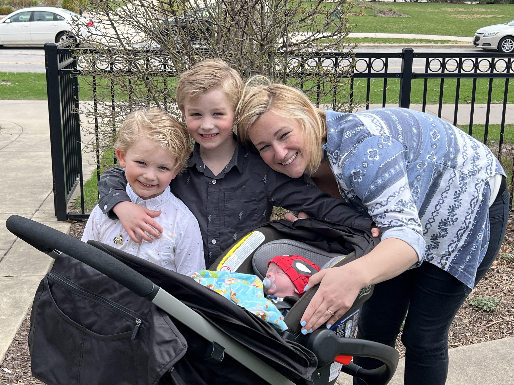
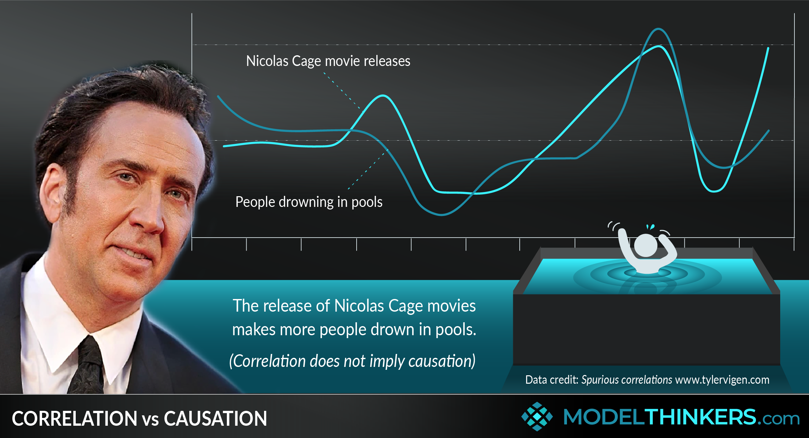

```{r setup, include=FALSE} 
options(htmltools.dir.version = FALSE)
library(knitr)
library(tidyverse)
library(huxtable)
library(data.table)
library(xaringanExtra)
library(icons)

# set default options
opts_chunk$set(echo=FALSE,
               collapse = TRUE,
               fig.width = 7.252,
               fig.height = 4,
               dpi = 300)

# set engines
knitr::knit_engines$set("markdown")

xaringanExtra::use_tile_view()
xaringanExtra::use_panelset()
xaringanExtra::use_clipboard()
xaringanExtra::use_webcam()
xaringanExtra::use_scribble()
xaringanExtra::use_broadcast()
xaringanExtra::use_share_again()
xaringanExtra::style_share_again(
  share_buttons = c("twitter", "linkedin", "pocket")
)
```

```{r load_refs, include=FALSE, cache=FALSE}
library(RefManageR)
BibOptions(check.entries = FALSE,
           bib.style = "authoryear",
           style = "markdown",
           hyperlink = FALSE,
           dashed = TRUE)
bib <- ReadBib("references.bib", check = FALSE)

print_bib_rmd <- function(bib, .opts = list(), start = 1, stop = NULL, decreasing = FALSE) {

    bib <- sort(bib, decreasing = FALSE)

    if (!length(bib)) {
        return(bib)
    }

    if (identical(class(bib), "bibentry")) {
        bib <- as.BibEntry(bib)
    }

    keys <- unlist(bib$key)
    ind <- keys %in% names(.cites$indices)

    if (!any(ind)) {
        message("You haven't cited any references in this bibliography yet.")
        return()
    }

    if (length(.opts$bib.style)) {
      bibstyle <- .opts$bib.style
    } else {
      bibstyle <- .BibOptions$bib.style
    }

    if (length(.opts$cite.style)) {
      citestyle <- .opts$cite.style
    } else {
      citestyle <- .BibOptions$cite.style
    }

    if (length(.opts$style)) {
      style <- .opts$style
    } else {
      style <- .BibOptions$style
    }

    bib <- bib[[ind]] # gets citations to print

    if (bibstyle == citestyle) {
        if (bibstyle == "numeric") {
            if (length(bib) == length(.cites$labs)) {
                bib <- bib[[names(.cites$labs)]]
                .opts$sorting <- "none"
                bib$.index <- structure(.cites$labs, names = NULL)
            }
        } else { 
          bib$.index <- .cites$labs[keys[ind]]
        }
    }

    if (length(.opts)) {
        old.opts <- BibOptions(.opts)
        on.exit(BibOptions(old.opts))
    }

    if (style == "yaml") {
        cat("\n---\nnocite:", sQuote(paste0(paste0("@", names(.cites$indices)), 
            collapse = ", ")))
        cat("\n...  \n\n")
    }
    if (is.null(stop)) {
      stop <- length(bib)
    } 
    bib <- bib[start:stop]
    print(bib)
}

environment(print_bib_rmd) <- asNamespace("RefManageR")

```

# Agenda
- Introductions

- Course Admin

- **Why is the Army making me take this course?**

- Causal Inference Primer
  - Why No Computers in the Classroom?

???

Feel:   Excited to come back, comfortable
Know:   Expectations, Framework for Decision Making and Human Behavior
Do:     Read Articles and Argue for Causality vs. Correlation

  
---
# This is me...

.pull-left[
```{r fam1, out.width='80%', fig.align='center'}
knitr::include_graphics("img/IMG_1157.jpg")
```
]

.pull-right[
```{r fam2, out.width='70%', fig.align='center'}

```

```{r fam3, out.width='70%', fig.align='center'}

```

]


---
# Introductions

- Name

- Hometown

- Major

- What do you do here other than school?

- Favorite TV Show or Book?

- Favorite childhood movie?

---
# Admin
.panelset[
.panel[.panel-name[Schedule]
.pull-left[
3 Blocks
  - MICRO 1: Consumers
  
  - MICRO 2: Firms
  
  - Macroeconomics
]

.pull-right[
Point Breakdown

|                                         |
|----------------------------:|:---------:|
|     Pre-Class Assignments   |     100   |
|     Problem Sets x 6        |     150   |
|     Paper                   |     70    |
|     WPR x 3                 |     405   |
|     TEE                     |     225   |
|     Instructor Points       |     50    |
| **TOTAL**                     | **1000** |
]
]<!---->

.panel[.panel-name[Class Policies]

- No computers (typing), digital pens on tablets OK

- No bathroom breaks, leaving forfeits the lesson

- No standing up, figure out how to stay seated and awake

- AI - schedule via email
  - Send three times and question
  
- Late Work - 10% per day
  - No credit after I hand back solutions
  - No late CENGAGE assignments
  
- Handouts - Based Class
  - Posted on canvas by 1700 day prior

- Assignments submitted online through Canvas
  
]<!---->

.panel[.panel-name[Section Marcher]
Duties Include:

- Attendance and accountability report
- Inspecting the class and enforcing standards
  - Uniforms / Hair
  - Backpacks
  - Food / Drink
- Collecting Assignments
- Dispersing Materials

.center[For ideas about how to make peer corrections check out *How to Win Friends and Influence People* by Dale Carnegie]

]<!---->

.panel[.panel-name[Expectations]
What you can expect from me:
- Committed to showing you the science as well as the art of economics.

- If I don't know the answer to a question, I'll find it. Try me. 

- Plenty of people here to talk Army, but I'm the only one here to talk economics.

.center[*This may be the only economics course you ever take, so I will prioritize the conversation accordingly.*]
]<!---->
]<!----End of Panel Set---->

---
class: inverse, center, middle

# Why is the Army making me take this course?

.pull-left[]
.pull-right[]

---
# What is economics?

.center[
"If you only like philosophy, then be a philosopher. If you only like history, then be a historian. If you only like mathematics, then be a mathematician. But if you like all of those things, you should be an economist."

*Tim S. Fuerst*
]

.center[
“The ideas of economists and political philosophers, both when they are right and when they are wrong are more powerful than is commonly understood. Indeed, the world is ruled by little else. Practical [thinkers], who believe themselves to be quite exempt from any intellectual influences, are usually slaves of some defunct economist.”

*John Maynard Keynes*
]

---
# The Economic Leader

.center[Economics is the study of decision-making ... a discipline focused on the optimal allocation of scarce resources that have alternate uses.

Leaders face scarcity in each decision – scarcity in time, people, and resources that have different uses. Leaders seek to allocate resources to their highest valued use.

As such, leadership and economics go hand in hand. **Great leaders are good economists (even when they don’t realize it).**

They realize that correlation does not equal causation. They appreciate the assumptions and associated limitations in the models and perspectives that they use to view the world. 

Leaders are forced to deal with the messy reality, and they recognize that their own biases can influence decision-making.]

---
# Economic Thinking
### Decisions need to be made on the margin...

Sir / Ma'am, we need to expand the officer corps. Where should we commission more officers from?
1. West Point
2. ROTC (with scholarship)
3. ROTC (no scholarship)
4. OCS (college grad)
5. OCS (enlisted soldier)

---
# Economic Thinking
### The prisoner's dilemma

Two cadets get accused of cheating. The instructor separates the two and explains that he will punish only the one who copied the other's work. If both do not blame the other, they will have to redo a different assignment. If one cadet blames the other and the other admits, the one who is caught will get turned in for an honor board. If they both blame the other, they both get zeros on the assignment. 

.center[**How does this situation play out?**]

---
# Causal Inference

Economists were among the first "data-scientists"

"Machine learning" and "big data" use algorithms and patterns within data to predict out of sample.

Economists use data and models to find "causal effects" (i.e. "x" caused "y")

--

.center[
```{r corr, out.width='70%', fig.align='center'}

```
]

---
#Causal Inference
To find causal effects, economists rely on **natural experiments** or **randomized control trials**

Within these experiments, economists apply statistical techniques in the form of "regressions" to estimate specific effects.

The key challenge within this analysis is to eliminate "selection" and show that the treatment caused the outcome]

--

.center[.black[*If this interests you, check out Mastering Metrics by Josh Angrist or Causal Inference: The Mixtape by Scott Cunningham*]]

.pull-left[.center[
```{r mm, out.width='30%', fig.align='center'}
knitr::include_graphics("img/mm.jpg")
```
]]

.pull-right[.center[
```{r ci, out.width='30%', fig.align='center'}
knitr::include_graphics("img/ci.jpg")
```
]]


---
# Why no computers in the classroom?

Everyone cares about education. Economists call this "human capital"

Common belief is more education leads to more income

More efficient education produces more income

</br></br>

.big[.center[Technology improves everything, right?]]

---
# Why no computers in the classroom?

.black[.center[`r Citet(bib, "carter2017_eer")` test this...]]

--

Randomly assigned all cadets taking SS201 to three groups:
  1. Unfettered Computer / Tablet Access
  2. Computer / Tablet Access if "Face-Up"
  3. No tech

--
</br></br>

.center[**Does technology improve learning and retention?**]

---
# Why no computers in the classroom?

```{r no_comp, out.width='80%', fig.align='center'}
knitr::include_graphics("img/no_comp.png")
```

---
# Next time...

- Handout Posted
- Chapter 2 (Including Appendix) 
- Chapter 3 

---
# Computer Stuff

.center[**Cengage**]

H2 - MTPP2D4ZM4XW

I2 - MTPQXG0ZFGRD

J2 - MTPP3QNZF8R8

K2 - MTPPGN6ZMNJH

.center[**Canvas**]

Course Key - J3BR7L

https://canvas.instructure.com/register


