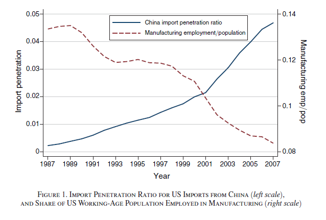
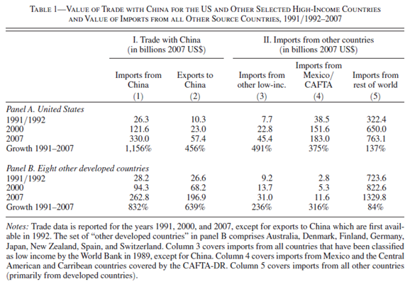
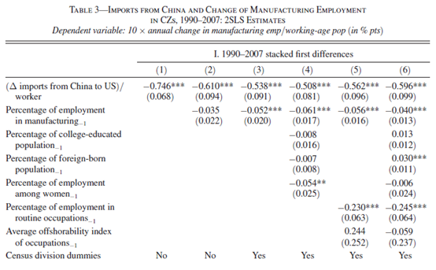

```{r setup, include=FALSE}
knitr::opts_chunk$set(
	cache = TRUE, 
	echo = FALSE, 
	warning = FALSE,
	message = FALSE,
	fig.align = 'center',
	out.width = '100%',
	dpi=300
	)
```

```{r libs, cache=FALSE, message=FALSE}
library(data.table)
library(ggplot2)
library(forcats)
library(kableExtra)
```


\fancyhf{}
\begin{center}
    \Large
    \textbf{
    \textit{SS201: Principles of Economics} \\ 
    AY 23-2 \\ 
    }
    Lesson 10: Trade Theories and Restrictions
\end{center}
\fancyfoot[C]{\thepage}

# Review {#sec:review}

Indicate the answer choice that best completes the statement or answers the question.

1. This concept forms the basis for trade.
    a. Substitution Effect
    b. Price Elasticity of Demand
    c. Absolute Advantage
    d. Comparative Advantage

\vspace{0.5cm}

2. Minimum wage is an example of a 
    a. Tax on Consumers
    b. Price Floor
    c. Price Ceiling
    d. Rent Subsidy

\vspace{0.5cm}

3. Deadweight loss represents 
    a. Excess within a market
    b. Market inefficiency
    c. Inelastic demand and elastic supply
    d. A surplus of demand and shortage of supply

\vspace{0.5cm}

4. A positive supply shock within any market will result in
    a. a new equilibrium quantity that is higher and lower price.
    b. a new equilibrium quantity that is lower and higher price.
    c. a new equilibrium price and quantity, but it is uncertain which direction both move.
    d. a new equilibrium quantity that is lower and lower price. 

\vspace{0.5cm}

\pagebreak

# Bottom Line Up Front {#sec:bluf}
Everyone does not benefit from trade. Our model predicts definite winners and losers. For policy and decision-makers, knowing who these agents are and the relative magnitudes are critical for effective decision-making.

# Trade, Tariffs, and Quotas {#sec:trade}

\hspace{0.5cm}  \begin{minipage}[t]{0.55\textwidth}
    \vspace{0pt}
Will Hunting loves apples and caramels. Suppose that the market for caramels sold in 1 lb packages is given by the equations below:
    
$$Q_D = 10,000-400P$$
$$Q_S = \frac{400p-2000}{3}$$
\end{minipage}
\hfill
\begin{minipage}[t]{0.35\textwidth}
    \vspace{0pt}
    \centering
    \includegraphics[width=\linewidth]{img/will.jpg}
\end{minipage}

\vspace{1cm}

1. Solve for the market equilibrium, price, and calculate the point elasticities for supply and demand at this equilibrium. \vspace{5cm}

\pagebreak

2. Let’s assume now that the world price for these caramels is \$20. Plot the graph of this market below, with the domestic equilibrium price and quantity, world price, and discuss who wins and loses from trade.

```{r g1, out.width='50%', fig.align='left'}
knitr::include_graphics("img/grid.png")
```

3. Let’s assume now that the world price for these caramels is \$16. Plot the graph of this market below, with the domestic equilibrium price and quantity, world price, and discuss who wins and loses from trade.

```{r g2, out.width='50%', fig.align='left'}
knitr::include_graphics("img/grid.png")
```

\pagebreak

4. The U.S. caramel industry has a surprisingly powerful lobby and can push through legislation that promotes protectionism. Ultimately, they lobby for a $2 tariff on imported caramel. Draw this tariff on the graph above for question 3, and label the government revenue, deadweight loss, producer surplus, and consumer surplus. Who are the winners and losers from this tariff? \vspace{6cm}

5. Solve for the amount of caramels imported before and after the tariff. \vspace{8cm}
 
6. Say instead, the government wants to consider implementing an import quota on caramels instead. How is this different and similar to a tariff? 

\pagebreak 

7. Now let’s assume that the government is considering whether to raise money through a tariff or a quota. With a quota, the government is going to sell licenses to sellers willing to pay for the right to import caramel. Assume that the government is only going to allow 1,000 lbs of caramel to be imported and they are going to sell licenses that enable producers to import 10 lbs of caramel. How much would the government have to charge to be just as well off as the $4 tariff? Could the government just charge the tariff price that the quota predicts? Graph how this quota would look below.

```{r g3, out.width='50%', fig.align='left'}
knitr::include_graphics("img/grid.png")
```

\pagebreak

# How does trade affect labor markets? {#sec:labor}

**Autor, Dorn, and Hansen (2013)** - *The China Syndrome: Local Labor Market Effects of Import Competition in the United States*

```{r adh1, out.width='80%', fig.align='center'}

```

```{r adh2, out.width='80%', fig.align='center'}

```

```{r adh3, out.width='100%', fig.align='center'}

```
