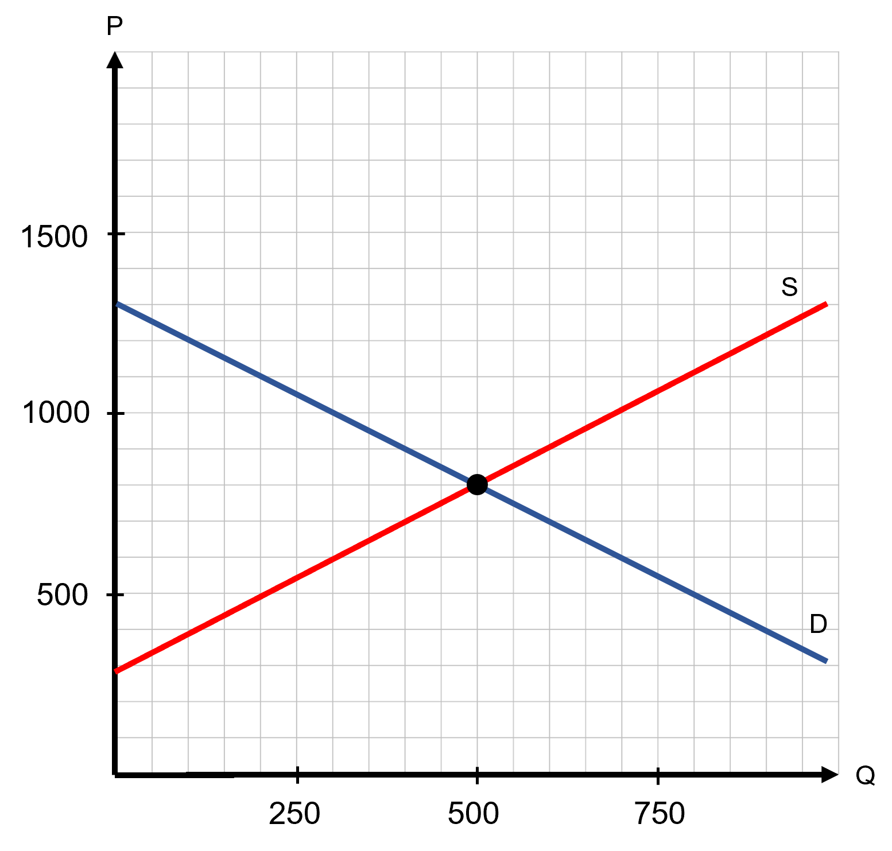
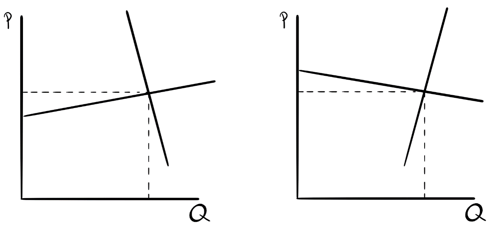
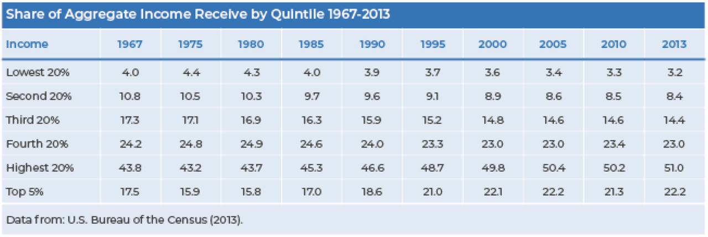
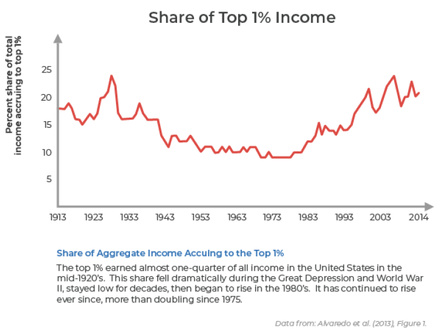

```{r setup, include=FALSE}
knitr::opts_chunk$set(
	cache = TRUE, 
	echo = FALSE, 
	warning = FALSE,
	message = FALSE,
	fig.align = 'center',
	out.width = '100%',
	dpi=300
	)
```

```{r libs, cache=FALSE, message=FALSE}
library(data.table)
library(ggplot2)
library(forcats)
library(kableExtra)
```


\fancyhf{}
\begin{center}
    \Large
    \textbf{
    \textit{SS201: Principles of Economics} \\ 
    AY 23-2 \\ 
    }
    Lesson 12: Externalities
\end{center}
\fancyfoot[C]{\thepage}

# Review {#sec:review}

For each question below, select either True, False, or Uncertain. Then in the space provided, briefly justify your answer (one or two sentences maximum).


\begin{center}
True \hspace{3cm} False \hspace{3cm} Uncertain
\end{center}

1. Deadweight loss only represents transactions within a market that are occurring but should not be.

  \vspace{3cm}

\begin{center}
True \hspace{3cm} False \hspace{3cm} Uncertain
\end{center}

2. If a country is a net exporter of a certain good, then the quantity of exports is equal to $Q_d$ - $Q_s$.

  \vspace{3cm}

\begin{center}
True \hspace{3cm} False \hspace{3cm} Uncertain
\end{center}

3. Import quotas cause higher domestic prices than tariffs.

  \vspace{3cm}

\begin{center}
True \hspace{3cm} False \hspace{3cm} Uncertain
\end{center}

4. In (perfectly) competitive markets, there are many buyers and sellers, identical goods, and large enough firms can affect price.

  \vspace{3cm}

\pagebreak

# Bottom Line Up Front {#sec:bluf}
Free markets are efficient, but they sometimes promote unintended consequences called externalities. Under certain circumstances, some inefficiencies introduced into a market can correct for negative and encourage positive externalities. Ultimately, being able to assign societal value to various goods is often the most important consideration for developing these policies.

# Buyers vs. Seller Taxes {#sec:bstax}

\hspace{0.5cm}  \begin{minipage}[t]{0.55\textwidth}
    \vspace{0pt}
Joseph Cooper is a former NASA pilot that now owns and operates a corn farm. He models the market for corn with the equations:
    
$$Q_D = 1300-P$$
$$Q_S = -300+P$$
\end{minipage}
\hfill
\begin{minipage}[t]{0.35\textwidth}
    \vspace{0pt}
    \centering
    \includegraphics[width=\linewidth]{img/interstellar.png}
\end{minipage}

\vspace{1cm}

1. Graph this market below. Label your axes and all intercepts. Solve for the equilibrium price and quantity and show it on the graph.

```{r g1, out.width='50%', fig.align='left'}
knitr::include_graphics("img/grid.png")
```

2. Calculate the consumer, producer, and total surplus. \vspace{3cm}

3. Now suppose that the government applied a \$200 per unit tax on the *sellers* of corn. Draw a small graph below to show which curve shifts in response to this tax. Solve algebraically for the after-tax price received by the sellers, the price paid by buyers, and quantity sold.

```{r g2, out.width='50%', fig.align='left'}
knitr::include_graphics("img/grid.png")
```

4. Now suppose that the government applied a \$200 per unit tax on the *buyers* of corn. Draw a small graph below to show which curve shifts in response to this tax. Solve algebraically for the after-tax price received by the sellers, the price paid by buyers, and quantity sold.

```{r g3, out.width='50%', fig.align='left'}
knitr::include_graphics("img/grid.png")
```

\pagebreak

5. Using the tax-wedge method, show the impact of a $200 tax on the market for corn on your figure from part 1 (given below). Label the values of the after-tax quantity, the price buyers pay, and the price sellers receive. Calculate and identify on the graph consumer surplus, producer surplus, and government tax revenue. Calculate the total social surplus.

```{r g4, out.width='100%', fig.align='center'}

```

\pagebreak

6. Why is the total social surplus different in questions 1 and 5? What do we call this difference? Label the area of the graph associated with this difference. \vspace{3cm}

7. Define tax incidence. What is the tax incidence on buyers and sellers in this market? Who bears the larger burden of the tax? \vspace{3cm}

\pagebreak

# Taxes and Elasticity {#sec:taxelast}

```{r taxelast, out.width='100%', fig.align='center'}

```

1. Who bears the greater burden of the tax in the market on the left? On the right? \vspace{3cm}

2. Complete the statement: ``The tax burden will fall more heavily on buyers when..'' \vspace{3cm}

Suppose the market for drones is given by the equations:
$$Q_D = 20-2P$$
$$Q_S = \frac{1}{2} P$$

\hspace{1cm} 3. Solve for the equilibrium price and quantity. Suppose we want to evaluate the effect of a \$4 per unit tax placed on the sellers of this good.  Solve (using algebra) for the new equilibrium quantity ($Q^T$), buyer price ($P_D$), and price sellers receive ($P_S$), from a \$4 per unit tax? \vspace{3cm}

4. Now graph the market, draw your solution on the graph and check that it is reasonable. What is the tax incidence on sellers? On buyers? Who bears more of the tax burden?

```{r g5, out.width='50%', fig.align='left'}
knitr::include_graphics("img/grid.png")
```

5. Calculate the POINT ELASTICITY of supply and demand at the original market equilibrium. How do these elasticities relate to your answer from question 4? \vspace{3cm}

\pagebreak

# Efficiency vs. Equity {#sec:equitvseffic}

Suppose the government places a $10/unit tax on a good with perfectly inelastic demand.

1. What happens to the market quantity sold? What happens to the price buyers pay? What happens to the price sellers receive? \vspace{3cm}

2. Does this tax generate a deadweight loss? \vspace{3cm}
 
3. Is this type of tax efficient? \vspace{3cm}

4. Is this type of tax likely to be equitable? (Hint: think about what types of goods tend to have inelastic demand) \vspace{3cm}

\pagebreak

# Why Tax? {#sec:whytax}

```{r grub1, out.width='100%', fig.align='center'}

```

```{r grub2, out.width='100%', fig.align='center'}

```

```{r grub3, out.width='100%', fig.align='center'}

```