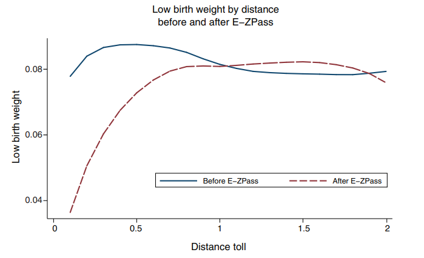
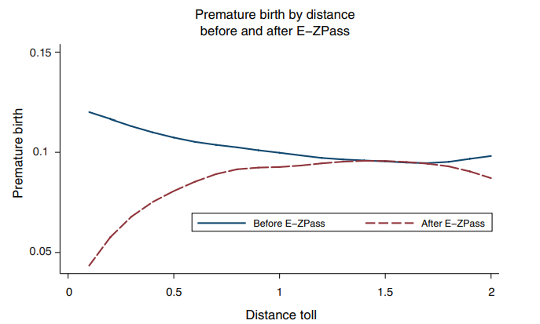

```{r setup, include=FALSE}
knitr::opts_chunk$set(
	cache = TRUE, 
	echo = FALSE, 
	warning = FALSE,
	message = FALSE,
	fig.align = 'center',
	out.width = '100%',
	dpi=300
	)
```

```{r libs, cache=FALSE, message=FALSE}
library(data.table)
library(ggplot2)
library(forcats)
library(kableExtra)
```


\fancyhf{}
\begin{center}
    \Large
    \textbf{
    \textit{SS201: Principles of Economics} \\ 
    AY 23-2 \\ 
    }
    Lesson 12: Externalities
\end{center}
\fancyfoot[C]{\thepage}

# Review {#sec:review}

For each question below, select either True, False, or Uncertain. Then in the space provided, briefly justify your answer (one or two sentences maximum).


\begin{center}
True \hspace{3cm} False \hspace{3cm} Uncertain
\end{center}

1. Deadweight loss only represents transactions within a market that are occurring but should not be.

  \vspace{2cm}

\begin{center}
True \hspace{3cm} False \hspace{3cm} Uncertain
\end{center}

2. If a country is a net exporter of a certain good, then the quantity of exports is equal to $Q_d$ - $Q_s$.

  \vspace{2cm}

\begin{center}
True \hspace{3cm} False \hspace{3cm} Uncertain
\end{center}

3. Import quotas cause higher domestic prices than tariffs.

  \vspace{2cm}

\begin{center}
True \hspace{3cm} False \hspace{3cm} Uncertain
\end{center}

4. In (perfectly) competitive markets, there are many buyers and sellers, identical goods, and large enough firms can affect price.

  \vspace{2cm}

\pagebreak

# Bottom Line Up Front {#sec:bluf}
Free markets are efficient, but they sometimes promote unintended consequences called externalities. Under certain circumstances, some inefficiencies introduced into a market can correct for negative and encourage positive externalities. Ultimately, being able to assign societal value to various goods is often the most important consideration for developing these policies.

# Externalities {#sec:intuitx}

1. Would you care if the cadets next door to you...

  a. Purchased a new couch?
  
  b. Purchased a microwave?
  
  c. Purchased a car?
  
  d. Purchased an Alexa, Google dot, or another smart device that can play music?
  
  e. Had a really loud alarm clock that they ``snoozed''?
  
  f. Smoked cigarettes?
  
  
2. Define an externality. What is it and how does this add to our model of consumer choice theory? \vspace{3cm}


3. Graph a market with positive externalities below. What new curve do we add to this and from who's perspective is it?

```{r g1, out.width='50%', fig.align='left'}
knitr::include_graphics("img/grid.png")
```

4. Graph a market with negative externalities below. What new curve do we add to this and from who's perspective is it?

```{r g2, out.width='50%', fig.align='left'}
knitr::include_graphics("img/grid.png")
```

\pagebreak

# Correcting Externalities {#sec:correct}

I always hated studying in the barracks because it was so loud. Upperclass cadets were always running around screaming or doing dumb things. Heaven forbid some cadet decided to go streaking across Central or North Area; the barracks would erupt!

Let's say that in order to correct the noisiness in the barracks, you get to be the Comm for a day and you are considering the following policies:

\hspace{0.5cm}  \begin{minipage}[t]{0.45\textwidth}
    \vspace{0pt}
- Restricting all cadets to their rooms during ESP.\vspace{0.5cm}

- Making cadets pay for the right to leave their rooms and talk outside of them during ESP.\vspace{0.5cm}

- Giving each cadet two ``hall passes" per week where they can leave their room during ESP.\vspace{0.5cm}

- Allow cadets of all classes to rent spaces/rooms in the barracks or library and set their own rules during ESP.\vspace{0.5cm}
\end{minipage}
\hfill
\begin{minipage}[t]{0.35\textwidth}
    \vspace{0pt}
\end{minipage}


1. Classify each of the following as either a command and control policy, pigouvian tax, cap and trade system, or as a private solution. \vspace{3cm}

2. Which policy does the Coase Theorem apply? What does this theorem say? \vspace{3cm}

\pagebreak

# Externalities in Practice {#sec:board}

Say the market for jet-skis in Gotham Harbor are represented by the equations below:
$$Q_D=80-P$$
$$Q_s=20+P$$

1. Graph this market below. What is the private market equilibrium price and quantity?

```{r g3, out.width='50%', fig.align='left'}
knitr::include_graphics("img/grid.png")
```

2. Suppose that each day of jet-ski use incurs $20 per unit cost on society through pollution, noise, and scaring fish away from nearby fishermen. Label the social value and social cost curves, drawing any new curves needed.

3. What is the efficient quantity of jet skis rented? Is there deadweight loss? If so, shade it in on the figure you have drawn and calculate its dollar value. \vspace{3cm}


4. Suppose the Gotham City government imposed a $30 per unit tax on jet ski rentals. What is the quantity sold now, and how does it compare to the private market's original equilibrium? Is there a deadweight loss? And if so, what is its dollar value?  \vspace{3cm}

\pagebreak

Now let's talk about pollution. Each of the four firms below wishes to dump two barrels’ worth of waste chemicals in Gotham Harbor. The price each firm would incur to avoid polluting is represented by the below table:

\begin{center}
\begin{tabular}{c|c}
Firm &	Cost per 1 Barrel \\
\hline
Firm A	& \$ 9 million \\
Firm B	& \$ 4 million \\
Firm C	& \$ 1 million \\
Firm D	& \$ 6 million \\
\end{tabular}
\end{center}

1. Suppose the government wishes to impose a tax in order reduce the total amount of pollution by half. At what level should the government set the tax? What is the total cost of firms to avoid polluting? \vspace{3cm}

2. Suppose the government gives each firm a permit to dump one barrel of waste into the river, but allows the firms to trade these permits at any price among themselves. At what price will the permits trade? Which firms will end up with the permits? What will be the total cost of pollution avoidance? \vspace{3cm}

3. Suppose instead the government gives each firm one permit, but does not allow them to trade. What is the total cost of pollution avoidance in this case? \vspace{3cm}

4. What policy would you choose as a government planner and why? \vspace{3cm}

\pagebreak

# Are there really pollution externalities?

\centering
Currie and Reed (2011) - \textit{``Traffic Congestion and Infant Health: Evidence from E-ZPass"}

```{r ext1, out.width='100%', fig.align='center'}

```

```{r ext2, out.width='100%', fig.align='center'}

```
