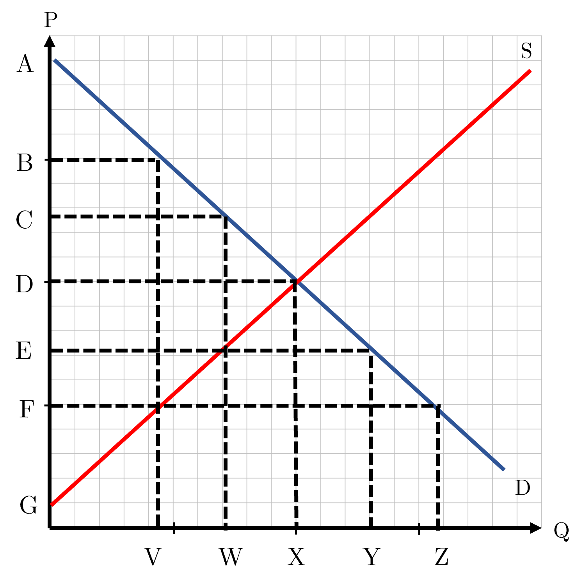

```{r setup, include=FALSE}
knitr::opts_chunk$set(
	cache = TRUE, 
	echo = FALSE, 
	warning = FALSE,
	message = FALSE,
	fig.align = 'center',
	out.width = '100%',
	dpi=300
	)
```

```{r libs, cache=FALSE, message=FALSE}
library(data.table)
library(ggplot2)
library(forcats)
library(kableExtra)
```


\fancyhf{}
\begin{center}
    \Large
    \textbf{
    \textit{SS201: Principles of Economics} \\ 
    AY 23-2 \\ 
    }
    Lesson 13: Public Goods and Common Resources
\end{center}
\fancyfoot[C]{\thepage}

# Review {#sec:review}

Indicate the answer choice that best completes the statement or answers the question.

```{r sandd, out.width='60%', fig.align='center'}

```

\hspace{0.5cm}  \begin{minipage}[t]{0.45\textwidth}
    \vspace{0pt}
1. Given a world price of $D$, consumer surplus is represented by the expression:
    \begin{enumerate}
        \item $\frac{1}{2}CX$
        \item $\frac{1}{2}(A-C)W$
        \item $\frac{1}{2}(A-D)X$
        \item $\frac{1}{2}(A-E)Y$
    \end{enumerate}
\vspace{0.5cm}

2. Given a tax of $(B-F)$, the deadweight loss is represented by the expression
    \begin{enumerate}
        \item $\frac{1}{2}(C-F)X$
        \item $(\frac{(B-F)+(A-G)}{2})V$
        \item $(\frac{(C-E)+(C-F)}{2})V$
        \item $\frac{1}{2}(B-F)(X-V)$
    \end{enumerate}
\end{minipage}
\hfill
\begin{minipage}[t]{0.45\textwidth}
    \vspace{0pt}
3. Given a tax of $(B-F)$, the total market surplus is represented by the expression
    \begin{enumerate}
        \item $\frac{1}{2}(C-F)X$
        \item $(\frac{(B-F)+(A-G)}{2})V$
        \item $(\frac{(C-E)+(C-F)}{2})V$
        \item $\frac{1}{2}(B-F)(X-V)$
    \end{enumerate}
\vspace{0.5cm}

4. Given a price floor of $E$, the equilibrium price will now be:
    \begin{enumerate}
        \item $B$
        \item $C$
        \item $D$
        \item $E$
    \end{enumerate}
\vspace{0.5cm}
\end{minipage}

\pagebreak

# Bottom Line Up Front {#sec:bluf}
Markets do not do well at allocating goods without prices. Without prices, goods are abused, overused, and under-provided. Governments, in these instances, can enforce property rights, allocate prices, and help improve market efficiency and allocation of these goods.

# A Public Goods Game {#sec:intuitx}

Each of you will be given four cards: two of these cards are red (hearts or diamonds), and two of these cards are black (clubs or spades). All of your cards will be the same number. The exercise will consist of a number of rounds. When a round begins, I will come to each of you in order, and you will play two of your four cards by placing these two cards face down on top of the stack in my hand. 

In each round, for each red card that you keep you will earn four points for the round, and for each black card that you keep you will earn nothing. Red cards that are placed on the stack affect everyone's points in the following manner. I will count up the total number of red cards in the stack and everyone will earn this amount of points. Black cards placed on the stack have no effect on the count. When the cards are counted, I will not reveal who made which decisions. 

Everyone will start each round with two red and two black cards.

We will play as many rounds as I see fit, and have a quick discussion as a class afterwards. At the end of the game, everyone will earn a piece of candy for every 10 points they earned.

Record your earnings below:

\begin{center}
\resizebox{0.9\textwidth}{!}{
\begin{tabular}{c|c|c|c|c}
Round &	Red Cards Kept (A) & Red Cards in Class Stack (B) & Earnings this Round (4*A + B) & Cumulative Earnings \\
\hline
1	& & & & \\
2	& & & & \\
3	& & & & \\
4	& & & & \\
5 & & & & \\
6 & & & & \\
7 & & & & \\
8 & & & & \\
\end{tabular}}
\end{center}
Questions for discussion:

1. How much candy would everyone gotten if no-one contributed? If everyone contributed every round? What actually happened? \vspace{1cm}

2. What is the \textit{socially efficient} outcome of the game? \vspace{2cm}

3. What is the \textit{equilibrium} outcome of the game? \vspace{2cm}

4. What do we call people who earn points from their classmates’ contributions but don’t contribute? \vspace{1cm}

\pagebreak

# Public Goods and Commmon Resource Terminology {#sec:terms}

1. Define an excludable good. \vspace{2cm}

2. Define a rival good. \vspace{2cm}

3. Fill in the table below with the type of good that it is and two examples.

```{r goods, out.width='80%', fig.align='center'}
knitr::include_graphics("img/goods_table.png")
```


4. Define the “Free Rider Problem” and give two examples, one from Cadet-Life and one that exists outside of the gates of West Point. \vspace{2cm}

5. Define the “Tragedy of the Commons” and give two examples, one from Cadet-Life and one that exists outside of the gates of West Point. \vspace{2cm}

\pagebreak

# Board Problem {#sec:boards}

\hspace{0.5cm}  \begin{minipage}[t]{0.55\textwidth}
    \vspace{0pt}
In Silvertown, there are a lot of fireworks stands. The state allows everyone and anyone to shoot off fireworks all year round.  Due to the noise, the fires they cause, and the overall pollution, the city council models the social cost of these fireworks with the following equation:

$$Q_{SMC} = 40P - 520$$
    
\end{minipage}
\hfill
\begin{minipage}[t]{0.35\textwidth}
    \vspace{0pt}
    \centering
    \includegraphics[width=\linewidth]{img/dirt.jpg}
\end{minipage}


1. Assuming the supply and demand curves for fireworks kits are modeled by the equations below, graph and label the following within this market: 

    a. Private Marginal Cost Curve
    b. Social Marginal Cost Curve
    c. Private Marginal Benefit Curve
    d. Social Marginal Benefit Curve
    e. Deadweight Loss

$$Q_D = -4P+140$$
$$Q_s = 25P-150$$

```{r g3, out.width='50%', fig.align='left'}
knitr::include_graphics("img/grid.png")
```

\pagebreak

2. Calculate and label the market equilibrium price ($P_M$) and quantity ($Q_M$) and the socially efficient price ($P_{SOC}$) and quantity ($Q_{SOC}$). \vspace{3cm}

3. Calculate the point elasticity at the market equilibrium. Should fireworks stands increase the price of a kit if they wanted to increase revenue? \vspace{3cm}


4. Calculate the area of the deadweight loss. What does this area to society represent?  \vspace{3cm}

5. Let's assume that Silvertown wanted to correct for this negative externality using a Pigouvian Tax. How much would they have to tax each fireworks kit to reach the desirable social outcome? Who bears more of this tax burden, consumers or producers? \vspace{3cm}

6. In weighing their options, Silvertown now wants to look at selling permits to allow fireworks stands to operate. How many permits should they offer, and at what price should they sell these to achieve the social outcome? \vspace{3cm}