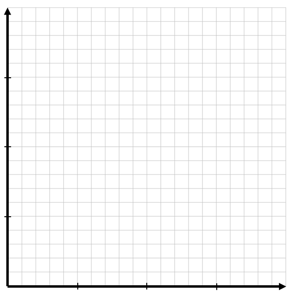

```{r setup, include=FALSE}
knitr::opts_chunk$set(
	cache = TRUE, 
	echo = FALSE, 
	warning = FALSE,
	message = FALSE,
	fig.align = 'center',
	out.width = '100%',
	dpi=300
	)
```

```{r libs, cache=FALSE, message=FALSE}
library(data.table)
library(ggplot2)
library(forcats)
library(kableExtra)
```


\fancyhf{}
\begin{center}
    \Large
    \textbf{
    \textit{SS201: Principles of Economics} \\ 
    AY 23-2 \\ 
    }
    Lesson 14: Costs of Production
\end{center}
\fancyfoot[C]{\thepage}

# Review {#sec:review}

For each question below, select either True, False, or Uncertain. Then in the space provided, briefly justify your answer (one or two sentences maximum).


\begin{center}
True \hspace{3cm} False \hspace{3cm} Uncertain
\end{center}

1. Excludable goods are those which people cannot be prevented from using.

  \vspace{3cm}

\begin{center}
True \hspace{3cm} False \hspace{3cm} Uncertain
\end{center}

2.	Private goods and common resources are goods which are considered rival in consumption.

  \vspace{3cm}

\begin{center}
True \hspace{3cm} False \hspace{3cm} Uncertain
\end{center}

3. Whichever agent, consumers or producers, that is more elastic bears more of the tax burden when an ad valorem tax is implemented.

  \vspace{3cm}

\begin{center}
True \hspace{3cm} False \hspace{3cm} Uncertain
\end{center}

4. The United States and Brazil both produce t-shirts and leather belts. The United States has the absolute advantage in producing both goods; therefore, the United States should not trade with Brazil for either of these goods.

  \vspace{3cm}

\pagebreak

# Bottom Line Up Front {#sec:bluf}
Markets do not do well at allocating goods without prices. Without prices, goods are abused, overused, and under-provided. Governments, in these instances, can enforce property rights, allocate prices, and help improve market efficiency and allocation of these goods.

# A Marginal Product of Labor Game {#sec:intuitx}

Congratulations! You all now work in my SS201 Forge! My Uncle Argyle recently passed and my friends Hamish, William, Stephen, and I recently inherited this blacksmith forge. I do not know much about running one of these things, so I first want to see how efficient we can be at making swords, and what the optimal number of laborers is. To make a sword, the iron must be taken from the ground and placed in the forge. 

```{r bh, out.width='100%', fig.align='center'}

```

We will experiment with how many workers are optimal for this process. I am going to start with 1 and progress to 10. We will have 30 second rounds to see how many swords we can make. We will record and plot the results below.
\hspace{0.5cm}  \begin{minipage}[t]{0.45\textwidth}
    \begin{center}    
    \vspace{0pt}
    \begin{tabular}{c|c}
    Workers &	Swords \\
    \hline
    1	&  \\
    2	&  \\
    3	&  \\
    4	&  \\
    5 &  \\
    6 &  \\
    7 &  \\
    8 &  \\
    9 & \\
    10 & \\
    \end{tabular}
    \end{center}
\end{minipage}
\hfill
\begin{minipage}[t]{0.45\textwidth}
    \vspace{0pt}
    \centering
    \includegraphics[width=.8\linewidth]{img/grid.png}
\end{minipage}
\vspace{0.5cm}

1. Why did our \textit{production function} of swords have this shape? Why does this make sense? \vspace{3cm}


2. Assuming we pay each laborer the same wage, what would our \textit{total cost curve} look like? What shape would it have? Graph it below.

```{r grid, out.width='50%', fig.align='center'}

```

\pagebreak

# Cost Terminology {#sec:costs}

Define the following and give an example of each for our blacksmith forge.

1. Fixed Cost (FC) & Average Fixed Cost (AFC) \vspace{2cm}

2. Variable Cost (VC) & Average Variable Cost (AVC)  \vspace{2cm}

3. Total Costs (TC) & Average Total Cost (ATC)  \vspace{2cm}

3. Marginal Cost (MC)  \vspace{2cm}

4. Sunk Cost  \vspace{2cm}

Let's simplify the cost structure of the blacksmith forge. Assume that the weekly rent on our space is \$500, and that this is our only fixed cost. Assume that labor is our only variable cost, and we can hire workers at \$10 an hour. Weekly sword production as a function of workers is given below. 

5. Complete the table.

\begin{center}
\resizebox{0.95\textwidth}{!}{
                \begin{tabular}{C{.08\linewidth}|C{.08\linewidth}|C{.08\linewidth}|C{.08\linewidth}|C{.08\linewidth}|C{.08\linewidth}|C{.08\linewidth}|C{.08\linewidth}|C{.08\linewidth}|C{.08\linewidth}}
Labor & \multicolumn{1}{p{1.5cm}|}{\centering Q \\ (in 100's)} & \multicolumn{1}{p{1.5cm}|}{\centering FC \\ (in \$100)} & VC & TC & AFC & AVC & ATC & MC & MC (Calculus) \\
\hline
0	& 0 & & & &--- &--- &--- & ---& 0 \\
10	& 1 & & & & & & & &  1 \\
40	& 2 & & & & & & & &  6 \\
150	& 3 & & & & & & & &  17 \\
400 & 4 & & & & & & & &  34 \\
850 & 5 & & & & & & & &  57 \\
\end{tabular}}
\end{center}
\pagebreak 

6. What pattern do you observe in the MC column? How does this relate to question 1 on the front page? \vspace{2cm}

7. The table above was generated from the total cost function: $TC= Q^3- 2Q^2+ 2Q+5$. Using this function, derive expressions (in terms of Q) for ATC, AVC, AFC, and MC. \vspace{3cm}

8. A graph of our cost equations is given below. Label each curve (ATC, AVC, AFC, and MC).

```{r costs, out.width='100%', fig.align='center'}

```


9. Describe the shape of the ATC. Why does it have this shape? \vspace{2cm}

10.	What is the relationship between AFC, AVC, and ATC? \vspace{2cm}

11. Where does the MC curve cross the ATC curve? Why does this make sense?

\hspace{1.0cm}\begin{minipage}{0.9\textwidth}
Using your academic GPA as an example:

\begin{enumerate}
  \item If your GPA is a 3.5 and you get an A in this course, your GPA will go up / down.
  \item If your GPA is a 3.5 and you get a B in this course, your GPA will go up / down.
  \item If your GPA is a 2.5 and you get a B in this course, your GPA will go up / down.
\end{enumerate}

\vspace{1cm}

By the same logic, when MC $<$ ATC, ATC is \rule{4cm}{0.15mm} and when MC $>$ ATC, ATC is \rule{4cm}{0.15mm}. Thus, the MC always intersects the ATC at the \rule{4cm}{0.15mm}.
\end{minipage}

\pagebreak

# Profit {#sec:profit}

1. What is profit? Write an equation defining it. \vspace{2cm}

    Below is a graph of our ATC from above.

```{r prof, out.width='100%', fig.align='center'}

```

2. What is the ATC when Q=2? Suppose the we sold 2 (hundred) units at a price of \$5. Calculate our profit using the graph above. Shade in the profits as well. \vspace{3cm}


3. Derive an expression for profit in terms of ATC and Q.


