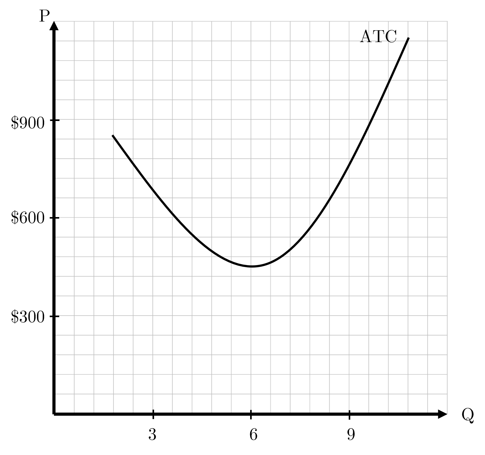
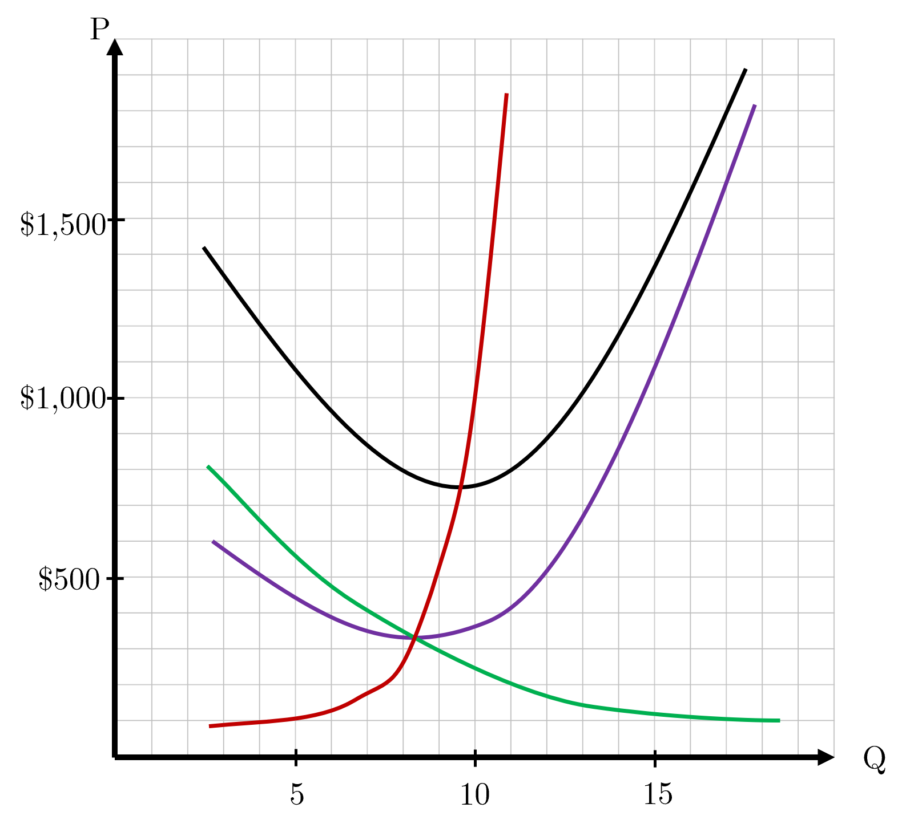
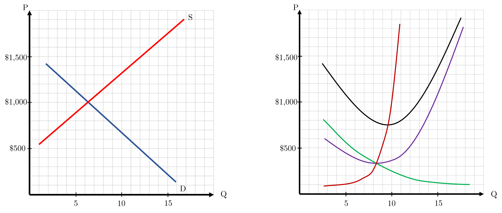
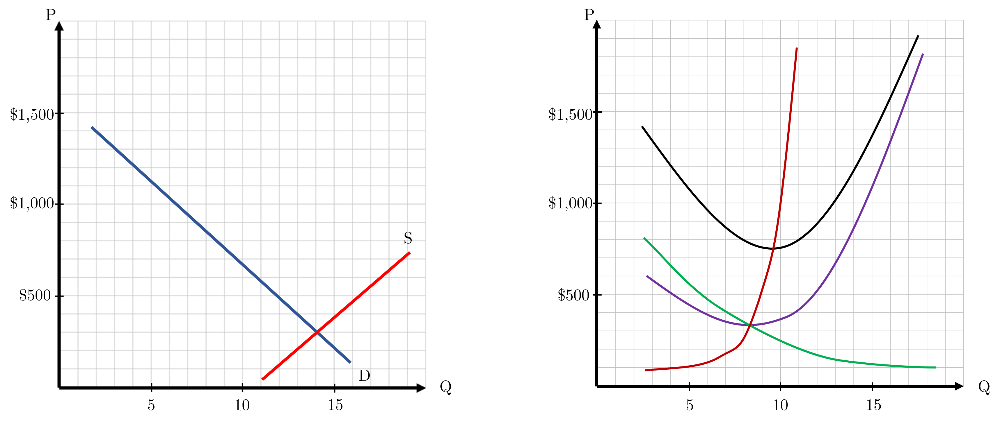

```{r setup, include=FALSE}
knitr::opts_chunk$set(
	cache = TRUE, 
	echo = FALSE, 
	warning = FALSE,
	message = FALSE,
	fig.align = 'center',
	out.width = '100%',
	dpi=300
	)
```

```{r libs, cache=FALSE, message=FALSE}
library(data.table)
library(ggplot2)
library(forcats)
library(kableExtra)
```


\fancyhf{}
\begin{center}
    \Large
    \textbf{
    \textit{SS201: Principles of Economics} \\ 
    AY 23-2 \\ 
    }
    Lesson 15: Firms in Perfect Competition
\end{center}
\fancyfoot[C]{\thepage}

# Review {#sec:review}

Indicate the answer choice that best completes the statement or answers the question.

1. Economic profit is represented by which expression below.
    a. Economic Profit = Total Revenue - Explicit Costs
    b. Economic Profit = Total Revenue - (Implicit Costs + Explicit Costs)
    c. Economic Profit = Accounting Profit - Explicit Costs
    d. Economic Profit = Accounting Profit - Implicit Costs

\vspace{0.5cm}

2. When long-run average total cost declines as output increases, there are said to be: 
    a. Economies of scale
    b. Diseconomies of scale
    c. Constant returns to scale
    d. Declining marginal costs

\vspace{0.5cm}

3. Which of the following is not a characteristic of a competitive market?
    a. There are many buyers and sellers in the market.
    b. The goods offered by the various sellers are largely the same.
    c. Firms can freely enter or exit the market.
    d. Firms have market power and can charge prices higher than market equilibrium.

\vspace{0.5cm}

4. A firm's total cost function is essentially the same as
    a. the sum of its implicit and explicit costs.
    b. the sum of its fixed and sunk costs.
    c. the sum of its marginal and variable costs.
    d. its explicit costs.

\vspace{0.5cm}

\pagebreak

# Bottom Line Up Front {#sec:bluf}
Using the definitions of costs from the previous lesson, firms will make decisions to either enter or exit a market. To understand these decisions and use our model to predict firm behavior, we must first add assumptions about competition within this market and describe how firms would act. Ultimately, perfect competition is the simplest case where firms can freely enter and exit, with little differentiation in goods and no effect on price.

# Profit Maximization {#sec:profit}

COL Benjamin Martin really likes making rocking chairs. By and large, these chairs are all very similar and have a price of \$600 per chair. To make these chairs, COL Martin rents a facility to do this wood-working, buys supplies, and hires labor.

```{r bh, out.width='100%', fig.align='center'}
knitr::include_graphics("img/colmartin.png")
```

1. While his marksmanship is impeccable (``aim-small, miss-small"), his bookkeeping is not all that great. Below are some of his costs, revenue, and profit. Complete the table below.
\vspace{0.5cm}
\begin{center}
\resizebox{0.95\textwidth}{!}{
                \begin{tabular}{C{.02\linewidth}|C{.08\linewidth}|C{.08\linewidth}|C{.08\linewidth}|C{.08\linewidth}|C{.08\linewidth}|C{.08\linewidth}|C{.08\linewidth}|C{.08\linewidth}}
Q & \multicolumn{1}{p{1.5cm}|}{\centering Total \\ Revenue} & \multicolumn{1}{p{1.5cm}|}{\centering Marginal \\ Revenue} & \multicolumn{1}{p{1.5cm}|}{\centering Variable \\ Cost} & \multicolumn{1}{p{1.5cm}|}{\centering Fixed \\ Cost} & \multicolumn{1}{p{1.5cm}|}{\centering Total \\ Cost} & \multicolumn{1}{p{1.5cm}|}{\centering Marginal \\ Cost} & Profit & \multicolumn{1}{p{1.5cm}}{\centering Marginal \\ Profit} \\
\hline
0	&  & --- & 0 & 3 & 3 &--- &--- & ---\\
\hline
1	&  & & 2 & 3 & 5 & & & \\
\hline
2	&  & &  &  & 8 & & & \\
\hline
3	&  & & 9 &  &  & & & \\
\hline
4   &  & &  &  & 17 & & & \\
\hline
5   &  & & 20 &  &  & & & \\
\hline
6   &  & &  &  & 30 & & & \\
\hline
7   &  & & 35 &  &  & & & \\
\end{tabular}}
\end{center}

\vspace{0.5cm}

2. What level should COL Martin produce at? Why? \vspace{3cm}

3. If one equation for profit is $\pi = P*Q - TC(Q)$, why does the above answer make sense mathematically? \vspace{5cm}

4. After seeing the table you completed above. COL Martin retools his production process, becoming more efficient, and models his Average Total Cost curve below. If he can sell a chair for \$600, depict the profit on the graph below if he sells at the profit-maximizing quantity from question 1.

```{r prof2, out.width='80%', fig.align='center'}

```

5. From the depiction above, what is another mathematically equivalent equation for $\pi = P*Q - TC(Q)$? \vspace{3cm}

# Perfect Competition / Competitive Markets {#sec:perf}

1. Short-Run vs. Long-Run. How do we draw the distinction between these two time periods? \vspace{2cm}


\begin{minipage}[t]{0.45\textwidth}
    \vspace{0pt}
    \centering
    \includegraphics[width=.45\linewidth]{img/charlotte.jpg}
\end{minipage}
\hfill
\begin{minipage}[t]{0.55\textwidth}
\vspace{0pt}
Charlotte Selton is in charge of a large wheat farm. The current market price per ton of wheat is \$1,000. Her farm's cost curves are depicted below. 
\end{minipage}

```{r perf1, out.width='80%', fig.align='center'}

```

2. Label the cost curves above and plot Charlotte's marginal revenue curve.\vspace{0.5cm}

3. How many tons of wheat should Charlotte produce? \vspace{3cm}

4. There have been many farmers move into Charlotte's region and the projected price of wheat per ton has dropped to \$500 per ton. She has already paid her property taxes for the year (\$10,000) and owns all her own equipment, so she has no other fixed costs. After running a wheat farm on this land for the past 20 years, she knows her average variable cost is roughly \$325 per ton and average fixed cost is \$300 per ton. Should she plant for the upcoming season or not? Graphically depict this decision on the cost curves below.

```{r perf2, out.width='80%', fig.align='left'}

```

5. What is the long-run price per ton that would force Charlotte to give up her wheat farm and exit the market? \pagebreak

6. Is there any chance for long-run economic profit for Charlotte? Why? Use the two graphs below to explain. 

```{r perf3, out.width='100%', fig.align='center'}

```

```{r perf4, out.width='100%', fig.align='center'}

```


