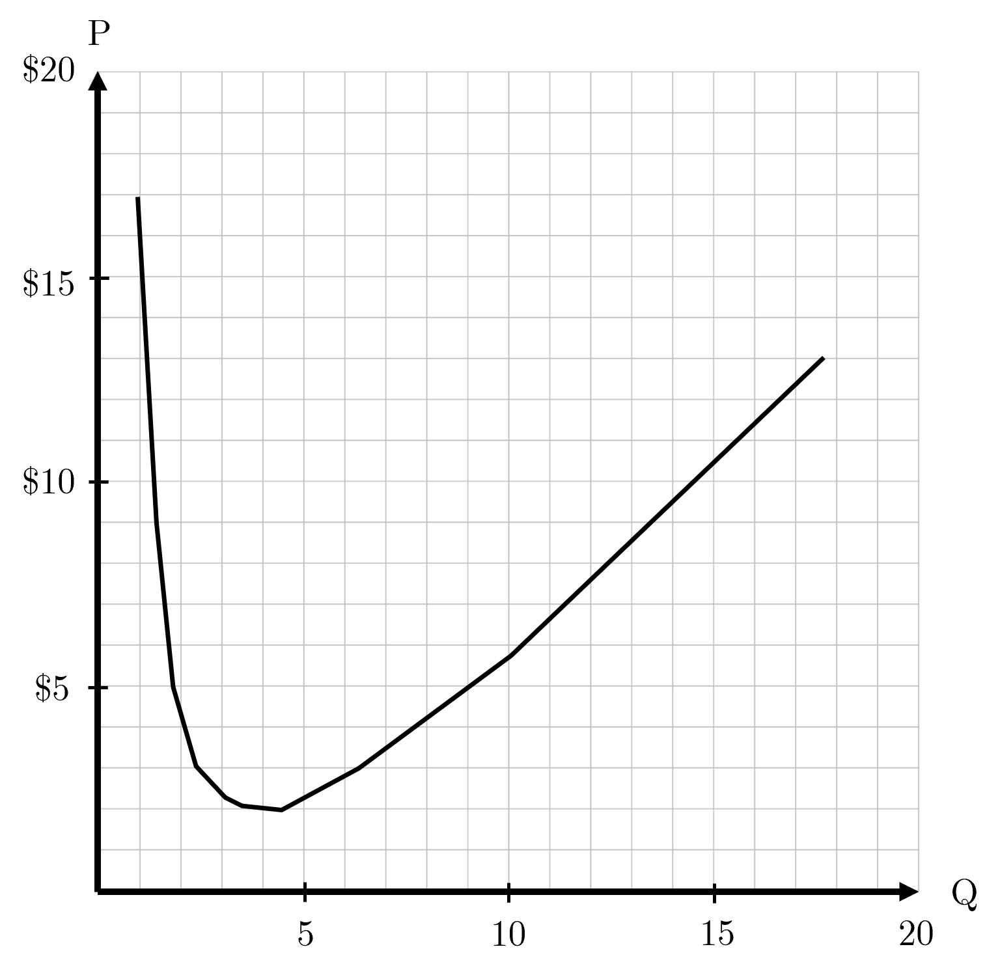

```{r setup, include=FALSE}
knitr::opts_chunk$set(
	cache = TRUE, 
	echo = FALSE, 
	warning = FALSE,
	message = FALSE,
	fig.align = 'center',
	out.width = '100%',
	dpi=300
	)
```

```{r libs, cache=FALSE, message=FALSE}
library(data.table)
library(ggplot2)
library(forcats)
library(kableExtra)
```


\fancyhf{}
\begin{center}
    \Large
    \textbf{
    \textit{SS201: Principles of Economics} \\ 
    AY 23-2 \\ 
    }
    Lesson 16: Monopoly
\end{center}
\fancyfoot[C]{\thepage}

# Review {#sec:review}

For each question below, select either True, False, or Uncertain. Then in the space provided, briefly justify your answer (one or two sentences maximum).


\begin{center}
True \hspace{3cm} False \hspace{3cm} Uncertain
\end{center}

1. Profit maximizing firms in competitive markets produce where $P = MC$.

  \vspace{3cm}

\begin{center}
True \hspace{3cm} False \hspace{3cm} Uncertain
\end{center}

2.	A price floor placed beneath the market equilibrium is binding.

  \vspace{3cm}

    
\hspace{0.5cm}  \begin{minipage}[t]{0.45\textwidth}
    \vspace{0pt}
  \includegraphics[width=.8\linewidth]{img/sandd.png}
\end{minipage}
\hfill
\begin{minipage}[t]{0.45\textwidth}
    \vspace{0pt}
3. Given an import quota of $(Y-W)$, the price domestic consumers would face is:
    \begin{enumerate}
        \item $F$
        \item $E$
        \item $D$
        \item $C$
    \end{enumerate}
\vspace{0.5cm}

4. Given a tax of $(C-E)$, Total Social Surplus is given by:
    \begin{enumerate}
        \item $\frac{1}{2}(C-E)(X-W)$
        \item $\frac{1}{2}(A-G)(X)$
        \item $(\frac{(C-E)+(A-G)}{2})(W)$
        \item $(C-E)(W)$
    \end{enumerate}
\vspace{0.5cm}
\end{minipage}

\pagebreak

# Competition Overview {#sec:cover}
\vspace{1cm}

\begin{center}
\begin{tblr}{
  colspec = {X[c,m]X[c]X[c]X[c]X[c]},
  stretch = 0,
  hlines = {1pt},
  vlines = {1pt},
  row{1} = {10pt},
  row{2-Z} = {40pt},
}
 & (Perfectly) Competitive  & Monopolistic Competition & Oligopoly  & Monopoly \\
\# of Firms &  & &  & \\
Type of Product	&  & &  & \\
Price vs. MR	&  & &  & \\
Price vs. MC 	&  & &  & \\
Entry  &  & &  & \\
LR Profits 	&  & &  & \\
Efficient  	&  & &  & \\
\end{tblr}
\end{center}

\pagebreak

# Bottom Line Up Front {#sec:bluf}
As opposed to (perfectly) competitive markets, monopolies are markets with one seller who can control the price. Monopolies afford great incentives for innovation within countries that allow them, yet they are not efficient markets, and do not maximize societal welfare.

# The Monopolist's Problem {#sec:mprob}

```{r bh, out.width='100%', fig.align='center'}

```

Our friend Cal Weaver loves mid-calf plain white socks. He tells you that he wears them, and his plain white briefs with literally every outfit. Upon hearing that you immediately tune out of the conversation, but for some reason can’t get these plain white socks out of your head. These were the same the Army issued you during Cadet Basic Training. While daydreaming, you ponder the following:


1. What does the demand curve for these plain white socks look like? What shape/elasticity would you expect it to have? Draw that, the total market supply curve, and plot the equilibrium price below.

```{r g1, out.width='40%', fig.align='left'}
knitr::include_graphics("img/grid.png")
```

\pagebreak

2. What if the government stepped in and said that Hanes was the only brand that was allowed to make these plain white socks? How would that change the above diagram? Draw the same figure below.

```{r g2, out.width='40%', fig.align='left'}
knitr::include_graphics("img/grid.png")
```

Let’s assume that the above scenario holds. Hanes is the sole producer of mid-calf white socks. Assume the demand curve they face is $Q_D=18-P$. 

3. What does the profit equation look like for this firm? Let’s assume they have a total cost function of $TC(Q)= Q^2-6Q+12$. Derive Hanes’ profit function in terms of Q.\vspace{3cm}


4. Despite this firm being a monopoly, does this firm still produce where marginal revenue equals marginal cost like the perfectly competitive firm? Show this mathematically below. \vspace{3cm}

\pagebreak

5. Below is a graph of Hanes' ATC. Plot the firm’s demand, marginal revenue, and marginal cost functions below.

```{r atc, out.width='80%', fig.align='center'}

```

6. What level of output Q does Hanes produce at? What price do they charge? Shade in the profit on the graph above.  \vspace{4cm}

7. Is this market efficient? Shade in the deadweight loss, if any, and explain why this market structure either maximizes or does not maximize societal welfare. \vspace{3cm}

\pagebreak

8. What policies can the government use to regulate monopolies? \vspace{3cm}

9. Is there profit in the long run for monopolies? What characteristic of this market structure allows for this? \vspace{3cm}