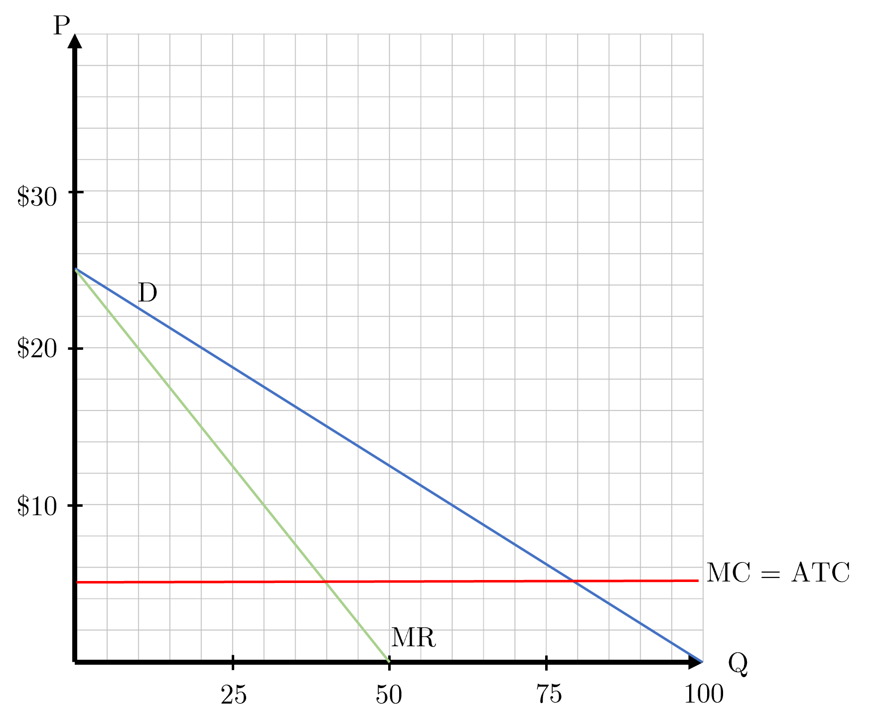
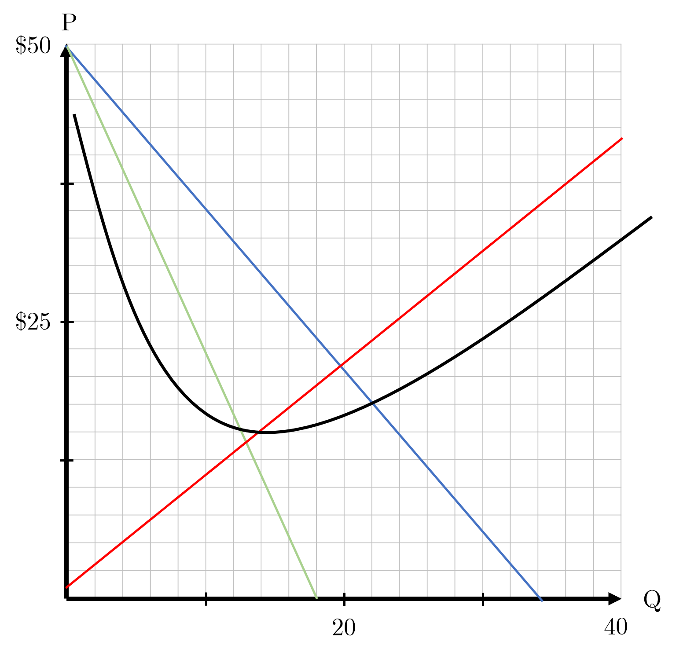
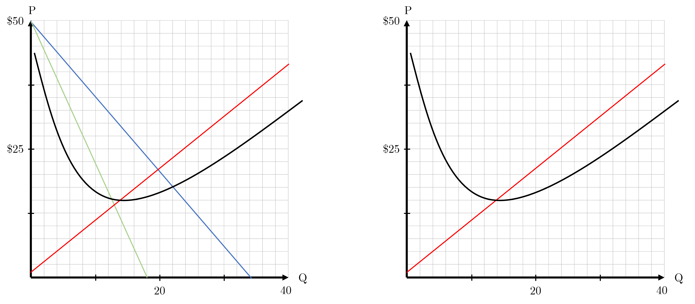
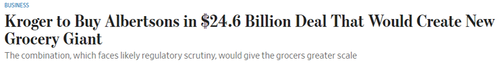

```{r setup, include=FALSE}
knitr::opts_chunk$set(
	cache = TRUE, 
	echo = FALSE, 
	warning = FALSE,
	message = FALSE,
	fig.align = 'center',
	out.width = '100%',
	dpi=300
	)
```

```{r libs, cache=FALSE, message=FALSE}
library(data.table)
library(ggplot2)
library(forcats)
library(kableExtra)
```


\fancyhf{}
\begin{center}
    \Large
    \textbf{
    \textit{SS201: Principles of Economics} \\ 
    AY 23-2 \\ 
    }
    Lesson 17: Monopolistic Competition
\end{center}
\fancyfoot[C]{\thepage}

# Review {#sec:review}

For each question below, select either True, False, or Uncertain. Then in the space provided, briefly justify your answer (one or two sentences maximum).


\begin{center}
True \hspace{3cm} False \hspace{3cm} Uncertain
\end{center}

1. In a perfectly competitive market structure, a firm should produce in the short run if it has already paid its fixed costs.

  \vspace{3cm}

\begin{center}
True \hspace{3cm} False \hspace{3cm} Uncertain
\end{center}

2.	If a firm has a marginal cost equation of $MC=aQ+b$ and an average fixed-cost equation of $AFC=  \frac{c}{Q}$, then its total cost equation is given by, $TC(Q)=  \frac{a}{2}Q^2+bQ+c$.  

  \vspace{3cm}

    
\hspace{0.5cm}  \begin{minipage}[t]{0.55\textwidth}
    \vspace{0pt}
  \includegraphics[width=.9\linewidth]{img/ccurves.png}
\end{minipage}
\hfill
\begin{minipage}[t]{0.35\textwidth}
    \vspace{0pt}
3. Which curve above is the Average Variable Cost curve?
    \begin{enumerate}
        \item $A$
        \item $B$
        \item $C$
        \item $D$
    \end{enumerate}
\vspace{0.5cm}

4. Assume the graph to the side is for a firm in a competitive market. The market equilibrium price is \$500. To maximize profit, this firm will produce how many of its good?
    \begin{enumerate}
        \item 9
        \item 12
        \item 4
        \item 6
    \end{enumerate}
\vspace{0.5cm}
\end{minipage}

\pagebreak

# Competition Overview {#sec:cover}
\vspace{1cm}

\begin{center}
\begin{tblr}{
  colspec = {X[c,m]X[c]X[c]X[c]X[c]},
  stretch = 0,
  hlines = {1pt},
  vlines = {1pt},
  row{1} = {10pt},
  row{2-Z} = {40pt},
}
 & (Perfectly) Competitive  & Monopolistic Competition & Oligopoly  & Monopoly \\
\# of Firms &  & &  & \\
Type of Product	&  & &  & \\
Price vs. MR	&  & &  & \\
Price vs. MC 	&  & &  & \\
Entry  &  & &  & \\
LR Profits 	&  & &  & \\
Efficient  	&  & &  & \\
\end{tblr}
\end{center}

\pagebreak

# Bottom Line Up Front {#sec:bluf}
Within this market structure, firms retain some ability to influence the price. They sell differentiated products, but are unable to reap long-run profit as the monopolist can. With many firms freely entering and exiting the market responding to the price, this freedom drives demand toward tangency with a firms’ Average Total Cost Curve and leads to no long-run profits.

# Price Discrimination {#sec:mprob}

```{r bh, out.width='100%', fig.align='center'}

```

Bianca Stratford, Cat’s younger sister, loves sunglasses. She rarely gets to wear them out in Seattle, but when the sun is out, she just can’t be without. Suppose that there is a sole supplier of sunglasses within this market. The graph below represents this monopolist’s market. Below is a graph of the firm’s demand, marginal revenue, marginal cost, and ATC functions.

```{r pd, out.width='80%', fig.align='center'}

```

1. Where does the monopolist produce within this market? Is this point efficient (socially optimal)? \vspace{3cm}

2. Now let’s assume that the monopolist now knows each consumer’s willingness to pay for sunglasses and can charge different prices to different consumers. What will this monopolist do in this case to maximize profits? \vspace{3cm}

3. What is consumer surplus, profit, and total surplus in this scenario? Is this socially efficient? \vspace{3cm}

\pagebreak

# Monopolistic Competition {#sec:mcomp}

High-schoolers (and me) love their shoes. Let’s explore Nike’s cost curves for a second. Suppose that Nike has a total cost curve of $TC(Q)=100+2Q+\frac{1}{2}Q^2$ and faces a demand curve of $P=50-\frac{3}{2}Q_D$. Below is a graph of Nike's cost and marginal revenue curves within the market for shoes.

```{r g2, out.width='80%', fig.align='center'}

```

1.	Label the curves and axes on the above graph. \vspace{0.5cm}
 
2.	Calculate the number of sneakers Nike will produce and the price they will charge, then label these on the graph above.\vspace{3cm}

3.	Draw and label Nike’s profit / loss. What do other shoe firms have an incentive to do within this market? What happens to Nike’s demand curve as a result? \vspace{3cm}

4. Is this market in long-run equilibrium? Why? What should happen in the long run? \vspace{3cm}

```{r perf3, out.width='100%', fig.align='center'}

```

\pagebreak

# Application {#sec:policy}

```{r headline, out.width='100%', fig.align='center'}

```

\hspace{0.5cm}  \begin{minipage}[t]{0.5\textwidth}
    \vspace{0pt}
  \includegraphics[width=.9\linewidth]{img/grocer_market_share.png}
\end{minipage}
\hfill
\begin{minipage}[t]{0.5\textwidth}
    \vspace{0pt} “It allows us to do things we are doing in an accelerated way,” Kroger Chief Executive Rodney McMullen, who will serve as CEO and chairman of the combined company, said in an interview. \\ \\
    The companies said Kroger plans to invest in lowering prices for consumers and expects to direct about \$500 million in anticipated cost savings toward that goal. \\ \\
    Combined, the companies said they would have a bigger network of stores, distributors and suppliers, in addition to a national reach and greater manufacturing footprint. Integrating their supply chains would shorten the time it takes products to hit store shelves, executives said on a call with analysts. Pooling customer data would help the companies engage better with shoppers, such as offering personalized promotions, they said. \\ \\
    Creating a strong No. 2 behind Walmart could give the combined entity more leverage in negotiations with vendors and help it push back on price increases, they wrote, though they expect regulators to focus more on the enlarged company’s regional influence versus its national share.
\vspace{0.5cm}
\end{minipage}
\begin{center}
\textit{https://www.wsj.com/articles/kroger-to-merge-with-albertsons-in-a-24-6-billion-deal-11665745735}
\end{center}

\vspace{0.5cm}

\pagebreak

1. What type of market does the grocery industry represent? \vspace{3cm}

2. If Kroger and Albertsons successfully merge to become the second largest grocer, what changes could be expected in the domestic food market’s price and quantity? \vspace{3cm}

3. Evaluate the following proposal’s impact regarding consumer pricing and address if you would make any changes.
\begin{center}
\begin{minipage}[t]{0.8\textwidth}
\textit{The merger should be allowed to occur as it will increase grocer efficiency with little to no effect on consumer prices.}
\end{minipage}
\end{center}