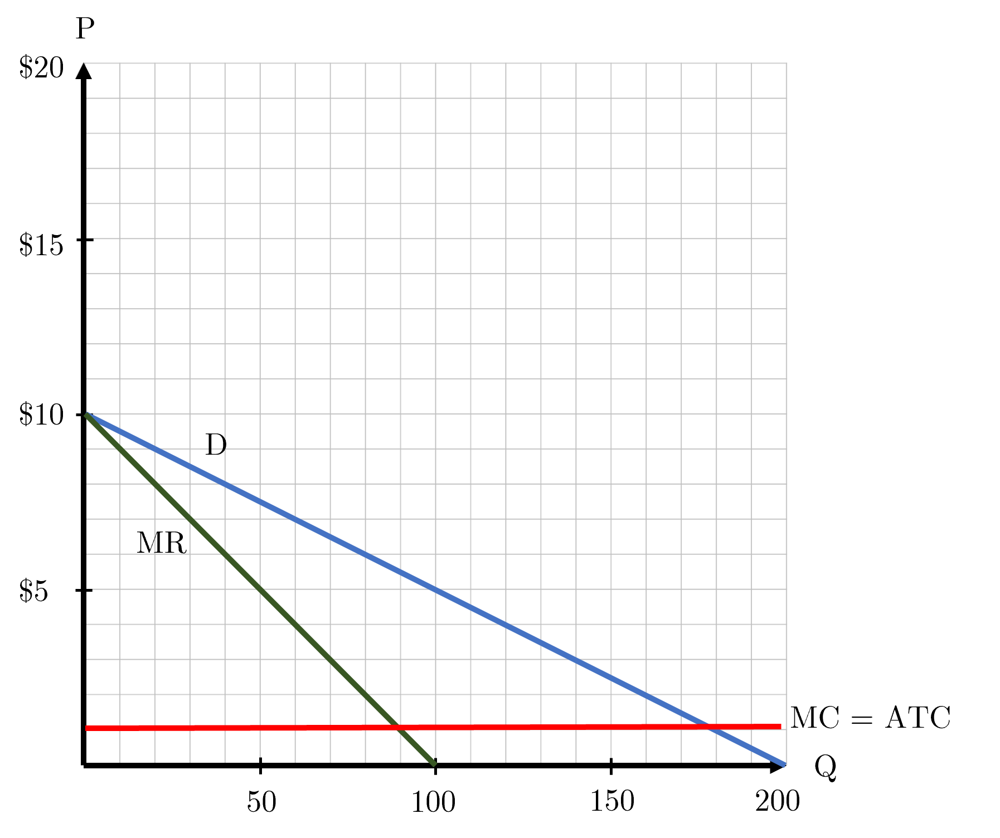

```{r setup, include=FALSE}
knitr::opts_chunk$set(
	cache = TRUE, 
	echo = FALSE, 
	warning = FALSE,
	message = FALSE,
	fig.align = 'center',
	out.width = '100%',
	dpi=300
	)
```

```{r libs, cache=FALSE, message=FALSE}
library(data.table)
library(ggplot2)
library(forcats)
library(kableExtra)
```


\fancyhf{}
\begin{center}
    \Large
    \textbf{
    \textit{SS201: Principles of Economics} \\ 
    AY 23-2 \\ 
    }
    Lesson 18: Oligopoly
\end{center}
\fancyfoot[C]{\thepage}

# Review {#sec:review}

Indicate the answer choice that best completes the statement or answers the question.

1. What is the main market failure associated with common resources? 
    a. Tragedy of the Commons
    b. The Free Rider Problem
    c. Deadweight Loss
    d. None of the above.

\vspace{0.5cm}

2. What is the main market failure associated with public goods?
    a. Negative Externalities
    b. Tragedy of the Commons
    c. The Free-Rider Problem
    d. Pollution

\vspace{0.5cm}

3. Jamie runs a coffee shop that makes \$200,000 a year in revenue. Jamie pays \$50,000 a year to lease the shop space, \$40,000 a year on supplies, and \$35,000 a year on part-time worker wages. If she wasn’t running the coffee shop, she would earn $100,000 a year working as a lawyer. What are Jamie’s accounting profits? What are her economic profits? Which are we referring to when we say competitive firms make zero profits in the long run?
    a. -\$25,000 Accounting, \$75,000 Economic
    b. $200,000 Accounting, \$100,000 Economic
    c. $75,000 Accounting, -\$25,000 Economic
    d. None of the above.

\vspace{0.5cm}

4. Which below is not a method for correcting negative externalities?
    a. Pigouvian Taxes
    b. Cap and Trade Systems
    c. Patent Protection
    d. Regulation

\vspace{0.5cm}

\pagebreak

# Competition Overview {#sec:cover}
\vspace{1cm}

\begin{center}
\begin{tblr}{
  colspec = {X[c,m]X[c]X[c]X[c]X[c]},
  stretch = 0,
  hlines = {1pt},
  vlines = {1pt},
  row{1} = {10pt},
  row{2-Z} = {40pt},
}
 & (Perfectly) Competitive  & Monopolistic Competition & Oligopoly  & Monopoly \\
\# of Firms &  & &  & \\
Type of Product	&  & &  & \\
Price vs. MR	&  & &  & \\
Price vs. MC 	&  & &  & \\
Entry  &  & &  & \\
LR Profits 	&  & &  & \\
Efficient  	&  & &  & \\
\end{tblr}
\end{center}

\pagebreak

# Bottom Line Up Front {#sec:bluf}
Between monopolistic competition and a monopoly, oligopolies exist as markets with very few players. In this scenario, we assume barriers to entry within these markets and that firms produce differentiated products. Due to the smaller number of firms in this market, we are able to apply game theory and models of strategic interaction that help us understand how these firms operate.

# Game Theory {#sec:gt}

```{r abm, out.width='100%', fig.align='center'}

```
\vspace{1cm}
1.	What is a dominant strategy? \vspace{3cm}

2.	How does a dominant strategy differ from a Nash Equilibrium? \vspace{3cm}

\pagebreak

For each of the following games, identify each player’s dominant strategy (if they have one) and the Nash Equilibrium of the game.  

3. Fake Friends
\begin{table}[h!]
\centering
  \setlength{\extrarowheight}{12pt}
  \begin{tabular}{cc|c|c|}
    \multicolumn{2}{c}{} & \multicolumn{2}{c}{Commandant}\\
    \multicolumn{1}{c}{} &  & Dean's Hour  & Comm's Hour \\\cline{2-4}
    \multirow{2}*{Dean}  & Dean's Hour & $(2,0)$ & $(2,1)$ \\\cline{2-4}
    & Comm's Hour & $(3,0)$ & $(1,2)$ \\\cline{2-4}
  \end{tabular}
\end{table}

4. Battle of the Sexes
\begin{table}[h!]
\centering
  \setlength{\extrarowheight}{12pt}
  \begin{tabular}{cc|c|c|}
    \multicolumn{2}{c}{} & \multicolumn{2}{c}{Ms. Homme}\\
    \multicolumn{1}{c}{} &  & Restaurant  & Eat at Home \\\cline{2-4}
    \multirow{2}*{MAJ Homme}  & Restaurant & $(2,1)$ & $(0,0)$ \\\cline{2-4}
    & Eat at Home & $(0,0)$ & $(1,2)$ \\\cline{2-4}
  \end{tabular}
\end{table}
\vspace{2cm}

5. The Prisoner's Dilemma
\begin{table}[h!]
\centering
  \setlength{\extrarowheight}{12pt}
  \begin{tabular}{cc|c|c|}
    \multicolumn{2}{c}{} & \multicolumn{2}{c}{Get Stitches}\\
    \multicolumn{1}{c}{} &  & Confess  & Silence \\\cline{2-4}
    \multirow{2}*{Snitches}  & Confess & $(-10,-10)$ & $(0,-20)$ \\\cline{2-4}
    & Silence & $(-20,0)$ & $(-1,-1)$ \\\cline{2-4}
  \end{tabular}
\end{table}

\pagebreak

# Cournot Duopoly {#sec:cd}

Suppose that the demand for ice cream at West Point is given by the equation $Q_D=200-20P$. Ben and Jerry are the only two makers of ice cream licensed by DCA (and supported by the local businesses in Highland Falls) to make and sell ice cream here, and they both have a constant marginal cost and average total cost of $1 for producing an additional ice cream cone. Below is a graph of this market.

```{r g1, out.width='60%', fig.align='center'}

```


1.	Let’s assume that within this market Ben and Jerry are cooperating. Together they will choose a total quantity of ice cream to produce to maximize total profits, then split those profits two ways. How many cones does each produce? What is the profit of each shop? \vspace{3cm}

2. Let’s say now that Ben and Jerry get into a big fight over whether "Cherry Garcia" is better than "Everything but the Kitchen Sink," and now they no longer cooperate on how much ice cream to produce and sell. Ben is thinking about producing an additional 15 ice cream cones. What will the market price of ice cream cones be if he does? What will be Ben’s profit? What about Jerry’s profit? 

\pagebreak

3. Assume now that Ben and Jerry have these two strategies at their disposal: they can either produce at the level in question 1 or produce an additional 15 ice cream cones. Fill in the game theory payoff matrix below:

\begin{table}[h]
\centering
  \setlength{\extrarowheight}{12pt}
  \begin{tabular}{cc|c|c|}
    \multicolumn{2}{c}{} & \multicolumn{2}{c}{Jerry}\\
    \multicolumn{1}{c}{} &  & Produce \rule{1cm}{0.15mm}  & Produce \rule{1cm}{0.15mm} \\\cline{2-4}
    \multirow{2}*{Ben}  & Produce \rule{1cm}{0.15mm} &  &  \\\cline{2-4}
    & Produce \rule{1cm}{0.15mm} &  &  \\\cline{2-4}
  \end{tabular}
\end{table}

4. What is each player’s dominant strategy? What is the Nash Equilibrium of this game? \vspace{3cm}

5. Should Ben and Jerry try to make up and collude? If they do, who wins and who loses? What would society prefer? How likely is it that collusion between Ben and Jerry is sustainable? \vspace{3cm}

6. Now assume it was easy to enter the ice cream market in West Point and produce with the same cost structure and quality of product as Ben and Jerry. What would be the market quantity and price? What type of market structure does this resemble? \vspace{3cm}
