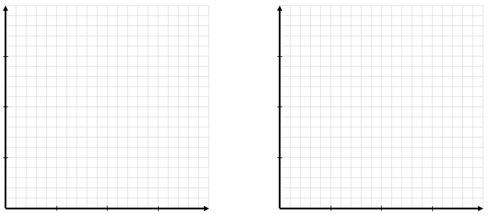
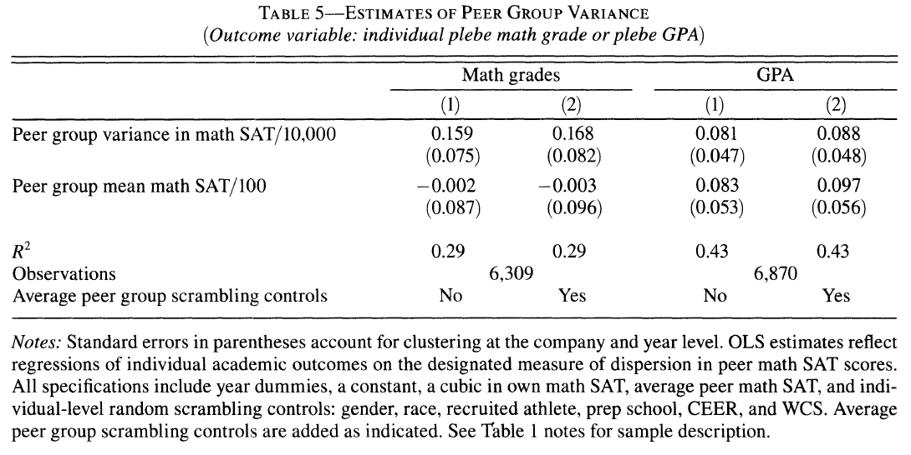

```{r setup, include=FALSE}
knitr::opts_chunk$set(
	cache = TRUE, 
	echo = FALSE, 
	warning = FALSE,
	message = FALSE,
	fig.align = 'center',
	out.width = '100%',
	dpi=300
	)
```

```{r libs, cache=FALSE, message=FALSE}
library(data.table)
library(ggplot2)
library(forcats)
library(kableExtra)
```


\fancyhf{}
\begin{center}
    \Large
    \textbf{
    \textit{SS201: Principles of Economics} \\ 
    AY 23-2 \\ 
    }
    Lesson 2: Economic Methods, Models, and Gains from Exchange
\end{center}
\fancyfoot[C]{\thepage}

# Bottom Line Up Front {#sec:bluf}
Comparative advantage is the basis for trade. Despite individuals having an absolute advantage at producing certain goods, all can be made better off through trade. 

# Modeling Disclaimer {#sec:model}
```{r box, out.width='60%', fig.align='center'}

```
\begin{center}
  \textit{``All models are wrong, but some are useful.''} \\
  - George Box
\end{center}

- Economics is a **positive** social science that involves stating facts, assumptions, and drawing conclusions about human behavior in an environment with scarce resources. Objectivity is the goal.

- These models are not perfect, but given the right situation and assumptions, we can apply them to simplify our understanding of the world around us.

\pagebreak

# Modeling Production {#sec:prod}

Suppose MAJ Homme can only do two things on a Sunday afternoon: grill steaks or smoke turkeys. If he spends all his time grilling, he can grill 25. If he 
only smokes turkeys, he can smoke 5 turkeys. Assume he can switch between tasks at a constant rate.

1. If you wanted to model this production and draw a picture of all the possible combinations that MAJ Homme could produce, what would this picture look like? Graph it below with turkeys on the horizontal axis and steaks on the vertical axis.
```{r g1, out.width='60%', fig.align='center'}
knitr::include_graphics("img/grid.png")
```

2. What do we call the above graph?
  \vspace{2cm}

3. Write an expression for the graph above.
  \pagebreak

4. What is the tradeoff the MAJ Homme faces between grilling steaks and smoking turkeys? What do we call this in economics?
  \vspace{2cm}

5. Let us assume that MAJ Homme has an insatiable appetite for meat. More is **ALWAYS** better. If he wanted to be as happy as possible, where should he produce at?  
  \vspace{2cm}

6. Suppose a new grill allows MAJ Homme to grill faster so that in any fixed amount of time, he can grill more steaks.  What would the new production possibility frontier curve look like? Sketch both below.

```{r g2, out.width='60%', fig.align='center'}
knitr::include_graphics("img/grid.png")
```

\pagebreak
# Trade
Now let me introduce you to CPT(P) Webster. When it comes to the grill, this man's a straight savage! On one Sunday, he can either grill 40 steaks or smoke 10 turkeys.

1. Compared with MAJ Homme, which SS201 instructor has the absolute advantage in producing steaks? Turkeys? 
  \vspace{3cm}

2. Given your answer to the previous question, does it ever make sense for CPT(P) Webster to trade with MAJ Homme?
  \vspace{3cm}
  
3. What is comparative advantage? Which instructor has the comparative advantage for each good?
  \vspace{3cm}
  
4. Revisit question 2. Does it make sense for the two instructors to trade? Why and at what price should they trade at?
  \vspace{3cm}

\pagebreak

5. Without trade, MAJ Homme can produce 15 steaks and 2 turkeys and CPT(P) Webster can produce 8 steaks and 8 turkeys. If they decide to trade, how much can each attain relative to these production sets? Graph both production possibility frontiers below, the production points they can produce without trade, and the production points they can attain with trade.

```{r g3, out.width='100%', fig.align='center'}

```

\pagebreak

# Does your company's academic ability matter? Lyle (2009)

- How does diversity affect team performance?

- If performance can be improved by assigning teams certain compositions, should businesses / the military seek to employ it?

- How could you set up an experiment to test this?

```{r pv, out.width='100%', fig.align='center'}

```
