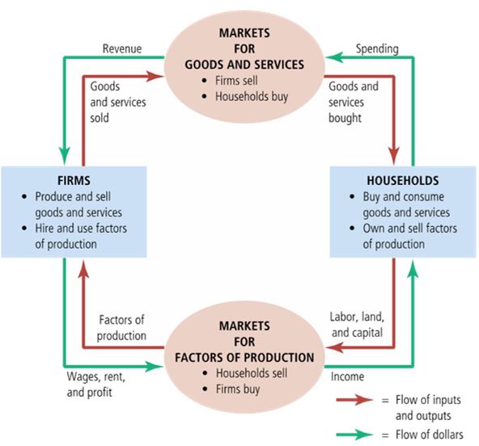
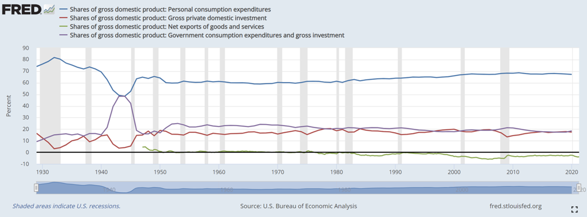
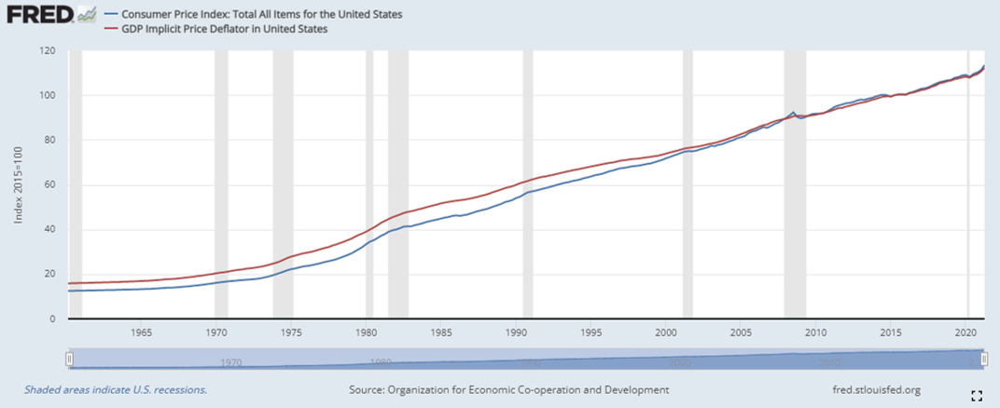
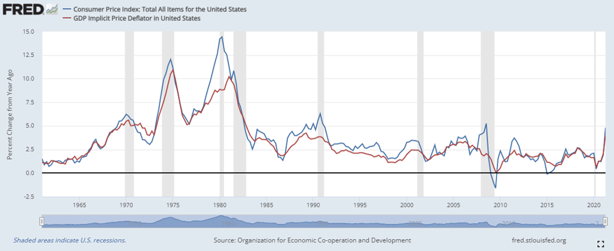

```{r setup, include=FALSE} 
options(htmltools.dir.version = FALSE)
library(knitr)
library(tidyverse)
library(huxtable)
library(data.table)
library(xaringanExtra)
library(icons)

# set default options
opts_chunk$set(echo=FALSE,
               collapse = TRUE,
               fig.width = 7.252,
               fig.height = 4,
               dpi = 300)

# set engines
knitr::knit_engines$set("markdown")

xaringanExtra::use_tile_view()
xaringanExtra::use_panelset()
xaringanExtra::use_clipboard()
xaringanExtra::use_webcam()
xaringanExtra::use_scribble()
xaringanExtra::use_broadcast()
xaringanExtra::use_share_again()
xaringanExtra::style_share_again(
  share_buttons = c("twitter", "linkedin", "pocket")
)
```

```{r load_refs, include=FALSE, cache=FALSE}
library(RefManageR)
BibOptions(check.entries = FALSE,
           bib.style = "authoryear",
           style = "markdown",
           hyperlink = FALSE,
           dashed = TRUE)
bib <- ReadBib("references.bib", check = FALSE)

print_bib_rmd <- function(bib, .opts = list(), start = 1, stop = NULL, decreasing = FALSE) {

    bib <- sort(bib, decreasing = FALSE)

    if (!length(bib)) {
        return(bib)
    }

    if (identical(class(bib), "bibentry")) {
        bib <- as.BibEntry(bib)
    }

    keys <- unlist(bib$key)
    ind <- keys %in% names(.cites$indices)

    if (!any(ind)) {
        message("You haven't cited any references in this bibliography yet.")
        return()
    }

    if (length(.opts$bib.style)) {
      bibstyle <- .opts$bib.style
    } else {
      bibstyle <- .BibOptions$bib.style
    }

    if (length(.opts$cite.style)) {
      citestyle <- .opts$cite.style
    } else {
      citestyle <- .BibOptions$cite.style
    }

    if (length(.opts$style)) {
      style <- .opts$style
    } else {
      style <- .BibOptions$style
    }

    bib <- bib[[ind]] # gets citations to print

    if (bibstyle == citestyle) {
        if (bibstyle == "numeric") {
            if (length(bib) == length(.cites$labs)) {
                bib <- bib[[names(.cites$labs)]]
                .opts$sorting <- "none"
                bib$.index <- structure(.cites$labs, names = NULL)
            }
        } else { 
          bib$.index <- .cites$labs[keys[ind]]
        }
    }

    if (length(.opts)) {
        old.opts <- BibOptions(.opts)
        on.exit(BibOptions(old.opts))
    }

    if (style == "yaml") {
        cat("\n---\nnocite:", sQuote(paste0(paste0("@", names(.cites$indices)), 
            collapse = ", ")))
        cat("\n...  \n\n")
    }
    if (is.null(stop)) {
      stop <- length(bib)
    } 
    bib <- bib[start:stop]
    print(bib)
}

environment(print_bib_rmd) <- asNamespace("RefManageR")

```
# Transitioning from Micro to Macro
## Preparation

Friendly Public Service Announcement...

If you normally don't read the book, this block is the time you need to start.

Not a lot of math, graphs to illustrate these concepts.

More terms / definitions and intuition than previously.

Empirical Macroeconomics and models require a lot of math tools you don't have.

---
# Transitioning from Micro to Macro
## Themes

.pull-left[.big[.center[Microeconomics]]
- The spot market for a single good
  - One good, one market
  - One firm
  - One worker or consumer
  
- Will a business operate or close in the short term?

- How will a tax on a single good affect the price and quantity of that good?
]

.pull-right[.big[.center[Macroeconomics]]

- The country’s or world’s economy as a whole
  - Combined analysis of all goods, all workers, all firms
  - Money / Currency

- Why are some countries more prosperous than others?

- How does the financial system affect economic growth?
]

???

Feel:   Excited to come back, comfortable
Know:   Expectations, Framework for Decision Making and Human Behavior
Do:     Read Articles and Argue for Causality vs. Correlation

---
# Transitioning from Micro to Macro
## Measurements

.pull-left[.big[.center[Microeconomics]]
- Price

- Quantity
]

.pull-right[.big[.center[Macroeconomics]]
- Price Index (CPI, GDP Deflator)

- Real GDP
]

---
# Transitioning from Micro to Macro

```{r cf, out.width='70%', fig.align='center'}

```

---
# Gross Domestic Product

$$Y = C + I + G + NX$$

**Consumption (C)**
- Household spending on goods and services

**Investment (I)**
- Goods used in the future to produce more goods and services
- Includes buildings and inventory accumulation
- NOT individuals or banks buying stocks (equity)

**Government (G)**
- Federal, state, or local spending on actual goods and services
- NOT taxes or transfer payments (ex. Social Security, welfare, etc.)

**Net Exports (NX)**
- Exports – Imports
- We include all the stuff we make that other countries use
- But don’t include the parts of C, I, and G that were produced in other countries, so subtract off

---
# Gross Domestic Product
</br></br></br></br>
```{r gdp_com, out.width='100%', fig.align='center'}

```

---
# Price Levels

GDP Deflator

$$GDP_D = \frac{\text{Nominal GDP}}{\text{Real GDP}} \times 100$$
</br></br>
Consumer Price Index (CPI)

$$CPI = \frac{\text{Current Year Basket Prices}}{\text{Base Year Basket Prices}} \times 100$$

---
# Price Levels
</br></br></br></br>
```{r cpi_gdp, out.width='100%', fig.align='center'}

```

---
# Real vs. Nominal
</br>
- Why make this distinction?

- What is the difference?

---
# What year did Army pay increase the most?
</br>

| **Year** | **Pay Raise** |
|:--------:|:-------------:|
| 2023     | 4.60%         |
| 2022     | 2.70%         |
| 2021     | 3.00%         |
| 2020     | 3.10%         |
| 2019     | 2.60%         |
| 2018     | 2.40%         |
| 2017     | 2.10%         |
| 2016     | 1.30%         |
| 2015     | 1.00%         |
| 2014     | 1.00%         |
| 2013     | 1.70%         |
| 2012     | 1.60%         |
| 2011     | 1.40%         |
---
# What year did Army pay increase the most?
</br>

| **Year** | **Pay Raise** | **Inflation** | **Real Raise** |
|:--------:|:-------------:|:-------------:|:--------------:|
| 2023     | 4.60%         | 8.20%         | -3.60%         |
| 2022     | 2.70%         | 4.70%         | -2.00%         |
| 2021     | 3.00%         | 1.23%         | 1.77%          |
| 2020     | 3.10%         | 1.81%         | 1.29%          |
| 2019     | 2.60%         | 2.44%         | 0.16%          |
| 2018     | 2.40%         | 2.13%         | 0.27%          |
| 2017     | 2.10%         | 1.26%         | 0.84%          |
| 2016     | 1.30%         | 0.11%         | 1.19%          |
| 2015     | 1.00%         | 1.62%         | -0.62%         |
| 2014     | 1.00%         | 1.46%         | -0.46%         |
| 2013     | 1.70%         | 2.06%         | -0.36%         |
| 2012     | 1.60%         | 3.15%         | -1.55%         |
| 2011     | 1.40%         | 1.64%         | -0.24%         |

---
# Inflation

GDP Deflator:
</br>
$$\frac{\text{GDP Deflator Year (Y)} - \text{GDP Deflator Base Year}}{\text{GDP Deflator Base Year}} \times 100$$

</br></br>

CPI:
</br>
$$\frac{\text{CPI Year (Y)} - \text{CPI Base Year}}{\text{CPI Base Year}} \times 100$$

---
# Inflation
</br></br></br></br>
```{r inflation, out.width='100%', fig.align='center'}

```
