```{r setup, include=FALSE} 
options(htmltools.dir.version = FALSE)
library(knitr)
library(tidyverse)
library(huxtable)
library(data.table)
library(xaringanExtra)
library(icons)

# set default options
opts_chunk$set(echo=FALSE,
               collapse = TRUE,
               fig.width = 7.252,
               fig.height = 4,
               dpi = 300)

# set engines
knitr::knit_engines$set("markdown")

xaringanExtra::use_tile_view()
xaringanExtra::use_panelset()
xaringanExtra::use_clipboard()
xaringanExtra::use_webcam()
xaringanExtra::use_scribble()
xaringanExtra::use_broadcast()
xaringanExtra::use_share_again()
xaringanExtra::style_share_again(
  share_buttons = c("twitter", "linkedin", "pocket")
)
```

```{r load_refs, include=FALSE, cache=FALSE}
library(RefManageR)
BibOptions(check.entries = FALSE,
           bib.style = "authoryear",
           style = "markdown",
           hyperlink = FALSE,
           dashed = TRUE)
bib <- ReadBib("references.bib", check = FALSE)

print_bib_rmd <- function(bib, .opts = list(), start = 1, stop = NULL, decreasing = FALSE) {

    bib <- sort(bib, decreasing = FALSE)

    if (!length(bib)) {
        return(bib)
    }

    if (identical(class(bib), "bibentry")) {
        bib <- as.BibEntry(bib)
    }

    keys <- unlist(bib$key)
    ind <- keys %in% names(.cites$indices)

    if (!any(ind)) {
        message("You haven't cited any references in this bibliography yet.")
        return()
    }

    if (length(.opts$bib.style)) {
      bibstyle <- .opts$bib.style
    } else {
      bibstyle <- .BibOptions$bib.style
    }

    if (length(.opts$cite.style)) {
      citestyle <- .opts$cite.style
    } else {
      citestyle <- .BibOptions$cite.style
    }

    if (length(.opts$style)) {
      style <- .opts$style
    } else {
      style <- .BibOptions$style
    }

    bib <- bib[[ind]] # gets citations to print

    if (bibstyle == citestyle) {
        if (bibstyle == "numeric") {
            if (length(bib) == length(.cites$labs)) {
                bib <- bib[[names(.cites$labs)]]
                .opts$sorting <- "none"
                bib$.index <- structure(.cites$labs, names = NULL)
            }
        } else { 
          bib$.index <- .cites$labs[keys[ind]]
        }
    }

    if (length(.opts)) {
        old.opts <- BibOptions(.opts)
        on.exit(BibOptions(old.opts))
    }

    if (style == "yaml") {
        cat("\n---\nnocite:", sQuote(paste0(paste0("@", names(.cites$indices)), 
            collapse = ", ")))
        cat("\n...  \n\n")
    }
    if (is.null(stop)) {
      stop <- length(bib)
    } 
    bib <- bib[start:stop]
    print(bib)
}

environment(print_bib_rmd) <- asNamespace("RefManageR")

```
# Agenda

- Announcements

- Review

- Growth Rate Fun

- Why Growth Matters

- A Nation's Production Function

- Some Other Growth Considerations

---
# Why Growth Matters

```{r gdp_cap, out.width='90%', fig.align='center'}
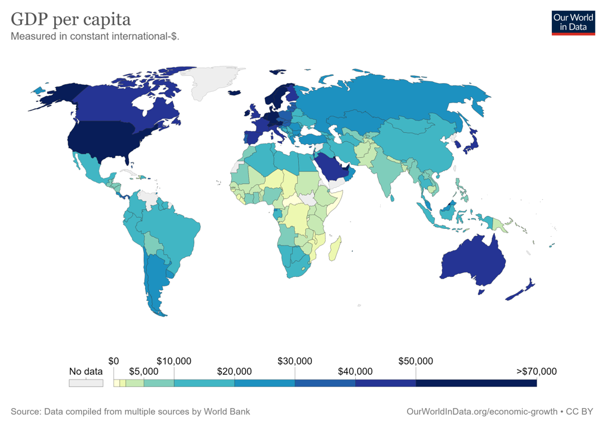
```

---
# Why Growth Matters

```{r gdp_cap_grow, out.width='90%', fig.align='center'}
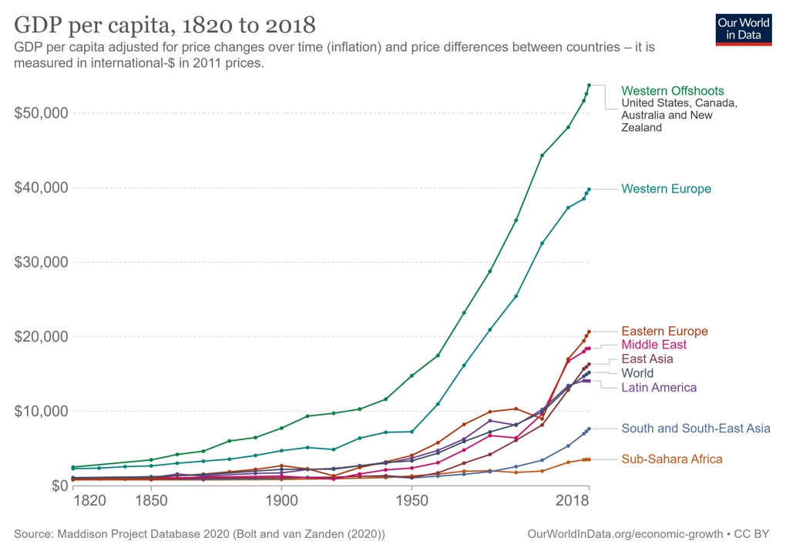
```

---
# Why Growth Matters

```{r gdp_life, out.width='90%', fig.align='center'}
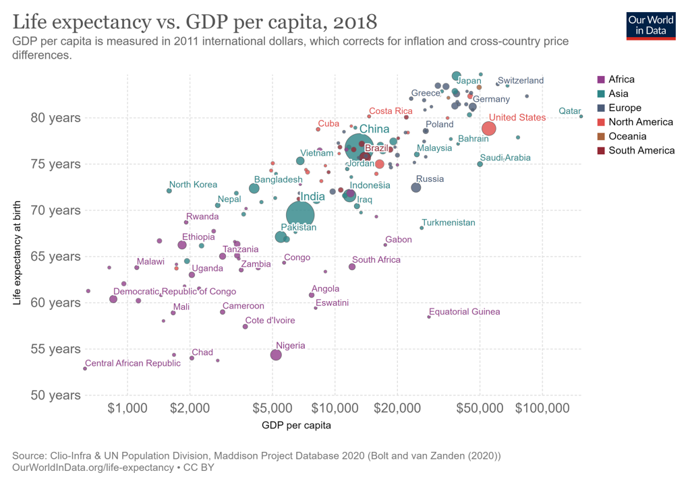
```

---
# Why Growth Matters

```{r gdp_life_sat, out.width='90%', fig.align='center'}
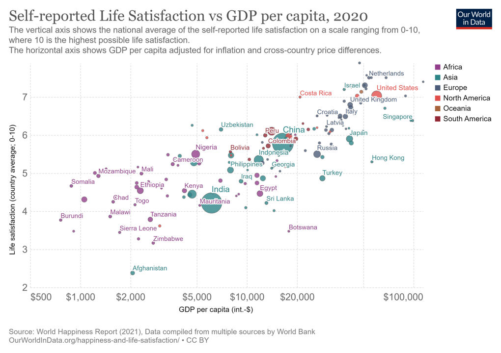
```

---
# A Nation's Production Function
.big[
$$Y = A \times F(L, K, H, N) $$
]
.pull-left[
Output / GDP (Y)

Technology (A)
 - The *processes* to make final goods and services using our inputs

]

.pull-right[
Workers (L)

Physical Capital (K)
 - Machines, factories, tools
 - The output of Investment!
 
Human Capital (H)
 - Knowledge and skills of workers

Natural Resources (N)
 - Land, water, timber, fossil fuels
 - Can renewable or nonrenewable
]
---
# A Nation's Production Function

More simply, the production function translates to the Solow Model

$$\frac{Y}{L} = A \times F(1, \frac{K}{L})$$

Output is now GDP per Capita ( $\frac{Y}{L}$ )

Capital is now in terms of "machines per person"

An example:

$$Y = 5L^\frac{2}{3} K^\frac{1}{3}$$

$$\frac{Y}{L} = 5(\frac{K}{L})^\frac{1}{3}$$
---
# A Nation's Production Function
</br></br>
```{r solow_catch, out.width='90%', fig.align='center'}
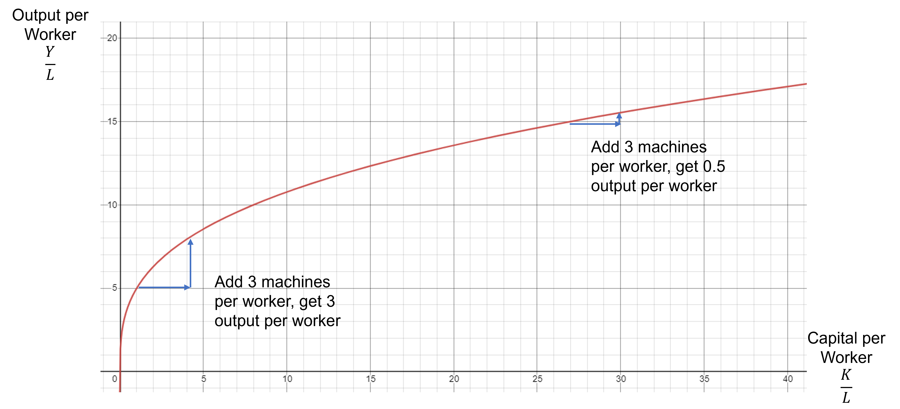
```

---
# A Nation's Production Function

```{r gdp_cap_country, out.width='90%', fig.align='center'}
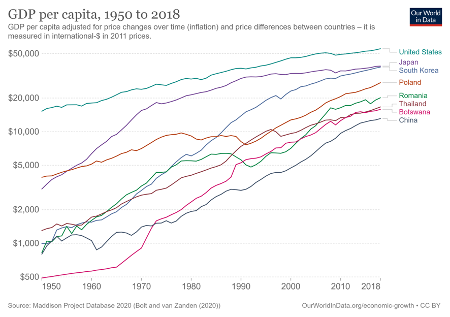
```

---
# A Nation's Production Function
```{r solow_tech, out.width='90%', fig.align='center'}
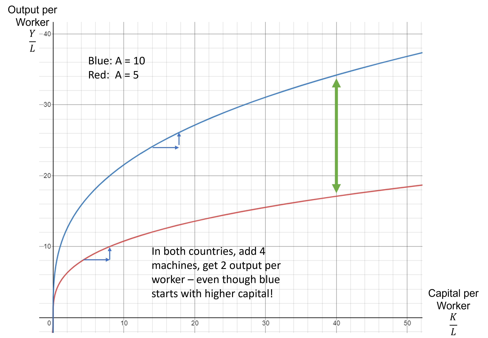
```

---
# Some Other Growth Considerations

Population (L)
- Larger population may promote innovation
- BUT too fast population growth stretches K and N per worker

```{r pop_growth, out.width='70%', fig.align='center'}
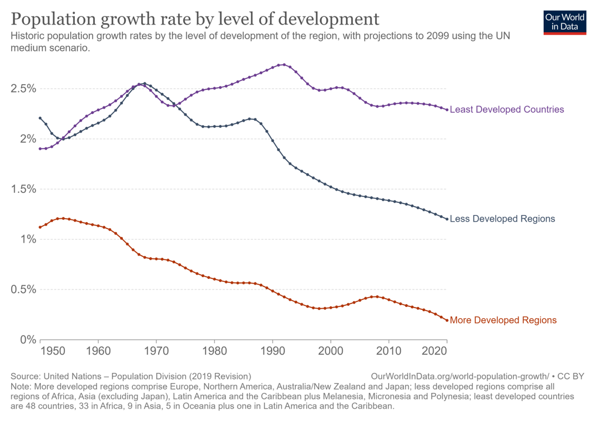
```

---
# Some Other Growth Considerations

Improve human capital to increase $\frac{H}{K}$
- Education and health

```{r educ_growth, out.width='70%', fig.align='center'}
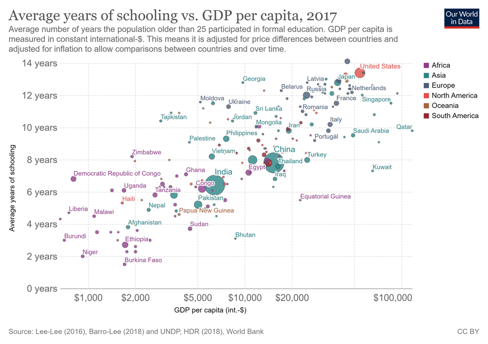
```

---
# Some Other Growth Considerations

Trust, Institutions, and Property Rights
- Strong intellectual property rights
- Provisions of public goods

.center[Acemoglu, Johnson, and Robinson (2001)]
```{r colonial_growth, out.width='70%', fig.align='center'}
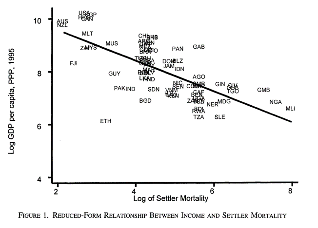
```

---
# Some Other Growth Considerations

Trust, Institutions, and Property Rights
- Strong intellectual property rights
- Provisions of public goods

.center[Nunn and Puga (2012)]
```{r slave_growth, out.width='70%', fig.align='center'}
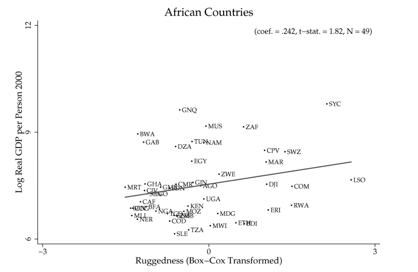
```