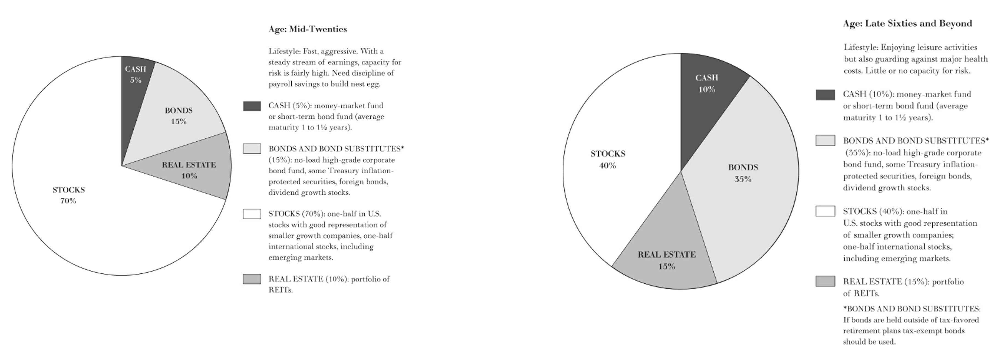

```{r setup, include=FALSE} 
options(htmltools.dir.version = FALSE)
library(knitr)
library(tidyverse)
library(huxtable)
library(data.table)
library(xaringanExtra)
library(icons)

# set default options
opts_chunk$set(echo=FALSE,
               collapse = TRUE,
               fig.width = 7.252,
               fig.height = 4,
               dpi = 300)

# set engines
knitr::knit_engines$set("markdown")

xaringanExtra::use_tile_view()
xaringanExtra::use_panelset()
xaringanExtra::use_clipboard()
xaringanExtra::use_webcam()
xaringanExtra::use_scribble()
xaringanExtra::use_broadcast()
xaringanExtra::use_share_again()
xaringanExtra::style_share_again(
  share_buttons = c("twitter", "linkedin", "pocket")
)
```

```{r load_refs, include=FALSE, cache=FALSE}
library(RefManageR)
BibOptions(check.entries = FALSE,
           bib.style = "authoryear",
           style = "markdown",
           hyperlink = FALSE,
           dashed = TRUE)
bib <- ReadBib("references.bib", check = FALSE)

print_bib_rmd <- function(bib, .opts = list(), start = 1, stop = NULL, decreasing = FALSE) {

    bib <- sort(bib, decreasing = FALSE)

    if (!length(bib)) {
        return(bib)
    }

    if (identical(class(bib), "bibentry")) {
        bib <- as.BibEntry(bib)
    }

    keys <- unlist(bib$key)
    ind <- keys %in% names(.cites$indices)

    if (!any(ind)) {
        message("You haven't cited any references in this bibliography yet.")
        return()
    }

    if (length(.opts$bib.style)) {
      bibstyle <- .opts$bib.style
    } else {
      bibstyle <- .BibOptions$bib.style
    }

    if (length(.opts$cite.style)) {
      citestyle <- .opts$cite.style
    } else {
      citestyle <- .BibOptions$cite.style
    }

    if (length(.opts$style)) {
      style <- .opts$style
    } else {
      style <- .BibOptions$style
    }

    bib <- bib[[ind]] # gets citations to print

    if (bibstyle == citestyle) {
        if (bibstyle == "numeric") {
            if (length(bib) == length(.cites$labs)) {
                bib <- bib[[names(.cites$labs)]]
                .opts$sorting <- "none"
                bib$.index <- structure(.cites$labs, names = NULL)
            }
        } else { 
          bib$.index <- .cites$labs[keys[ind]]
        }
    }

    if (length(.opts)) {
        old.opts <- BibOptions(.opts)
        on.exit(BibOptions(old.opts))
    }

    if (style == "yaml") {
        cat("\n---\nnocite:", sQuote(paste0(paste0("@", names(.cites$indices)), 
            collapse = ", ")))
        cat("\n...  \n\n")
    }
    if (is.null(stop)) {
      stop <- length(bib)
    } 
    bib <- bib[start:stop]
    print(bib)
}

environment(print_bib_rmd) <- asNamespace("RefManageR")

```
# Agenda

- Saving Considerations
  - Timeframe
  - Taxes
  - Passive vs. Active
  - Diversification
  
- Retirement Savings
  - Blended Retirement System / Thrift Savings Plan
  - Individual Retirement Accounts

- Cow Loan Considerations

---
# Couple Recommendations

```{r rand_walk, out.width='90%', fig.align='center'}

```

---
# Saving Considerations
## Timeframe
</br>
- Need to know / forecast when you want the money
- Helps inform what savings vehicle you use
- Something better than nothing... inflation always happening

```{r usaa, out.width='80%', fig.align='center'}

```

---
# Saving Considerations
## Taxes
</br>
.small[
| Type          | Tax Rate %  | Basis                                   | Comments                                                                                                                                  |
|:--------------------------|:-----------:|:-----------------------------------------:|-------------------------------------------------------------------------------------------------------------------------------------------|
| Short-term Capital Gains | 0 - 37   | Income level | Applies to any investments you hold equal to or less than 12 months                                                                       |
| Long-term Capital Gains  | 0 - 20 | Income level                   | Applies to investments held for over 12 months and are taxed when you sell                                                                |
| Qualified Dividends      | 0 - 20 | Income level                   | Applies to dividends from stocks held more than 60 days before and after the dividend payment and are taxed when you receive the payment  |
| Bond Interest Income     | 0 - 37   | Income level | When bonds are sold for a profit or loss, they also incur capital gains taxes        ]                                                     |
---
# Saving Considerations
## Taxes

```{r tax_invest, out.width='70%', fig.align='center'}

```

---
# Saving Considerations
## Passive vs. Active
</br>
- Some people think they can beat the market
- Others (economists) are a little more realistic...

```{r passive_active, out.width='50%', fig.align='center'}

```

---
# Saving Considerations
## Diversification
</br>
- With more time, you can tolerate more risk and experience larger gains (on average)
- As you approach the time when you need the money, you need safer assets

```{r diversification, out.width='100%', fig.align='center'}

```


---
# Retirement Savings

.pull-left[
Private Options

- Individual Retirement Accounts (IRA)

- Thrift Savings Plan (TSP)
]

.pull-right[
Employer Options

- Blended Retirement System (BRS)

- 401K
]

</br></br>
.big[.center[**Can't access until age 59.5!!**]]

---
# Retirement Savings
## Private Options

.pull-left[
Individual Retirement Accounts (IRA)

- Brokerage account with contribution limits
  - Currently at $6,500 / year

- Two Types
  - Traditional (Pre-Tax)
  - Roth (Post-Tax)

- Managed through most financial institutions (i.e. Schwab, Wells Fargo, etc.)
]

.pull-right[
Thrift Savings Plan (TSP)

- Federally ran mutual funds

- Less diversity for investments, lower costs, higher contribution Limits ($22,500 / year)

- Two Types
  - Traditional (Pre-Tax)
  - Roth (Post-Tax)

- Managed through TSP / MyPay
]

---
# Retirement Savings
## Employer Options

.pull-left[
401k

- Most civilian entities offer these

- Basically a retirement savings account with matching contributions
  - Ex. You contribute 10% of pay to savings and employer will match 5%

- Can have this and TSP if you transition from military to civilian
]

.pull-right[
Blended Retirement System

- DOD Changed to this policy in 2019

- Defined Benefit
  - 20 YOS = 40% for life
  - Can take lump sum option

- Defined Contribution
  - 1% Given, 4% Match
  
- Continuation Pay
  - Between 8-12 Years
  - Anywhere from 2.5x - 13x monthly base pay
]

---
# Cow Loan Consideration
##Overview
</br>
- It's a good deal if you need it
- NOT FREE MONEY
- Frontloading consumption now as opposed to later

</br>
.pull-left[
**Normal Unsecured Loan**
- 14.79% interest rate
- $1,143.83 monthly
- $32,629.60 in interest
]

.pull-right[
**Cow Loan**
- 0.75% interest rate
- $620.75 monthly
- $1,244.80 in interest
]
---
# Cow Loan Consideration
## Budget Comparison
</br>
.small[
| Amount           | Category                                   | Amount          | Category                                    |
|------------------|--------------------------------------------|-----------------|---------------------------------------------|
|  $      3,637    | 2LT Base Pay                               |  $      3,637   | 2LT Base Pay                                |
|  $       (500)   | Food       |  $       (500)  | Food        |
|  $       (700)   | Insurance, Gas, Phone Etc.                 |  $       (700)  | Insurance, Gas, Phone Etc.                  |
|  $       (727)   | Taxes (@20% Total)                         |  $       (727)  | Taxes (@20% Total)                          |
|                  |                                            | **$       (620)** | **Cow Loan Payment**              |
|  $      1,710    | Remaining after Expenses                   |  $       1,090  | Remaining after Expenses                    |
|  $       (181)   | BRS (TSP) (5%) |  $       (181)  | BRS (TSP) (5%)  |
|  $       (360)   | Roth IRA (10%)                |  $       (360)  | Roth IRA (10%)                 |
|  $       (150)   | Savings Goals (Emergency Account, etc.)    |  $       (150)  | Savings Goals (Emergency Account, etc.)     |
| **$       1,019** | **Remaining after Savings**                    | **$       400**  | **Remaining after Savings**                     |
]
---
# Cow Loan Consideration
## Things to Think About
</br>
.pull-left[
What do you need the money for and when do you need it?
</br>
- Car
- Furniture
- Engagement Ring
- Class Ring
- Uniforms
- Retirement Savings
- Trip to Celebrate Graduating
]

.pull-right[
.tiny[
| MAJ Homme's Cow Loan                  | $35,000.00   |
|---------------------------------------|--------------|
|                                       |              |
| Credit Card Debt                      | $500.00      |
| Speeding Ticket                       | $150.00      |
| Roth IRA                              | $10,000.00   |
| Emergency Fund                        | $1,000.00    |
| Truck                                 | $12,500.00   |
|                                       |              |
| Uniforms/Clothing                     | $1,000.00    |
|                                       |              |
| Apartment Starter Kit                 | $3,500.00    |
| Apartment Lease                       | $1,500.00    |
|                                       |              |
| Christmas                             | $1,000.00    |
| Iron Man Race                         | $2,500.00    |
| Spring Break Trip                     | $1,050.00    |
| Valentine's Day/ Anniversary | $200.00      |
| Kayti's B-Day                         | $100.00      |
]
]