```{r setup, include=FALSE} 
options(htmltools.dir.version = FALSE)
library(knitr)
library(tidyverse)
library(huxtable)
library(data.table)
library(xaringanExtra)
library(icons)

# set default options
opts_chunk$set(echo=FALSE,
               collapse = TRUE,
               fig.width = 7.252,
               fig.height = 4,
               dpi = 300)

# set engines
knitr::knit_engines$set("markdown")

xaringanExtra::use_tile_view()
xaringanExtra::use_panelset()
xaringanExtra::use_clipboard()
xaringanExtra::use_webcam()
xaringanExtra::use_scribble()
xaringanExtra::use_broadcast()
xaringanExtra::use_share_again()
xaringanExtra::style_share_again(
  share_buttons = c("twitter", "linkedin", "pocket")
)
```

```{r load_refs, include=FALSE, cache=FALSE}
library(RefManageR)
BibOptions(check.entries = FALSE,
           bib.style = "authoryear",
           style = "markdown",
           hyperlink = FALSE,
           dashed = TRUE)
bib <- ReadBib("references.bib", check = FALSE)

print_bib_rmd <- function(bib, .opts = list(), start = 1, stop = NULL, decreasing = FALSE) {

    bib <- sort(bib, decreasing = FALSE)

    if (!length(bib)) {
        return(bib)
    }

    if (identical(class(bib), "bibentry")) {
        bib <- as.BibEntry(bib)
    }

    keys <- unlist(bib$key)
    ind <- keys %in% names(.cites$indices)

    if (!any(ind)) {
        message("You haven't cited any references in this bibliography yet.")
        return()
    }

    if (length(.opts$bib.style)) {
      bibstyle <- .opts$bib.style
    } else {
      bibstyle <- .BibOptions$bib.style
    }

    if (length(.opts$cite.style)) {
      citestyle <- .opts$cite.style
    } else {
      citestyle <- .BibOptions$cite.style
    }

    if (length(.opts$style)) {
      style <- .opts$style
    } else {
      style <- .BibOptions$style
    }

    bib <- bib[[ind]] # gets citations to print

    if (bibstyle == citestyle) {
        if (bibstyle == "numeric") {
            if (length(bib) == length(.cites$labs)) {
                bib <- bib[[names(.cites$labs)]]
                .opts$sorting <- "none"
                bib$.index <- structure(.cites$labs, names = NULL)
            }
        } else { 
          bib$.index <- .cites$labs[keys[ind]]
        }
    }

    if (length(.opts)) {
        old.opts <- BibOptions(.opts)
        on.exit(BibOptions(old.opts))
    }

    if (style == "yaml") {
        cat("\n---\nnocite:", sQuote(paste0(paste0("@", names(.cites$indices)), 
            collapse = ", ")))
        cat("\n...  \n\n")
    }
    if (is.null(stop)) {
      stop <- length(bib)
    } 
    bib <- bib[start:stop]
    print(bib)
}

environment(print_bib_rmd) <- asNamespace("RefManageR")

```
# Laborer Definitions

--

Adult Population
- 16 and older (not in the military)

--

Employed Person
- Had ANY job
- Paid employment, self-employment, or unpaid family business work

--

Unemployed Person
- Not currently employed
- BUT actively tried to find a job within the last four weeks

--

Not in Labor Force
- Not working, and not looking for a job
- Students, homemakers, retirees, etc.

---
# Categorize These People

Abby is a full time 20-year-old college student who doesn’t work to focus on her studies.

--

- Not in labor force

--

Bob lost his full time job in a steel mill and now works part time as a waiter. He is also actively looking for a full time job.

--

- Employed

--

Cassie is an attorney who runs her own law practice.

-- 

- Employed

--

Darryl lost his job as a programmer when his company went out of business two months ago. Yesterday he interviewed for a new job and also sent out two new job applications.

--

- Unemployed

---
# Categorize These People
Edith worked full time as a nurse but is taking a year off to care for her newborn baby.

--

- Not in labor force

--

Francis is a 15-year-old high school student who works part time at McDonalds for spare money.
--

- Not in adult population

--

Gina is a 21-year-old West Point cadet.

--

- Not in adult (civilian) population

--

Harry was laid off from his job at an auto manufacturing plant six months ago. For a while he tried to find a new similar job, but he gave up searching two months ago.

--

- Not in labor force


---
# Employment Rates
</br></br>

*Labor Force Participation Rate*
--
 = $\frac{\text{Labor Force}}{\text{Adult Population}} \times 100$
--
</br></br></br>
*Unemployment Rate*
--
 = $\frac{\text{Number of Unemployed}}{\text{Labor Force}} \times 100$
--
</br></br></br>
*Employment to Population Ratio*
--
 = $\frac{\text{Number of Employed}}{\text{Adult Population}} \times 100$

---
# Types of Unemployment
Frictional
- Arises from the process of matching workers to jobs

Structural
- Something in the labor market keeping wages higher than in equilibrium
- Textbook: minimum wage, unions

Natural Rate of Unemployment
- Combination of frictional and structural unemployment
- Unemployment fluctuates around this

Cyclical
- Deviation from this natural rate
- Excess (or temporarily lower) unemployment caused by short-term economic recessions or booms


---
# Why pay more than you *have* to for a worker?

--
“Efficiency wages”

--

Better worker health/nutrition
- Mostly think about this in poor countries

--

Lower worker turnover
- Reduce training costs, etc.

--

Improve worker quality
- Attract many applicants, can be more choosy

--

Increase worker effort
- Want to keep a good job

---
#Unemployment Stylized Facts
## Time Trend
</br></br>
```{r u_time, out.width='100%', fig.align='center'}
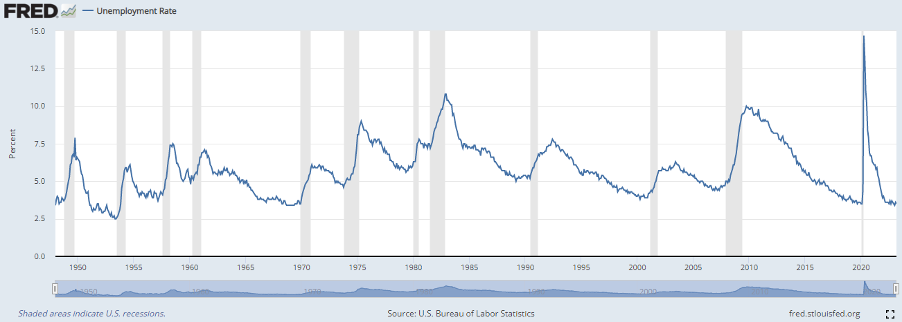
```

---
#Unemployment Stylized Facts
## Education
</br></br>
```{r u_edu, out.width='100%', fig.align='center'}
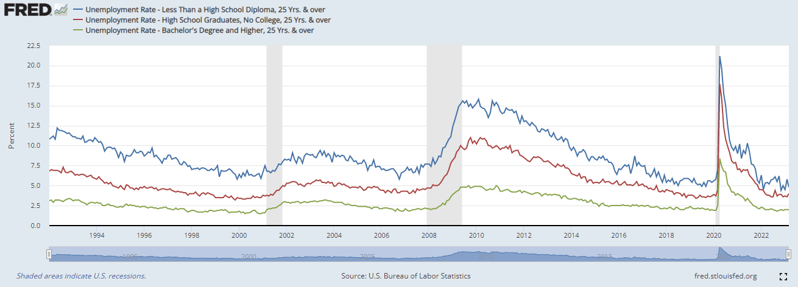
```

---
#Unemployment Stylized Facts
## Gender
</br></br>
```{r u_gender, out.width='100%', fig.align='center'}
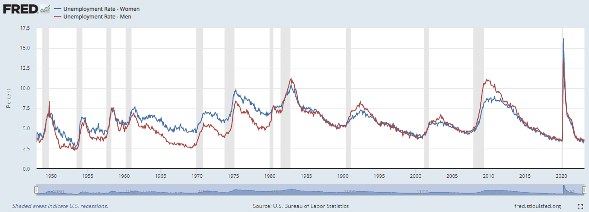
```

---
#Labor Force Participation Stylized Facts
## Time Trend
</br></br>
```{r lf_time, out.width='100%', fig.align='center'}
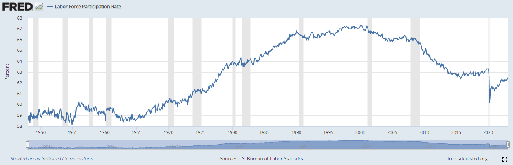
```
---
#Labor Force Participation Stylized Facts
## Education
</br></br>
```{r lf_edu, out.width='100%', fig.align='center'}
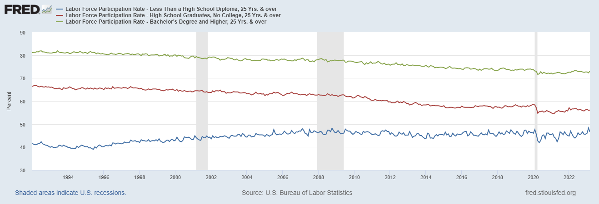
```
---
#Labor Force Participation Stylized Facts
## Gender
</br></br>
```{r lf_gender, out.width='100%', fig.align='center'}
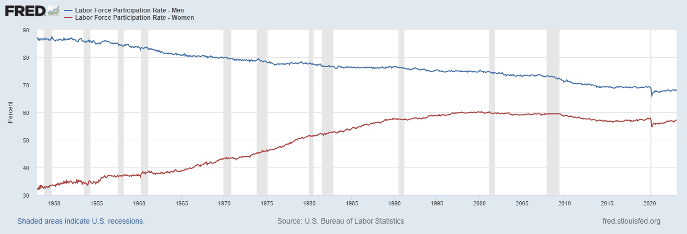
```
---
#Labor Force Participation Stylized Facts
## Why is women's participation increasing?

```{r fem_prof, out.width='65%', fig.align='center'}
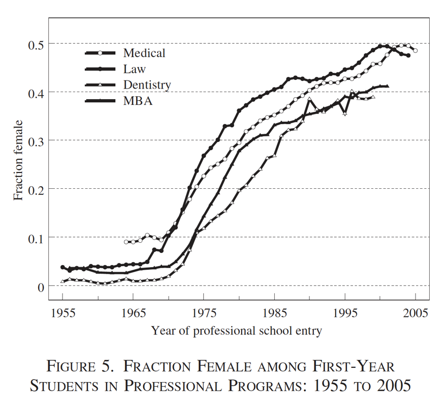
```
---
#Labor Force Participation Stylized Facts
## Why is women's participation increasing?
</br></br>
```{r fem_prof_race, out.width='100%', fig.align='center'}
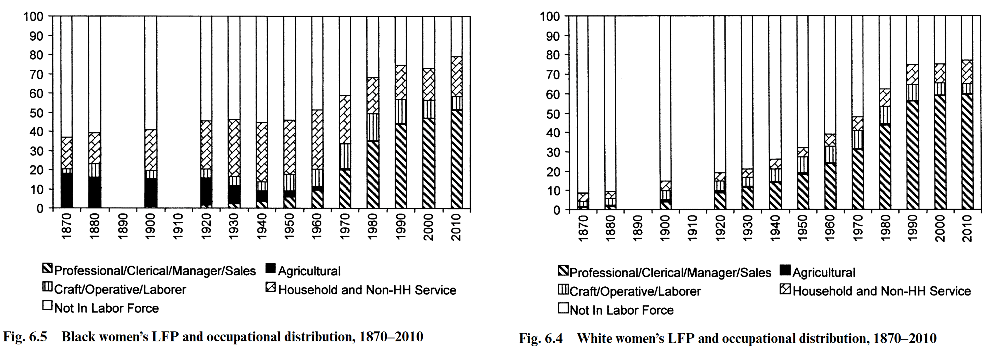
```
---
#Labor Force Participation Stylized Facts
## Why is women's participation increasing?
</br>
```{r fem_prof_race_gap, out.width='75%', fig.align='center'}
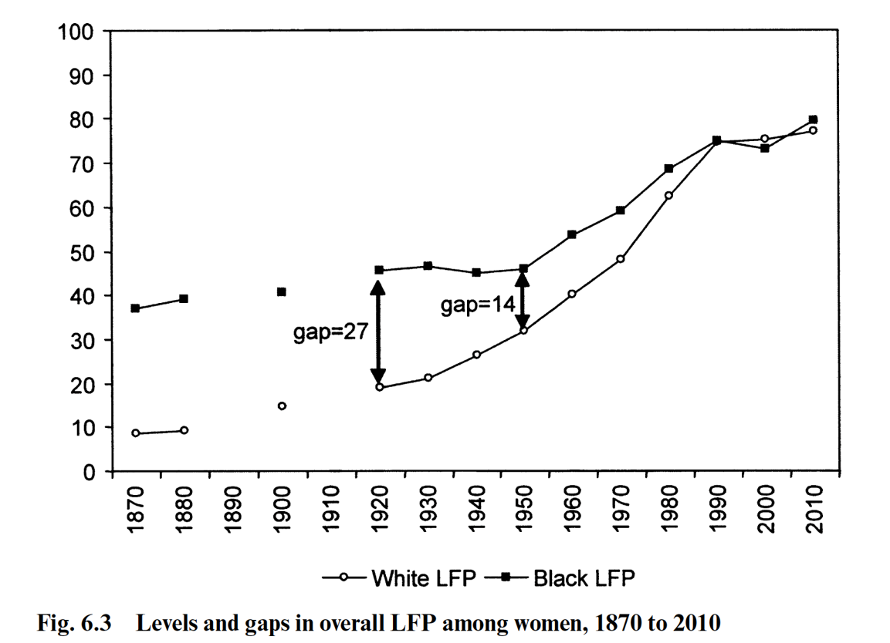
```
---
#Labor Force Participation Stylized Facts
## Why is women's participation increasing?
</br></br>
```{r fem_wage, out.width='75%', fig.align='center'}
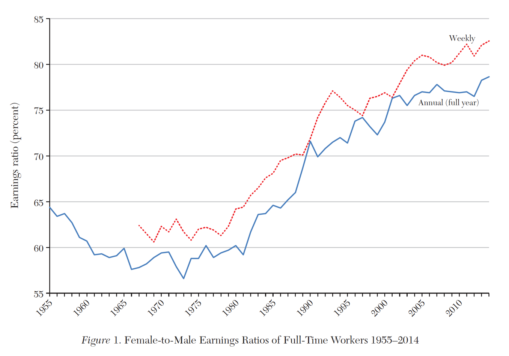
```
---
#Labor Force Participation Stylized Facts
## Why is women's participation increasing?
</br></br>
```{r fem_wage_change, out.width='100%', fig.align='center'}
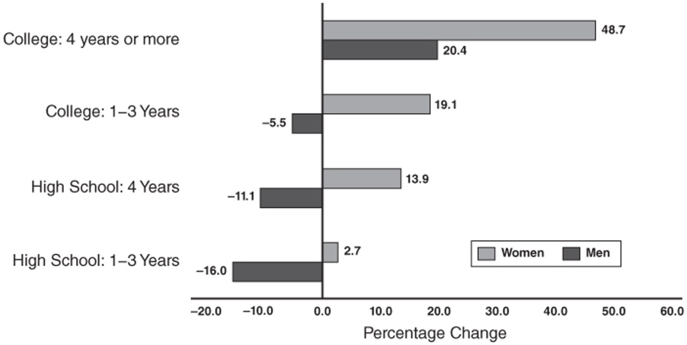
```
---
#Labor Force Participation Stylized Facts
## Why is men's participation decreasing?
</br></br>
```{r men_lfp_race, out.width='100%', fig.align='center'}
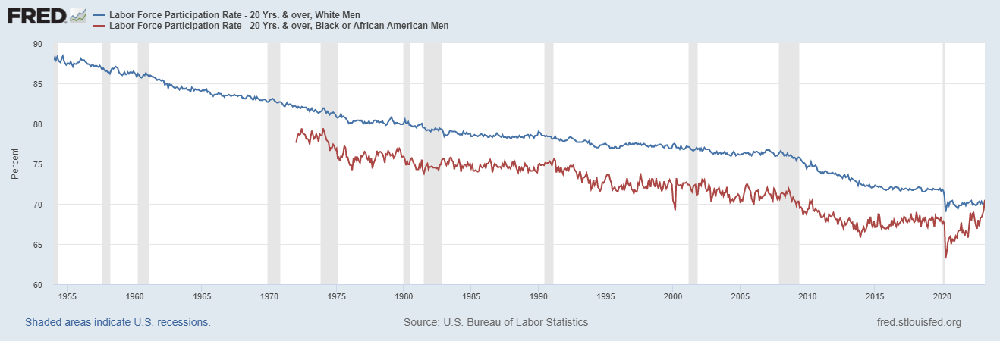
```
---
#Labor Force Participation Stylized Facts
## Why is men's participation decreasing?
```{r men_lfp_edu, out.width='90%', fig.align='center'}
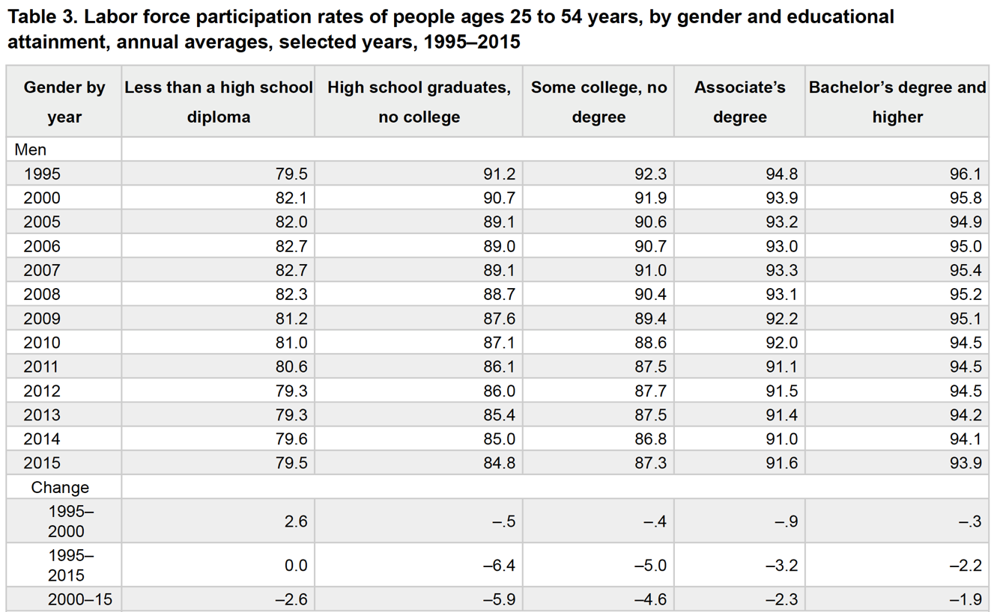
```

---
#The All-Volunteer (AVF) Force
## How do local labor market conditions affect the military?

“…whether it be just in a community, that the richer part should compel the poorer to fight in defen[s]e of them and their properties, for such wages as they think fit to allow, and punish them if they refuse?” – *Benjamin Franklin*

Vietnam War thought of as a “rich man’s war and a poor man’s fight.”

**Do economic conditions influence who enlists and joins?**

To what extent is war among democracies fought by those who have limited economic options? Essentially, **how much weight does patriotism carry in an individual's utility function?**

---
#The All-Volunteer (AVF) Force
## How do local labor market conditions affect the military?
```{r avf_gwot_enlist, out.width='80%', fig.align='center'}
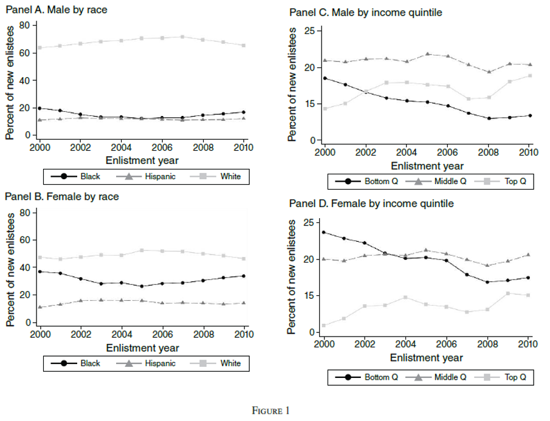
```

---
#The All-Volunteer (AVF) Force
## How do local labor market conditions affect the military?
```{r avf_gwot_enlist_race, out.width='80%', fig.align='center'}
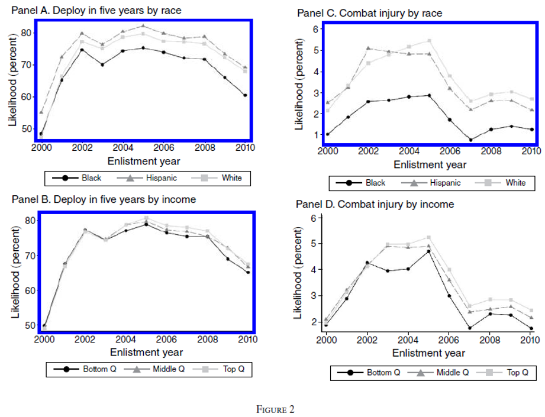
```

---
#The All-Volunteer (AVF) Force
## How do local labor market conditions affect the military?
```{r avf_labor_market, out.width='90%', fig.align='center'}
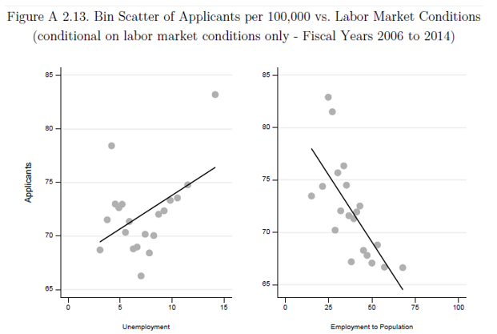
```