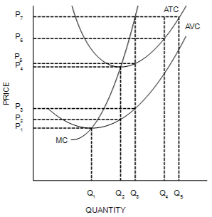
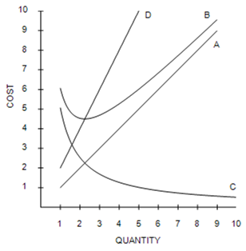

```{r setup, include=FALSE}
knitr::opts_chunk$set(
	cache = TRUE, 
	echo = FALSE, 
	warning = FALSE,
	message = FALSE,
	fig.align = 'center',
	out.width = '100%',
	dpi=300
	)
```

```{r libs, cache=FALSE, message=FALSE}
library(data.table)
library(ggplot2)
library(forcats)
library(kableExtra)
```


\fancyhf{}
\begin{center}
    \Large
    \textbf{
    \textit{SS201: Principles of Economics} \\ 
    AY 23-2 \\ 
    }
    Lesson 26: Aggregate Demand and Aggregate Supply
\end{center}
\fancyfoot[C]{\thepage}

# Review {#sec:review}
```{r prof_max, out.width='50%', fig.align='center'}

```
1. When market price is $P_2$, a profit-maximizing firm's losses can be represented by the area
 	a. 	$(P_4 − P_2) \times Q_2$
 	b. 	$(P_2 − P_1) \times (Q_2 − Q_1)$
 	c. 	At a market price of P2, the firm earns profits, not losses.
 	d. 	At a market price of P2 the firm has losses, but the reference points in the figure don't identify the losses.

\vspace{0.5cm}
2.  Equilibrium quantity must decrease when
 	a. 	demand increases and supply decreases.
 	b. 	demand decreases and supply increases.
 	c. 	demand increases and supply does not change.
 	d. 	both demand and supply decrease.

```{r rcosts, out.width='50%', fig.align='center'}

```

\vspace{0.5cm}
3. Curve B intersects curve D
 	a. 	where the firm maximizes production.
 	b. 	at the minimum of average fixed cost.
 	c. 	at the efficient scale.
 	d. 	where fixed costs equal variable costs.
\vspace{0.5cm}
4. Curve D is the firm's
 	a. 	Marginal Cost Curve
 	b. 	Variable Cost Curve
 	c. 	Fixed Cost Curve
 	d. 	Average Total Cost Curve
\vspace{0.5cm}
5. Curve C is the firm's
 	a. 	Marginal Cost Curve
 	b. 	Average Variable Cost Curve
 	c. 	Average Fixed Cost Curve
 	d. 	Average Total Cost Curve
\vspace{0.5cm}
6. A Texas household receives a Social Security check for \$1500, which it uses to purchase a \$40 pair of shoes made in Thailand by a Thai firm, a \$1240 television made by a Korean firm in Korea, and \$220 on groceries from a local store. As a result, U.S. GDP
 	a. 	increases by $40.
 	b. 	increases by $220.
 	c. 	increases by $280.
 	d. 	increases by $1500.
\vspace{0.5cm}

7. At Sarah's Bakery, the cost of making one cake is \$1.00. If Sarah sells 20 cakes and gains producer surplus of \$40.00, then Sarah must be selling her cakes for
 	a. 	\$1.00 each.
 	b. 	\$2.00 each.
 	c. 	\$3.00 each.
 	d. 	\$20.00 each.
\vspace{0.5cm}

8. Which of the following demonstrates the law of supply?
 	a. 	When leather became more expensive, belt producers decreased their supply of belts.
 	b. 	When car production technology improved, car producers increased their supply of cars.
 	c. 	When sweater producers expected sweater prices to rise in the near future, they decreased their current supply of sweaters.
 	d. 	When ketchup prices rose, ketchup sellers increased their quantity supplied of ketchup.
 	
\vspace{0.5cm}

Below is a table of Uruguay's national data for the year 2019.

| Category                                        | Amount        |
|--------------------------------------------------|:---------:|
| Household purchases of durable goods             | $1,574  |
| Household purchases of nondurable goods          | $1,717  |
| Household purchases of services                  | $385    |
| Household purchases of new housing               | $704    |
| Purchases of capital equipment                   | $310    |
| Inventory changes                                | $363    |
| Purchases of new structures                      | $611    |
| Depreciation                                     | $117    |
| Salaries of government workers                   | $1,422  |
| Government expenditures on public works          | $569    |
| Transfer payments                                | $777    |
| Foreign purchases of domestically produced goods | $88     |
| Domestic purchases of foreign goods              | $140    |

9. What were country Uruguay's net exports in 2019?
 	a. 	−$52
 	b. 	$52
 	c. 	$88
 	d. 	$140
\vspace{0.5cm}
10. Suppose that the demand for picture frames is highly inelastic, and the supply of picture frames is highly elastic. A tax of $1 per frame levied on picture frames will increase the price paid by buyers of picture frames by
 	a. 	less than \$0.50.
 	b. 	\$0.50.
 	c. 	between \$0.50 and \$1.
 	d. 	$1.

\pagebreak

# Bottom Line Up Front {#sec:bluf}
The Aggregate Demand and Supply model we are learning about today is different than the typical supply and demand model for a single market. We have defined the macroeconomy and modeled growth, but now it is time to present a model which explains short-term macroeconomic variation to accompany long-term predictions. 

# Aggregate Demand {#sec:dem}

1. What relationship does this curve depict? How does this curve factor into our original model of our national economy, $Y=C+I+G+NX$? \vspace{4cm}
2. Why is the Aggregate Demand curve downward sloping? \pagebreak

# Aggregate Supply {#sec:sup}
1. What relationships do the Short-Run and Long-Run Aggregate Supply curves depict? \vspace{4cm}
2. Why is the Long-Run Aggregate Supply curve a vertical line? \vspace{4cm}
3. Why is the Short-Run Aggregate Supply curve upward sloping? \pagebreak

# Equilibrium {#sec:equil}
For each of the following scenarios, explain which of the curves shift, and in which direction.

1. Europe experiences a recession and reduces its imports from the U.S. \vspace{2cm}
2. There is an increase in “consumer confidence” and people decide to consume more and save less. Assume that interest rates do not significantly change. \vspace{2cm}
3. Weather becomes permanently hotter, reducing farming output. \vspace{2cm}
4. Within an economic recession, firms and workers finally start to think that this low price level will be around for a long time (i.e. expectations adjust, bringing the expected price level close to the real price level). \vspace{2cm}
5. The government increases income taxes but does not increase government spending. \vspace{2cm}
6. Oil prices spike upwards temporarily. \vspace{2cm}

\pagebreak

For each of the following scenarios: (i) Use an AD-AS graph to explain what happens in the short-run to prices, output, real and nominal wages; (ii) Label the economic situation (i.e. recession, expansion, stagflation); (iii) What would a policy-maker worry about in this situation?

7. OPEC restricts the supply of oil and raises the price of oil. Assume that the Long Run Aggregate Supply does not shift.
```{r g1, out.width='50%', fig.align='left'}
knitr::include_graphics("img/grid.png")
```

8. Suppose that the market pivots toward a “bullish” outlook, driving up consumer and business confidence and a sense of optimism.
```{r g2, out.width='50%', fig.align='left'}
knitr::include_graphics("img/grid.png")
```

