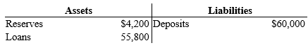
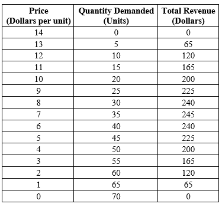

```{r setup, include=FALSE}
knitr::opts_chunk$set(
	cache = TRUE, 
	echo = FALSE, 
	warning = FALSE,
	message = FALSE,
	fig.align = 'center',
	out.width = '100%',
	dpi=300
	)
```

```{r libs, cache=FALSE, message=FALSE}
library(data.table)
library(ggplot2)
library(forcats)
library(kableExtra)
```


\fancyhf{}
\begin{center}
    \Large
    \textbf{
    \textit{SS201: Principles of Economics} \\ 
    AY 23-2 \\ 
    }
    Lesson 27: Monetary Policy
\end{center}
\fancyfoot[C]{\thepage}

# Review {#sec:review}

```{r msreview, out.width='60%', fig.align='center'}

```
1. Assume the Fed's reserve requirement is 5 percent and all banks besides the Bank of Cheerton are exactly in compliance with the 5 percent requirement. Further assume that people hold only deposits and no currency. Starting from the situation as depicted by the T-account, if the Bank of Cheerton decides to make new loans so as to end up with no excess reserves, then by how much does the money supply eventually increase?
 	a. 	$17,142.86
 	b. 	$24,926.97
 	c. 	$26,871.29
 	d. 	$24,000.00
 	
\vspace{0.5cm}
Only two firms, ABC and MNO, sell a particular product. The following table shows the demand curve for their product. Each firm has the same constant marginal cost of $4 and zero fixed cost.

```{r abcmno, out.width='60%', fig.align='center'}

```

2. ABC and MNO agree to jointly maximize profits. If ABC and MNO each break the agreement and each produce 5 more than agreed upon, how much less profit does each make, compared to the profit at the cartel output?
 	a. 	$20.00
 	b. 	$10.00
 	c. 	$5.00
 	d. 	$70.00
\vspace{0.5cm}
3. Suppose there is currently a tax of \$80 per ticket on airline tickets. Sellers of airline tickets are required to pay the tax to the government. If the tax is reduced from \$80 per ticket to \$64 per ticket, then the
 	a. 	demand curve will shift upward by \$16, and the price paid by buyers will decrease by less than \$16.
 	b. 	demand curve will shift upward by \$16, and the price paid by buyers will decrease by \$16.
 	c. 	supply curve will shift downward by \$16, and the effective price received by sellers will increase by less than \$16.
 	d. 	supply curve will shift downward by \$16, and the effective price received by sellers will increase by \$16.
\vspace{0.5cm}
4. Which of the following statements is not correct?
 	a. 	Tradable pollution permits have an advantage over corrective taxes if the government is uncertain as to the optimal size of the tax necessary to reduce pollution to a specific level.
 	b. 	Both corrective taxes and tradable pollution permits provide market-based incentives for firms to reduce pollution.
 	c. 	Corrective taxes set the maximum quantity of pollution, whereas tradable pollution permits fix the price of pollution.
 	d. 	Both corrective taxes and tradable pollution permits reduce the cost of environmental protection and thus should increase the public's demand for a clean environment.
\vspace{0.5cm}
5. Assume that a college student purchases only Ramen noodles and textbooks. If Ramen noodles are an inferior good and textbooks are a normal good, then the income effect associated with an increase in the price of a textbook will result in
 	a. 	a decrease in the consumption of textbooks and a decrease in the consumption of Ramen noodles.
 	b. 	a decrease in the consumption of textbooks and an increase in the consumption of Ramen noodles.
 	c. 	an increase in the consumption of textbooks and an increase in the consumption of Ramen noodles.
 	d. 	an increase in the consumption of textbooks and a decrease in the consumption of Ramen noodles.
\vspace{0.5cm}
6. Which of the following statements is correct?
 	a. 	Monopolistic competition is similar to monopoly because both market structures are characterized by firms being price makers rather than price takers.
 	b. 	Monopolistic competition is similar to perfect competition because both market structures are characterized by differentiated products.
 	c. 	Monopolistic competition is similar to oligopoly because both market structures are characterized by strategic interaction between firms in the market.
 	d. 	Monopolistic competition is similar to perfect competition because both market structures are characterized by perfectly elastic demand curves facing each firm.
\vspace{0.5cm}
7. Suppose that the equilibrium price in the market for widgets is \$5. If a law increased the minimum legal price for widgets to \$6, producer surplus
 	a. 	would necessarily increase even if the higher price resulted in a surplus of widgets.
 	b. 	would necessarily decrease because the higher price would create a surplus of widgets.
 	c. 	might increase or decrease.
 	d. 	would be unaffected.
\vspace{0.5cm}
8. Suppose that some country had an adult population of about 59 million, a labor-force participation rate of 72.9 percent, and an unemployment rate of 2.3 percent. How many people were employed?
 	a. 	1.0 million
 	b. 	42.0 million
 	c. 	59 million
 	d. 	137.2 million
 	\vspace{0.5cm}
9. What happens to consumer surplus in the cell phone market if cell phones are normal goods and income of the cell phone buyers rises?
 	a. 	Consumer surplus decreases.
 	b. 	Consumer surplus remains unchanged.
 	c. 	Consumer surplus increases.
 	d. 	Consumer surplus may increase, decrease, or remain unchanged.
\vspace{0.5cm}
10. Suppose you are deciding whether or not to buy a particular bond for \$5,980.17. If you buy the bond and hold it for 5 years, then at that time you will receive a payment of \$10,000. You will buy the bond today if the interest rate is
 	a. 	no less than 9.48 percent.
 	b. 	no greater than 9.48 percent.
 	c. 	no less than 10.83 percent.
 	d. 	no greater than 10.83 percent.


\pagebreak

# Bottom Line Up Front {#sec:bluf}
The Federal Reserve and other Central Banks play a huge role within the macroeconomy. Their ability to affect the money supply helps stabilize prices, employment, and interest rates throughout the world. Absent from politics, this body can be the unsung hero which holds the economy together throughout tough supply or demand shocks. 

# The Federal Reserve (Review) {#sec:fed}
1.	Who controls the nation’s money supply? \vspace{3cm}
2.	What tools do they use? \vspace{3cm}
  
    a.	What is the Federal Funds Rate? \vspace{2cm}
    b.	What is the Discount Rate? \vspace{2cm}

3.	What is the Fed’s “Dual Mandate,” and what are its requirements? \vspace{3cm}

\pagebreak

# Liquidity Preference and the (Short-Run) Money Market {#sec:liq}
1.	Graphically depict the short-run money market below 

```{r g1, out.width='60%', fig.align='center'}
knitr::include_graphics("img/grid.png")
```
    
2.  Who determines money demand, and what is the shape of the curve? \vspace{3cm}

3.	Given what we know about the Federal Reserve, what is the shape of the curve for money supply? \pagebreak

4.  Show what happens to the market for money when the price level increases. How do we reflect that change on the AS/AD diagram? What is the most important reason that Aggregate Demand falls when the price level increases?

```{r g2, out.width='100%', fig.align='center'}
knitr::include_graphics("img/double_grid.png")
```

\pagebreak

# Monetary Policy {#sec:mp}
Begin by drawing the LRAS, SRAS, and AD curves for an economy in long-run equilibrium below. Label the initial equilibrium point A.

```{r g3, out.width='70%', fig.align='center'}
knitr::include_graphics("img/grid.png")
```

1.	Suppose there is a shock to consumer confidence which reduces household spending. Draw the effect of this short-run shock using our AS/AD model and label the resulting point B. \vspace{2.0cm}

2.	Considering the dual mandate of the FED, what is the Central Bank likely concerned about in the short term? \pagebreak

3.	Describe the FED’s likely response. Show the implications of the Central Bank’s policy on the money supply/demand diagram (sketch below) and on the AS/AD model. Label the resulting point C. 

```{r g4, out.width='100%', fig.align='center'}
knitr::include_graphics("img/double_grid.png")
```

\pagebreak

In the late 1970s OPEC restricted the supply of oil and raised the price of oil (which more than doubled). 

4. Analyze this shock using our AS-AD model. Label the new short-run equilibrium as point B. 

```{r g5, out.width='70%', fig.align='center'}
knitr::include_graphics("img/grid.png")
```

5. This country’s central bank wants to use monetary policy to intervene. What are its two primary concerns? What tradeoff does it face? \vspace{3cm}

6.	In 1979 Paul Volcker, the chairman of the FED, decided to combat this inflation by targeting a much higher federal funds rate. Show the likely effect of this policy on the graph above. What would you expect to happen to inflation, unemployment, and total output? \vspace{3cm}
