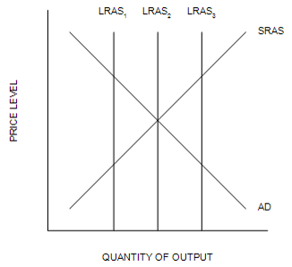
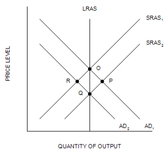

```{r setup, include=FALSE}
knitr::opts_chunk$set(
	cache = TRUE, 
	echo = FALSE, 
	warning = FALSE,
	message = FALSE,
	fig.align = 'center',
	out.width = '100%',
	dpi=300
	)
```

```{r libs, cache=FALSE, message=FALSE}
library(data.table)
library(ggplot2)
library(forcats)
library(kableExtra)
```


\fancyhf{}
\begin{center}
    \Large
    \textbf{
    \textit{SS201: Principles of Economics} \\ 
    AY 23-2 \\ 
    }
    Lesson 28: Fiscal Policy
\end{center}
\fancyfoot[C]{\thepage}

# Review {#sec:review}
```{r lras, out.width='100%', fig.align='center'}

```
1. The short-run equilibrium is defined by the given AD and SRAS curves. Which of the long-run aggregate-supply curves is consistent with the economy being in a recession?
 	a. 	$LRAS_1$
 	b. 	$LRAS_2$
 	c. 	$LRAS_3$
 	d. 	Both $LRAS_1$ and $LRAS_3$
\vspace{0.5cm}
2. You are in charge of the local city-owned aquatic center. You need to increase the revenue generated by the aquatic center to meet expenses. The mayor advises you to increase the price of a day pass. The city manager recommends reducing the price of a day pass. You realize that
 	a. 	the mayor thinks demand is elastic, and the city manager thinks demand is inelastic.
 	b. 	both the mayor and the city manager think that demand is elastic.
 	c. 	both the mayor and the city manager think that demand is inelastic.
 	d. 	the mayor thinks demand is inelastic, and the city manager thinks demand is elastic.
\vspace{0.5cm}
3. A free rider is a person who
 	a. 	will only purchase a product on sale.
 	b. 	receives the benefit of a good but avoids paying for it.
 	c. 	can produce a good at no cost.
 	d. 	rides public transit regularly.
\pagebreak
4. The following information applies to a competitive firm that sells its output for \$45 per unit: (1) When the firm produces and sells 100 units of output, its average total cost is \$24.5; (2)When the firm produces and sells 101 units of output, its average total cost is \$24.65. When the firm produces 100 units of output, its total cost is
 	a. 	$4,500.00.
 	b. 	$1,109.25.
 	c. 	$2,450.00.
 	d. 	$2,465.00.
\vspace{0.5cm}
5. National saving is
 	a. 	the total income in the economy that remains after paying for consumption.
 	b. 	the total income in the economy that remains after paying for consumption and government purchases.
 	c. 	always greater than investment for a closed economy.
 	d. 	equal to private saving minus public saving.
\vspace{0.5cm}
6. The wealth effect, interest-rate effect, and exchange-rate effect are all explanations for
 	a. 	the slope of short-run aggregate supply.
 	b. 	the slope of long-run aggregate supply.
 	c. 	the slope of the aggregate-demand curve.
 	d. 	shifts in the aggregate-demand curve.
\vspace{0.5cm}
7. The rate at which a consumer is willing to exchange one good for another while maintaining a constant level of satisfaction is called the
 	a. 	relative expenditure ratio.
 	b. 	value of marginal product.
 	c. 	marginal rate of substitution.
 	d. 	relative price ratio.
\pagebreak
8. The government builds a new water-treatment plant. The owner of the company that builds the plant pays her workers. The workers increase their spending. Firms from which the workers buy goods increase their output. This type of effect on spending illustrates
 	a. 	the multiplier effect.
 	b. 	the crowding-out effect.
 	c. 	the Fisher effect.
 	d. 	the wealth effect.
\vspace{0.5cm}
```{r asad_rev, out.width='100%', fig.align='center'}

```

9. If the economy is in long-run equilibrium, then an adverse shift in short-run aggregate supply would move the economy from
 	a. 	O to P.
 	b. 	Q to R.
 	c. 	P to O.
 	d. 	R to Q.
\vspace{0.5cm}
10. Which of the following is correct?
 	a. 	The GDP deflator is better than the CPI at reflecting the goods and services bought by consumers.
 	b. 	The CPI is better than the GDP deflator at reflecting the goods and services bought by consumers.
 	c. 	The GDP deflator and the CPI are equally good at reflecting the goods and services bought by consumers.
 	d. 	The GDP deflator is more commonly used as a gauge of inflation than the CPI is.

\pagebreak

# Bottom Line Up Front {#sec:bluf}
Fiscal Policy is another means, albeit a more politically divisive one, which can be used to stimulate the economy. Together, central banks and governments must work together to synchronize the economy and ensure balanced growth. 

# Fiscal Policy {#sec:fisc}
Suppose the economy is in long-run equilibrium. Draw the AS/AD Diagram on the right most coordinate system and label the initial equilibrium point A. 

```{r g1, out.width='100%', fig.align='center'}
knitr::include_graphics("img/double_grid.png")
```

1. Congress has just passed a new $10 billion infrastructure improvement program. Draw the short-term impact of this policy and label the resulting short-run equilibrium point B. \vspace{1cm}

2.	What two offsetting effects explain why this spending could theoretically increase Aggregate Demand by more than \$10 billion or less than \$10 billion? \vspace{3cm}

3.	Suppose the Marginal Propensity to Consume (MPC) is 0.75. What is the equation for the spending multiplier? Assuming there is no crowding out at all, how much does the \$10 billion increase in spending increase the demand for goods and services by? \vspace{3cm}

4.	Explain how the FED might respond to this infrastructure improvement program and why? Draw the effects of the FED’s intervention in a money supply/demand diagram on the left-most coordinate system above. Label the final point C. \vspace{3cm}

5.	What might happen to the macroeconomy in the long run if the infrastructure bill is successful at improving domestic transportation networks? If you were the FED, how might you respond? \vspace{3cm}


\pagebreak

# Fiscal Considerations {#sec:fisc_con}
1.	Fiscal Policy’s effect on the Aggregate Demand curve is largely governed by the MPC for the beneficiaries. What types of households are likely to have a high MPC? What should this imply about the design of income tax cuts designed to stimulate the economy through household spending? \vspace{3cm}

2.	Fiscal deficits impose costs on future generations who have to then pay these debts with interest. These debts cause crowding out of private investment, reduce long run capital accumulation and standards of living. Some have suggested requiring the government to run a balanced budget.  Suppose the government was required by law to run a balanced budget. What would this imply for government spending during a recession? What do you think we should do? \vspace{3cm}

\pagebreak

# Monetary / Fiscal Policy Review {#sec:pol_rev}

\begin{center}
\begin{tblr}{
  colspec = {X[c,]X[c]X[c]},
  stretch = 0,
  hlines = {1pt},
  vlines = {1pt},
  row{1} = {10pt},
  row{2} = {30pt},
  row{3} = {180pt},
  row{4-Z} = {120pt},
}
& \textbf{Monetary Policy} & \textbf{Fiscal Policy} \\
\textit{Who} makes policy decisions? &  & \\
What \textit{actions} does this policy type include?	&  & \\
\textit{How} does this policy work?	&  & \\
\textit{Which curve} shifts on AS/AD?	&  & \\
\end{tblr}
\end{center}
