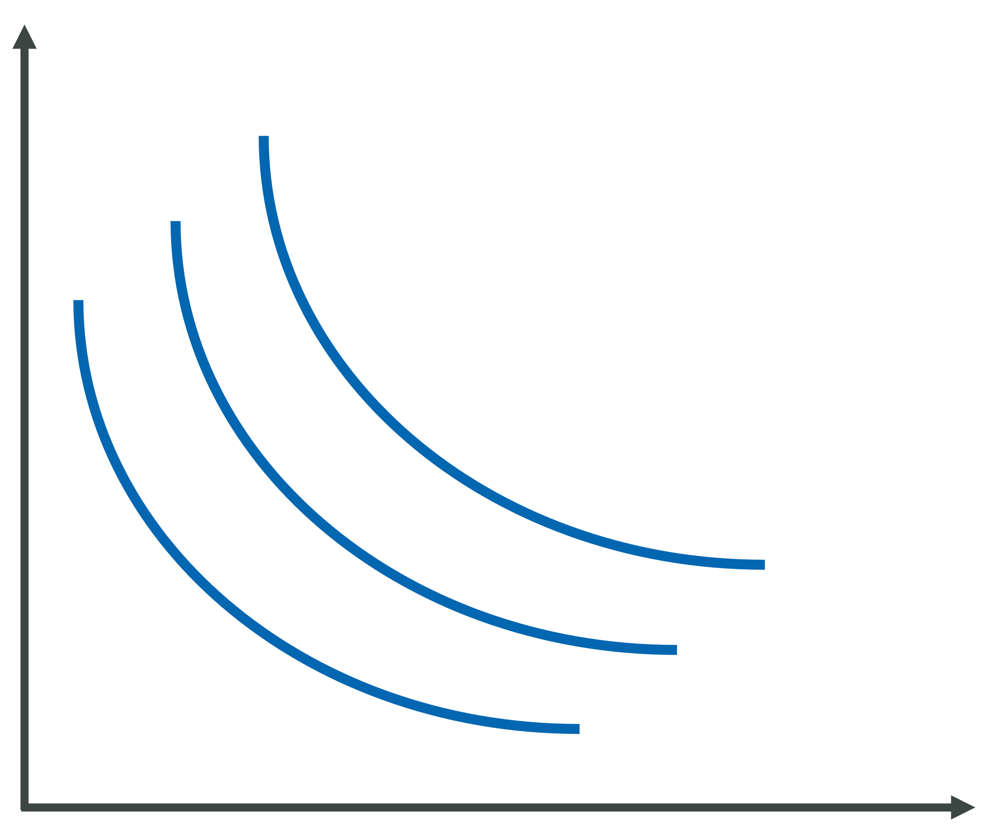
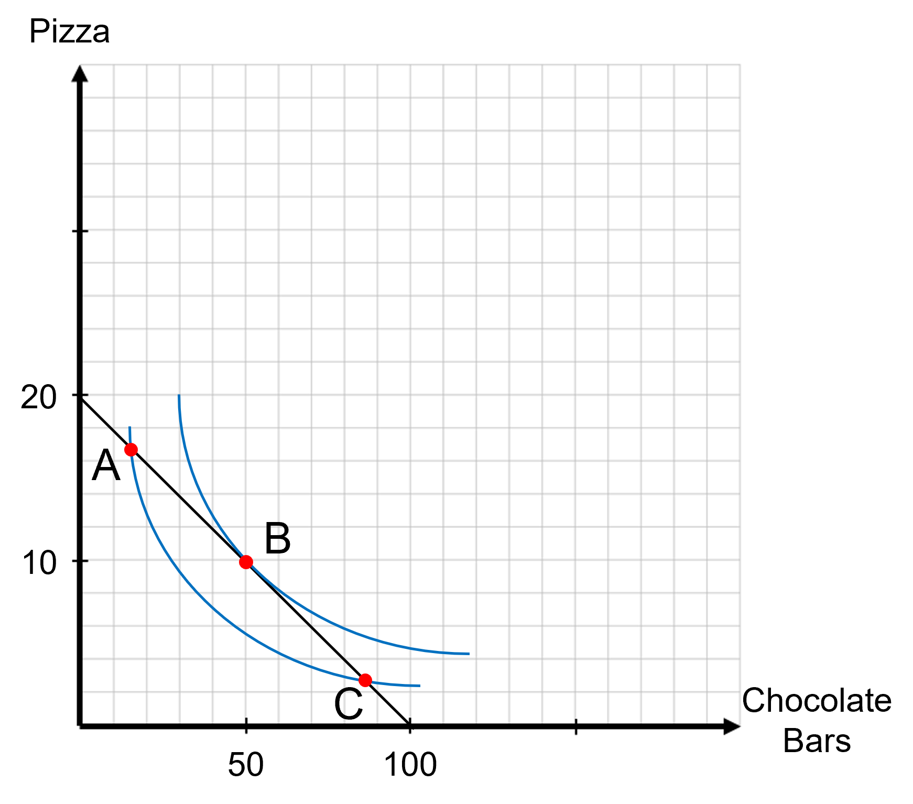

```{r setup, include=FALSE}
knitr::opts_chunk$set(
	cache = TRUE, 
	echo = FALSE, 
	warning = FALSE,
	message = FALSE,
	fig.align = 'center',
	out.width = '100%',
	dpi=300
	)
```

```{r libs, cache=FALSE, message=FALSE}
library(data.table)
library(ggplot2)
library(forcats)
library(kableExtra)
```


\fancyhf{}
\begin{center}
    \Large
    \textbf{
    \textit{SS201: Principles of Economics} \\ 
    AY 23-2 \\ 
    }
    Lesson 3: Consumer Choice Theory I
\end{center}
\fancyfoot[C]{\thepage}

# Review {#sec:review}

For each question below, select either True, False, or Uncertain. Then in the space provided, briefly justify your answer (one or two sentences maximum).


\begin{center}
True \hspace{3cm} False \hspace{3cm} Uncertain
\end{center}

1. If an individual has an absolute advantage in one good, they have a comparative advantage in that same good.

  \vspace{3cm}

\begin{center}
True \hspace{3cm} False \hspace{3cm} Uncertain
\end{center}

2. Individuals can benefit from trade when they have different comparative advantages.

  \vspace{3cm}

\begin{center}
True \hspace{3cm} False \hspace{3cm} Uncertain
\end{center}

3. The statement, "Cadets should only have recall formation on long weekends," is a positive statement.

  \vspace{3cm}

\pagebreak

# Bottom Line Up Front {#sec:bluf}
Individuals are constrained optimizers who maximize their own happiness subject to their preferences and resources available. **More is always better, but** with any individual good, **just not as good as the previous one.**

# Utility {#sec:prod}
Before we produce a model of an individual's preferences, let's first build some intuition for how an individual values any good. One student will consume, and after each unit consumed, he or she will assign a value of how happy that unit made them. This value will be from 0-100. That student will continue eating until the unit gives them zero additional happiness. Rather than use the word "happiness," we will now refer to this as "utility." Throughout this process, we will fill in the tables, and build the graphs below of the consumer's "marginal utility" (the utility they gain from consuming each additional unit), and the "total utility," (the total amount of utility from all consumption). We will graph marginal utility on the left and total utility on the right. Place utility on the vertical axis and the number of units consumed on the horizontal axis.

\begin{center}
  \footnotesize
  \begin{tabular}{c|c|c}
    Number & Marginal Utility & Total Utility \\ \hline
    1 & & \\ \hline
    2 & & \\ \hline
    3 & & \\ \hline
    4 & & \\ \hline
    5 & & \\ \hline
    6 & & \\ \hline
    7 & & \\ \hline
    8 & & \\ \hline
    9 & & \\ \hline
    10 & & \\ \hline
    11 & & \\ \hline
    12 & & \\ \hline
    13 & & \\ \hline
    14 & & \\ \hline
    15 & & \\ \hline
  \end{tabular}
\end{center}

\vspace{1cm}

```{r g1, out.width='100%', fig.align='center'}
knitr::include_graphics("img/double_grid.png")
```

\pagebreak

# Consumer Choice Theory {#sec:cst}
You (should) make decisions based off two criteria:

- Preferences: What you enjoy and makes you happiest, or what brings you the most "utility."

- Scarcity: What is available and what you can afford.

\begin{center}
  \textit{The best decisions evaluate tradeoffs at the margin. These decisions allocate where you should spend your next     dollar or minute of your time.}
\end{center}

## Preferences - The Utility Function {#sec:pref}
\begin{minipage}[t]{0.45\textwidth}
    \vspace{0pt}
    To help us develop our model of how consumers choose which goods to consume subject to their resources, allow me to introduce our friend Lawrence. He loves Domino's pizza and Baby Ruth chocolate bars. He does not view them as perfect substitutes or complements, but values them similarly. He's only a teenager, doesn't have a job, and also enjoys riding bikes with his friends around Astoria, Oregon.
\end{minipage}
\hfill
\begin{minipage}[t]{0.45\textwidth}
    \vspace{0pt}
    \centering
    \includegraphics[width=.45\linewidth]{img/chunk.jpg}
\end{minipage}

Two graphs of Lawrence's indifference curves are given below. His utility function is $U(c, p) = p^\frac{1}{2}c^\frac{1}{2}$, and is what we refer to as "Cobb-Douglas Utility" in economics. Good 1 in this instance are chocolate bars and are located on the horizontal axis on the graph on the right. Good 2 in this instance is pizza and is on the vertical axis on the graph on the right. 

\begin{center}
\includegraphics[width=\textwidth]{img/cd_util.png}
\end{center} 
\pagebreak

1. What are the four properties of indifference curves, and what are the reasons behind these?
\vspace{3cm}

2. Say Lawrence's preferences change to where he prefers pizza twice as much as candy bars. How does this change what Lawrence's indifference curves look like? Draw them below. Keep chocolate bars on the horizontal axis and pizza on the vertical axis. 

```{r g3, out.width='50%', fig.align='center'}
knitr::include_graphics("img/grid.png")
``` 

3. Let's now talk about the slopes of our indifference curves. What do we call this in economics, and what does it represent? 

\pagebreak


4. Lawrence's utility function is $U(c, p) = p^\frac{1}{2}c^\frac{1}{2}$ and his indifference curves are plotted below. How do I find the Marginal Rate of Substitution for any bundle $(c,p)$?

```{r ic, out.width='50%', fig.align='center'}

``` 
\pagebreak

## Scarcity - The Budget Constraint {#sec:scar}
Lawrence is lucky and has generous parents. They give him an allowance each week of \$100. Pizza costs \$5 a slice and chocolate bars cost \$1.

1. Write out the equation of Lawrence's Budget Constraint, graph it below, and shade in the area of all the combinations he can afford (his feasible set). Keep chocolate bars on the horizontal axis and pizza on the vertical axis.

```{r g4, out.width='50%', fig.align='left'}
knitr::include_graphics("img/grid.png")
``` 

2. What happens to our budget constraint within each of the following situations below:

    a. Lawrence's parents double his allowance. \vspace{2cm}
    b. The price of chocolate bars rises to \$5 per bar. \vspace{2cm}
    c. Lawrence's allowance, the price of chocolate bars, and the price of pizza all increases by 10%. \vspace{2cm}

\pagebreak
## Constrained Optimization - Finding The Optimal Bundle {#sec:optimal}
Given below is a graph of Lawrence's budget constraint along with a couple of his indifference curves.

1. When faced with the decision of how to spend his allowance, at what point below will Lawrence choose? Why?

```{r ob, out.width='70%', fig.align='left'}

``` 

2. Given your answer above, what is the expression that enables individuals to choose their optimal bundles for any income level $I$? What does this expression mean and how do I translate it?

\pagebreak

3. Given that Lawrence's utility function is $U(c, p) = p^\frac{1}{2}c^\frac{1}{2}$ and his budget constraint generally is $I = 5p + c$, how do I solve for Lawrence's optimal bundle?