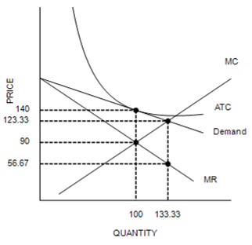
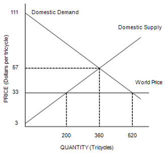
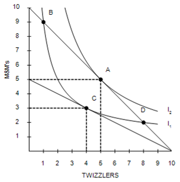
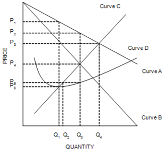
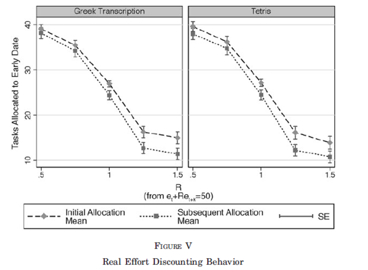
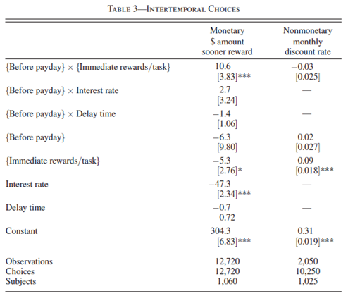
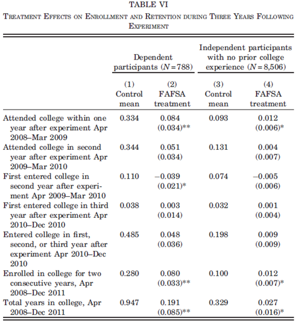

```{r setup, include=FALSE}
knitr::opts_chunk$set(
	cache = TRUE, 
	echo = FALSE, 
	warning = FALSE,
	message = FALSE,
	fig.align = 'center',
	out.width = '100%',
	dpi=300
	)
```

```{r libs, cache=FALSE, message=FALSE}
library(data.table)
library(ggplot2)
library(forcats)
library(kableExtra)
```


\fancyhf{}
\begin{center}
    \Large
    \textbf{
    \textit{SS201: Principles of Economics} \\ 
    AY 23-2 \\ 
    }
    Lesson 30: Frontiers in Economics
\end{center}
\fancyfoot[C]{\thepage}

# Review {#sec:review}
```{r l30_1, out.width='90%', fig.align='center'}

```
1. In order to maximize its profit, the firm will choose to produce
 	a. 	less than 100 units of output.
 	b. 	100 units of output.
 	c. 	between 100 and 133.33 units of output.
 	d. 	more than 133.33 units of output.

\vspace{0.5cm}
2. Which of the following statements is correct about the relationship between the nominal interest rate and the real interest rate?
 	a. 	The real interest rate is the nominal interest rate times the rate of inflation.
 	b. 	The real interest rate is the nominal interest rate minus the rate of inflation.
 	c. 	The real interest rate is the nominal interest rate plus the rate of inflation.
 	d. 	The real interest rate is the nominal interest rate divided by the rate of inflation.

\vspace{0.5cm}
3. Suppose there was a large increase in net exports. If the Fed wanted to stabilize output, it could
 	a. 	increase the money supply, which will reduce interest rates.
 	b. 	decrease the money supply, which will reduce interest rates.
 	c. 	increase the money supply, which will increase interest rates.
 	d. 	decrease the money supply, which will increase interest rates.

\pagebreak

4. Samantha is maximizing total utility while consuming food and clothing. Her marginal utility from food is 50, and her marginal utility from clothing is 25. If clothing is priced at $10 per unit, the price of food per unit must be
 	a. 	$2.
 	b. 	$2.50.
 	c. 	$5.
 	d. 	$20.

\vspace{0.5cm}
5. For a large firm that produces and sells automobiles, which of the following costs would be a variable cost?
 	a. 	The $20 million payment that the firm pays each year for accounting services
 	b. 	The cost of the steel that is used in producing automobiles
 	c. 	The rent that the firm pays for office space in a suburb of St. Louis
 	d. 	The cost of internet advertising incurred each year

\vspace{0.5cm}

```{r l30_6, out.width='100%', fig.align='center'}

```
6. With trade, the price of tricycles in this country is
 	a. 	$33, with 200 tricycles produced in this country and another 320 tricycles imported.
 	b. 	$33, with 360 tricycles produced in this country and another 160 tricycles imported.
 	c. 	$57, with 200 tricycles produced in this country and another 160 tricycles imported.
 	d. 	$57, with 360 tricycles produced in this country and another 160 tricycles imported.

\vspace{0.5cm}
7. Henry is willing to pay 45 cents, and Janine is willing to pay 55 cents, for 1 pound of bananas. When the price of bananas falls from 50 cents a pound to 40 cents a pound,
 	a. 	Henry experiences an increase in consumer surplus, but Janine does not.
 	b. 	Janine experiences an increase in consumer surplus, but Henry does not.
 	c. 	both Janine and Henry experience an increase in consumer surplus.
 	d. 	neither Janine nor Henry experiences an increase in consumer surplus.

\pagebreak

```{r l30_8, out.width='100%', fig.align='center'}

```
8. Assume that the consumer depicted in the figure faces prices and income such that she optimizes at point A. According to the graph, which of the following would cause the consumer to move to point C?
 	a. 	A decrease in the price of Twizzlers
 	b. 	A decrease in the price of M&M's
 	c. 	An increase in the price of Twizzlers
 	d. 	An increase in the price of M&M's

\vspace{0.5cm}

9. Al, Ralph, and Stan are all intending to retire. Each currently has $1 million in his retirement account. Al will earn 16% interest and retire in two years. Ralph will earn 8% interest and retire in four years. Stan will earn 4% interest and retire in eight years. Who will have the largest sum when he retires?
 	a. 	Al
 	b. 	Ralph
 	c. 	Stan
 	d. 	They all retire with the same amount.

\vspace{0.5cm}

```{r l30_10, out.width='100%', fig.align='center'}

```
10. A profit-maximizing monopoly will produce an output level of
 	a. 	$Q_1$.
 	b. 	$Q_2$.
 	c. 	$Q_3$.
 	d. 	$Q_4$.

\pagebreak

# Bottom Line Up Front {#sec:bluf}
Economists have documented how humans are not always rational decision makers. We especially discount time and incorrectly interpret probabilities. We also have a tendency to resort to a “default” option when uncertainty is high or a decision is complex. Life is “OPT-IN” and should rarely resort to a default option. Have a plan, ensure you revisit it and reconfirm its validity. Understand that it will change, but as long as you have an idea of where you are headed, you can always find the most efficient way of getting there. You define your own success!

# Select Microeconomics Review {#sec:appmic}
1.	As an SS201 instructor, part of my challenge is to get a bunch of cadets, whom did not elect to take my course, to spend time studying for my course. As you know, a cadet has many demands on his or her time. As the instructor who prepares each lesson, I know how much effort I want cadets to put into preparation, but I have limited information on how much time available and other graded events each cadet has. Cadets have perfect information about their own schedules, but limited information on how they will be evaluated. What do we call this problem in economics? Within this scenario, what do we call instructors and what do we call cadets? \vspace{3cm}

2.	One of my more unpopular ideas is to buy only new cars. My current vehicle is a 2011 Toyota Tacoma which I bought with my cow loan. Even within my current family, I have never purchased a used car (my wife hates this). Why do I do this? Maybe it’s because I’m weird, but maybe it’s because I’m an economist. What problem am I overcoming by only buying new vehicles? \vspace{3cm}

3.	Eventually, you as battalion commanders, Chief Executive Officers, or leaders of any organization will have to overcome the above information asymmetries within the labor market. What are two mechanisms that applicants and employers will use to avoid the “market for lemons?” \vspace{3cm}


\pagebreak

# Behavioral Economics - Time Preferences {#sec:behav}
1. What is behavioral economics and how does it differ from our traditional models? \vspace{3cm}

2. Would you rather take \$100 today or \$110 a week from now? Would you rather take \$100 a year from now or \$110 a year and a week from now? Did your answer change? Why? What is hyperbolic discounting? \vspace{3cm}

3. What do we learn about human behavior from Augenblick et. al (2015)? \vspace{2cm}

```{r aug, out.width='90%', fig.align='center'}

```
\pagebreak

4. What do we learn about human behavior from Carvalho et. al (2016)? \vspace{2cm}

```{r carv, out.width='80%', fig.align='center'}

```
\pagebreak

5. What do we learn about human behavior from Bettinger et. al (2012)? \vspace{2cm}

```{r bett, out.width='80%', fig.align='center'}

```