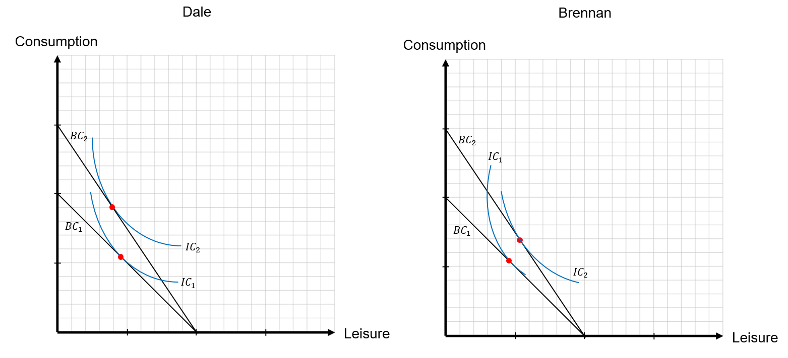

```{r setup, include=FALSE}
knitr::opts_chunk$set(
	cache = TRUE, 
	echo = FALSE, 
	warning = FALSE,
	message = FALSE,
	fig.align = 'center',
	out.width = '100%',
	dpi=300
	)
```

```{r libs, cache=FALSE, message=FALSE}
library(data.table)
library(ggplot2)
library(forcats)
library(kableExtra)
```


\fancyhf{}
\begin{center}
    \Large
    \textbf{
    \textit{SS201: Principles of Economics} \\ 
    AY 23-2 \\ 
    }
    Lesson 4: Consumer Choice Theory II
\end{center}
\fancyfoot[C]{\thepage}

# Review {#sec:review}

Indicate the answer choice that best completes the statement or answers the question.

1. Suppose that a person can either produce 800 golf clubs or 400 golf bags. Assume the PPF is graphed with golf bags on the horizontal axis and 800 golf clubs on the vertical axis. For this individual, the opportunity cost of producing each golf bag is
    a. The slope of the PPF, or $\frac{-1}{2}$ golf clubs.
    b. The reciprocal of the slope of the PPF, or $-2$ golf clubs. 
    c. The absolute value of the slope of the PPF, or $\frac{1}{2}$ golf clubs.
    d. The absolute value of the slope of the PPF, or $2$ golf clubs.

\vspace{0.5cm}

Clarke can produce either 50 toy sharks or 25 spider-man masks. Cal can produce either 40 toy sharks or 25 spider-man masks. 

2. When thinking about whether the two should trade,
    a. You would tell them not to trade. Clarke has the absolute advantage in both goods.
    b. You would tell them to trade. Clarke would make sharks, and Cal would make spider-man masks.
    c. You would tell them to trade. Clarke would make spider-man masks, and Cal would make sharks.
    d. You would tell them not to trade. Clarke has the comparative advantage in both goods.

\vspace{0.5cm}

3. Assume that Clarke and Cal decide they are going to trade. Using their production from above, what is the range of prices that a shark would trade for? 
    a. $\frac{1}{2} SM < SHARK < \frac{5}{8} SM$
    b. $\frac{3}{4} SM < SHARK < \frac{7}{8} SM$
    c. $\frac{8}{5} SM < SHARK < 2 SM$
    d. $1 SM < SHARK < \frac{8}{5} SM$

\vspace{0.5cm}

4. Which of the following is not a property of indifference curves?
    a. Higher indifference curves are preferred to lower ones.
    b. Indifference curves slope downward.
    c. Indifference curves do not cross.
    d. Indifference curves can bow outward.

\vspace{0.5cm}

5. The slope of which curve reflects the rate at which a consumer is willing to substitute one good for the other, and what is this slope called?
    a. Budget Constraint; the price ratio.
    b. Production Possibilities Frontier; opportunity cost.
    c. Indifference Curves; the marginal rate of substitution.
    d. Isoquants; the marginal rate of transformation.

\pagebreak

# Bottom Line Up Front {#sec:bluf}
Demand curves come from exogenous price changes, and consumers re-optimizing their bundle. Consumers might buy less, more, or switch to a different good. Within this re-optimization, there are two competing effects which take place: the income and substitution effects. We use these two concepts to explain how consumers react to price changes.

# Income and Substitution Effects {#sec:inc}
\begin{minipage}[t]{0.45\textwidth}
    \vspace{0pt}
    \centering
    \includegraphics[width=.45\linewidth]{img/brennan.png}
\end{minipage}
\hfill
\begin{minipage}[t]{0.45\textwidth}
\vspace{0pt}
    Meet our new friend Brennan Huff. He has been told by some that he is the ``song-bird of his generation," with his voice sounding something like a mix between Fergie and Jesus. As such, Brennan loves purchasing digital music and kites. Similar to our old pal Lawrence, Brennan does not view kites and music as perfect substitutes or complements, but values them similarly. 
\end{minipage}

Below is a graph of Brennan's indifference curves, his budget constraint, and his optimal bundle. His mom is a total enabler and gives him an allowance of \$100 a week. Let us assume that on average, each music purchase Brennan makes costs \$5 and that he only prefers dollar-store kites, so these cost \$1.

1. Write out the equation for Brennan's budget constraint.

```{r brenan_ic, out.width='70%', fig.align='left'}
knitr::include_graphics("img/brennan_ic.png")
```

2. The price of digital music has sky-rocketed, and as a result, Brennan's music purchases now cost double (\$10 per purchase). Brennan thinks that this sucks, and as a result, his house has turned into a prison! Despite the price increase, however, Brennan still loves music and refuses to completely substitute away. Write the new equation of the budget constraint and draw it on the above graph.
\vspace{3cm}

3. How does Brennan's new bundle compare to the old? How do the income and substitution effects explain this change?
\vspace{3cm}

\pagebreak

4. Now as we all know, Brennan's mom is an enabler and not an SS201 graduate. She cannot stand to see her baby not as happy as he was before. She knows you are at West Point taking economics and asks for your help. She wants to know how much she would have to increase his allowance by for him to be just as happy as he was before the price change.

    a. First, draw the point at which Brennan would be just as happy as before the price change. (Hint: Find this point after looking at the new budget constraint. The slope of this new budget constraint does not change.)
  
    b. Second, draw the "compensated" budget constraint and approximate how much more money Brennan's parents will have to give him to compensate.

```{r brenan_ic2, out.width='70%', fig.align='left'}

```

5. So what type of good is music? If the price of it increased, and Brennan purchased fewer, then it must be a...
    a. Normal Good \vspace{1cm}
    b. Inferior Good \vspace{1cm}
    c. Giffen Good \vspace{1cm}

\pagebreak

6. Now that I have two points of Brennan's preference over a good, what can I now produce? Graph that function below and write out the equation.

```{r dcurve, out.width='100%', fig.align='center'}
knitr::include_graphics("img/dcurve.png")
```

\pagebreak

# Labor Application {#sec:lab}
The model used in consumer choice theory is applied throughout economics. It is the micro-foundation which we ground many of the more complicated macro models which explain how a national economy works. For the sake of application, we will now apply this utility maximization model to the canonical example of the labor versus leisure tradeoff. The primary question here is what happens to an individual's labor supply when the wage rises? Do they work more? Do they work less? Time is a scarce resource. There are only so many hours in the week to both work and play. How does increasing one's pay affect this?

\begin{minipage}[t]{0.45\textwidth}
    \vspace{0pt}
    \centering
    \includegraphics[width=.85\linewidth]{img/db.png}
\end{minipage}
\hfill
\begin{minipage}[t]{0.45\textwidth}
\vspace{0pt}
  To look at this problem, we are going to need to bring in Dale, Brennan's step-brother. Together, they both own a karaoke business, ``Prestige Worldwide," which they provide their services to local bars, restaurants, and other commercial parties. We will now model the labor-leisure tradeoff decision that each faces given a change in the wage.
\end{minipage}

Formally, each agent is seeking to maximize $U(C, L)$ subject to the budget constraint $wh \geq C + R$ where $C$ is consumption, $L$ is hours of leisure, $w$ is the wage, $h$ the number of hours worked and $R$ as the money some one might earn outside the labor market (i.e. investments, transfer payments, etc.). To get our budget constraint in terms of leisure, we will substitute the identity $h = L_0-L$ in for $h$ and rewrite $R_0 = wL_0 + R$. In this instance, $L_0$ is the total amount of hours available for either labor or leisure.

Thus, where before consumers were maximizing $U(x_1, x_2)$  $s.t.$   $I \geq p_1 x_1 + p_2 x_2$, now we have just changed the "goods" inside our utility function and laborers are now maximizing $U(C,L)$  $s.t.$  $C + wL \leq R_0$.

Let's assume that Dale and Brennan have different utility functions, but the same budget constraint. Their business has been booming lately, and the wage that each of them receives has increased the same amount. Graphs of their indifference curves and the change in their budget constraint are depicted below. 

```{r db_labor, out.width='100%', fig.align='center'}

```
What do you notice about the amounts of leisure that each chooses after the wage increase? How do you reconcile this with the income and substitution effects?

\pagebreak

## Does this really happen?

### Fehr and Goette (2007)

```{r fehr2007, out.width='80%', fig.align='center'}

```

### Imbens et. al (2001)

```{r imbens, out.width='80%', fig.align='center'}

```
