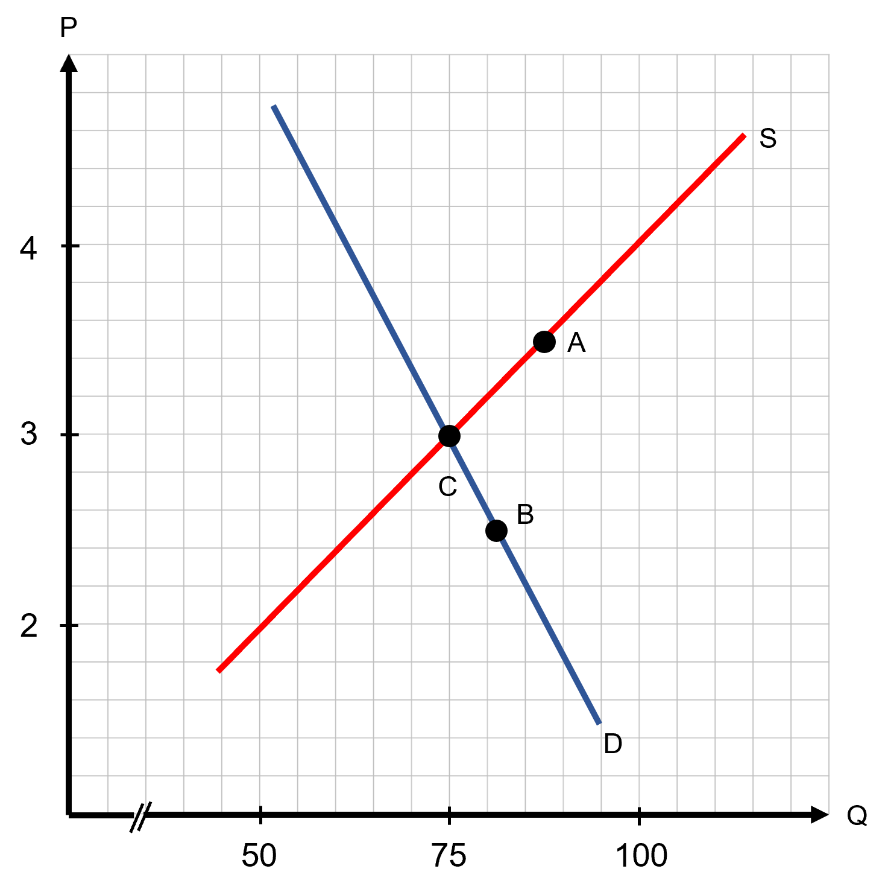
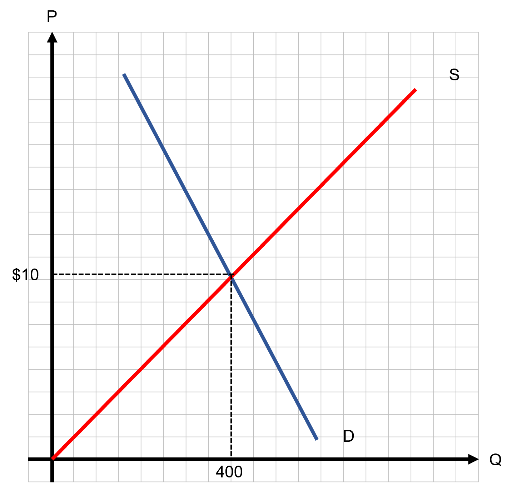
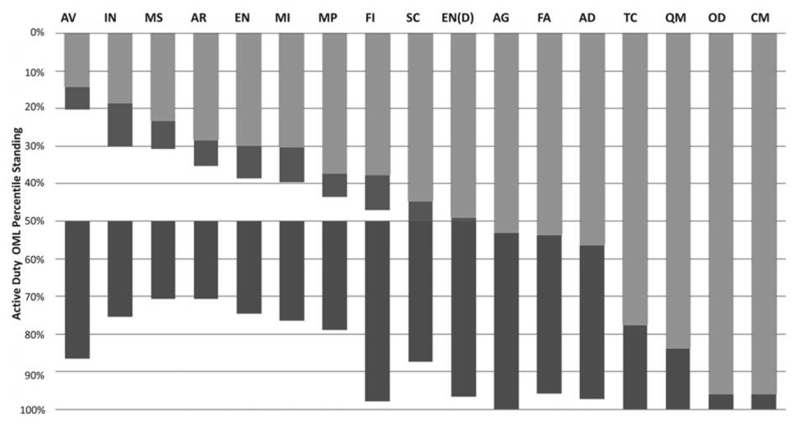

```{r setup, include=FALSE}
knitr::opts_chunk$set(
	cache = TRUE, 
	echo = FALSE, 
	warning = FALSE,
	message = FALSE,
	fig.align = 'center',
	out.width = '100%',
	dpi=300
	)
```

```{r libs, cache=FALSE, message=FALSE}
library(data.table)
library(ggplot2)
library(forcats)
library(kableExtra)
```


\fancyhf{}
\begin{center}
    \Large
    \textbf{
    \textit{SS201: Principles of Economics} \\ 
    AY 23-2 \\ 
    }
    Lesson 6: Market Equilibrium
\end{center}
\fancyfoot[C]{\thepage}

# Review {#sec:review}

Indicate the answer choice that best completes the statement or answers the question.

1. The slope of the Production Possibilities Frontier represents
    a. the price ratio a consumer faces.
    b. the opportunity cost of production. 
    c. the marginal rate of substitution.
    d. the absolute advantage a producer has.

\vspace{0.5cm}

2. Consumers are happiest when
    a. they consume any bundle along their budget constraint.
    b. the slope of their budget constraint is less than their indifference curve.
    c. the slope of their budget constraint is greater than their indifference curve.
    d. the slope of their budget constraint is equal to the slope of their indifference curve.

\vspace{0.5cm}

3. Which of the below is true? 
    a. The substitution effect explains movements to different indifference curves.
    b. The income effect always dominates the substitution effect.
    c. The substitution effect explains movements along an indifference curve.
    d. The income effect explains why a consumer's ratio of consumption may change after a relative price change.

\vspace{0.5cm}

\pagebreak

# Bottom Line Up Front {#sec:bluf}
Markets are everywhere and use prices to as a mechanism to allocate scarce resources. We leverage their power to maximize efficiency, yet sometimes they do not result in the most equitable outcomes. Branching is now a market. Your future assignments within the Army (after your first post) will be decided through a market. Understanding how these work (or at least are supposed to) and being able to communicate your preferences through them can help you in the future.

# Equilibrium Price and Quantity {#sec:equil}

The graph below depicts the demand and supply for helicopter rides across the Grand Canyon. Price on the vertical axis is given in $100 intervals.

```{r brenan_ic, out.width='80%', fig.align='center'}

```

1. Suppose the price starts out at $400. What is the quantity of helicopter rides sold? What is the quantity of rides available for sale?
\vspace{3cm}

\pagebreak

\hspace{0.5cm}  \begin{minipage}[t]{0.55\textwidth}
    \vspace{0pt}
2. Suppose the market price is \$400. Jake Preston, a former Apache helicopter pilot, currently charges \$350 per ride and is represented by point A on the graph. Is he willing to sell a ride at the market price? Is able to sell a ride at the market price? What might he do as a seller facing this market? What will happen to the market price?
    
\end{minipage}
\hfill
\begin{minipage}[t]{0.35\textwidth}
    \vspace{0pt}
    \centering
    \includegraphics[width=\linewidth]{img/preston.png}
\end{minipage}

\vspace{3cm}

3. Suppose the price is instead $200. What is the quantity of rides sold now? \vspace{3cm}

\begin{minipage}[t]{0.35\textwidth}
    \vspace{0pt}
    \centering
    \includegraphics[width=\linewidth]{img/young.png}
\end{minipage}
\hfill
\begin{minipage}[t]{0.55\textwidth}
    \vspace{0pt}
4. Suppose the market price is \$200. Sean Young, a former OH-60 Kiowa pilot, says she will pay \$250 for a ride just to feel the thrill again and is represented by point B on the graph. Is she willing to buy a ride at the market price? Is she able to buy a ride at the market price? What might she do as a buyer facing this market? What will happen to the market price?
\end{minipage}

\pagebreak

5. Suppose the price is instead $300. What is the quantity of rides sold? Are any willing sellers unable to sell? Are any willing buyers unwilling to buy?
\vspace{3cm}


6. How is the price of $300 different from all other prices? What do we call this price?
\vspace{3cm}

\pagebreak

# Changes to Market Equilibrium {#sec:changes}

## Cost of Inputs {#sec:costs}

The figure below depicts the market for sunglasses in Ft. Hood, Texas. Suppose that the cost of plastic for the glasses drops dramatically.

```{r sg1, out.width='80%', fig.align='center'}

```

1. Describe the market shock. \vspace{3cm}

2. Was the shock a determinant of supply or demand? \vspace{3cm}
 
3. Draw the shock on the graph above. Did supply or demand shift? Which direction? \vspace{3cm}

4. Describe what happens now at the initial equilibrium price. Is it an excess, surplus, shortage, etc.? \vspace{3cm}

5. Explain the price adjustment / price pressure. \vspace{3cm}

6. Compare the new equilibrium price and quantity to the original. \vspace{3cm}

7. Label the initial equilibrium Quantity $Q_1$ and Price $P_1$. Label the final equilibrium Quantity $Q_2$ and Price $P_2$. \vspace{3cm}

\pagebreak

## Cost of Substitutes {#sec:comps}

Same market as previous for sunglasses in Ft. Hood. Plastic has returned to its normal price, but now the price of hats has dramatically increased. Assume that hats and sunglasses are substitute goods.

```{r sg2, out.width='80%', fig.align='center'}

```

1. Describe the market shock. \vspace{3cm}

2. Was the shock a determinant of supply or demand? \vspace{3cm}
 
3. Draw the shock on the graph above. Did supply or demand shift? Which direction? \vspace{3cm}

4. Describe what happens now at the initial equilibrium price. Is it an excess, surplus, shortage, etc.? \vspace{3cm}

5. Explain the price adjustment / price pressure. \vspace{3cm}

6. Compare the new equilibrium price and quantity to the original. \vspace{3cm}

7. Label the initial equilibrium Quantity $Q_1$ and Price $P_1$. Label the final equilibrium Quantity $Q_2$ and Price $P_2$. \vspace{3cm}

\pagebreak

## Multiple Shifts {#sec:coke}

After a hot day of flying and riding around in a helicopter, there’s nothing that beats the cool, refreshing taste of a nice, fizzy, soda. Suppose the demand for Coke is $Q_D=510-20P$  and the supply is $Q_s=5P-40$.

1. Draw supply and demand and label the intercepts, equilibrium price, and equilibrium quantity.

```{r g1, out.width='70%', fig.align='left'}
knitr::include_graphics("img/grid.png")
```

2. Solve for the equilibrium price and quantity algebraically, showing all steps.  \vspace{3cm}
 
3. Suppose that Coke is an inferior good and the consumers’ incomes increase, while at the same time, the price of aluminum (what coke cans are made of) increases due to tariffs. Compare the new equilibrium price and quantity to the original equilibrium price and quantity. Is the new price higher, lower, or ambiguous relative to the original market clearing price. What about quantity? \vspace{3cm}

\pagebreak

# A Market for Branching {#sec:branch}

We can show how markets are efficient, and how buyers with differing levels of willingness to pay and suppliers with different costs can make trades. Eventually the market settles on an equilibrium price which maximizes preferences, payoffs, and “happiness” for all. If these markets work so well within the “private sector,” how can we employ these forces within branching? What’s the best way to assign cadets to branches? What are the considerations from both the demand and the supply side for this market? 

\begin{multicols}{2}
\begin{center}
    \textbf{Supply Side (The Army)}
\end{center}
\columnbreak
\begin{center}
    \textbf{Demand Side (Cadets)}
\end{center}
\end{multicols}

\pagebreak

## The Good Ol' Days? {#sec:oml}
In 2011, cadets branched via Order of Merit List (OML). For USMA cadets, 75% of slots went via OML and 25% of slots went via ADSO through a reshuffled OML of those who bid the extra three years for the branch.

For ROTC, branching was different. 50% of their branch slots went via OML and 50% went via ADSO; however, for the ADSO, only 15% of the ADSO slots were available for those cadets within the top 50% of the original OML. This slating created the “dead zones” within branches where ROTC cadets who were in the middle percentiles of the OML had a lower probability of getting the branch than those who were in the bottom half of the OML. ROTC leaders made this decision because they did not want concentrate all the “highly skilled” among the more desirable branches.

Below is a depiction of these “dead zones” from ROTC branching in 2011. This is Figure 1 from Sönmez (2011).

```{r sonmez, out.width='90%', fig.align='center'}

```

So how do they propose to fix this? Sönmez (2011) recommends to allot a fraction to OML and allow the remaining fraction of cadets to bid years of service for their branch. This system would allow more “motivated” cadets to get the branch they want without the punishing them for being in the “dead zones”. Essentially, a hybrid between meritocracy and allowing cadets to bid their “willingness to pay” for those scarce resources.

