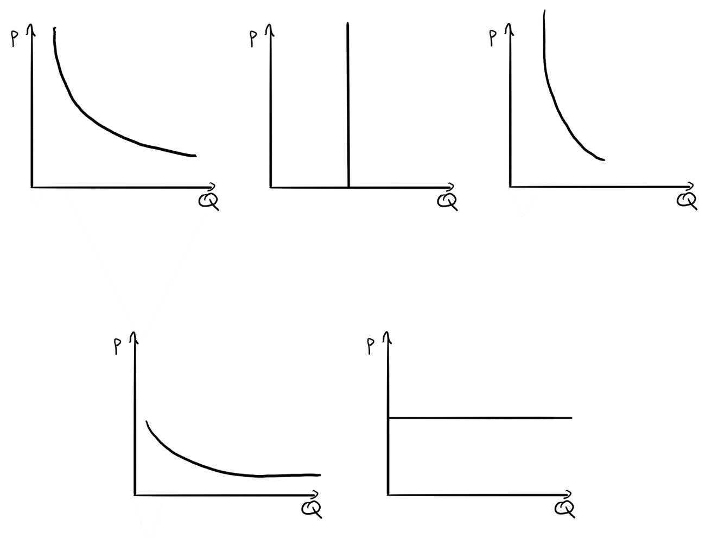
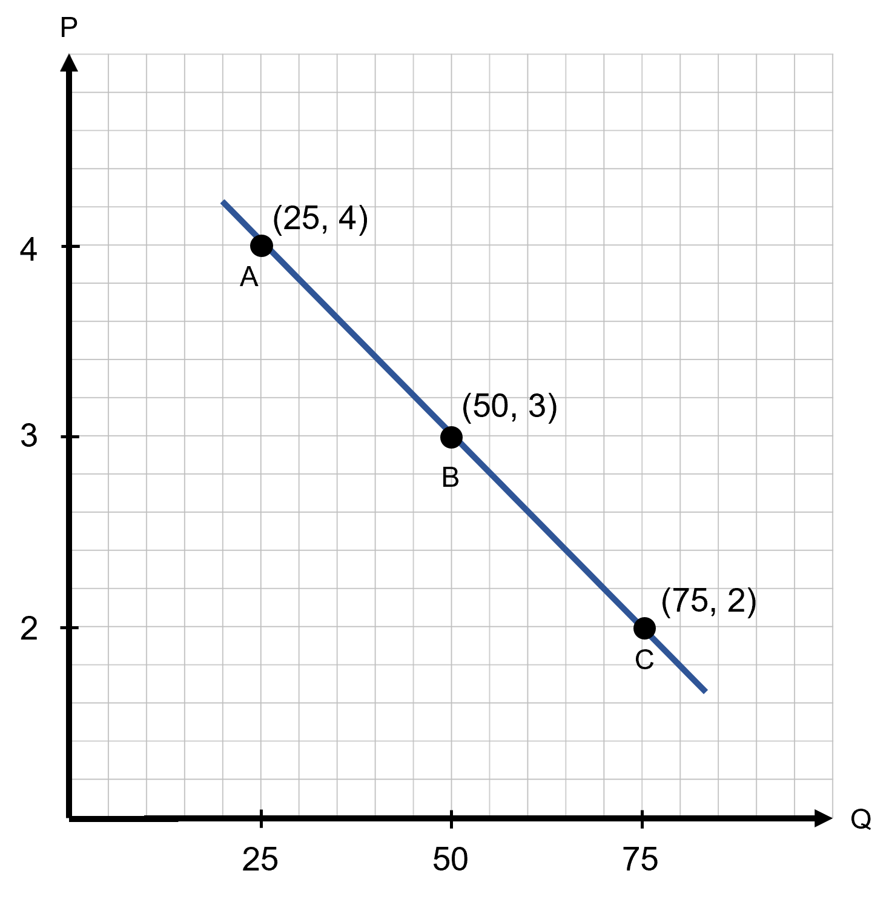

```{r setup, include=FALSE}
knitr::opts_chunk$set(
	cache = TRUE, 
	echo = FALSE, 
	warning = FALSE,
	message = FALSE,
	fig.align = 'center',
	out.width = '100%',
	dpi=300
	)
```

```{r libs, cache=FALSE, message=FALSE}
library(data.table)
library(ggplot2)
library(forcats)
library(kableExtra)
```


\fancyhf{}
\begin{center}
    \Large
    \textbf{
    \textit{SS201: Principles of Economics} \\ 
    AY 23-2 \\ 
    }
    Lesson 7: Elasticity
\end{center}
\fancyfoot[C]{\thepage}

# Review {#sec:review}

For each question below, select either True, False, or Uncertain. Then in the space provided, briefly justify your answer (one or two sentences maximum).


\begin{center}
True \hspace{3cm} False \hspace{3cm} Uncertain
\end{center}

1. The price of apples just skyrocketed, and they are close substitutes for bananas. Scientists just discovered a new fertilizer that improves the production of bananas. In the market for bananas, both the new equilibrium price and quantity are higher than before.

  \vspace{3cm}

\begin{center}
True \hspace{3cm} False \hspace{3cm} Uncertain
\end{center}

2. West Point tours just discounted tickets an exorbitant amount for tours around the academy, and has sold out all of their tours for the next four months. Part of their tour is a stop for lunch at Chipotle. This increase in tourism will prompt a movement along the supply curve in the market for Chipotle burritos. 

  \vspace{3cm}

\begin{center}
True \hspace{3cm} False \hspace{3cm} Uncertain
\end{center}

3. The government just increased the minimum wage by 20\% nationwide. Similarly, the demand for fast food has increased dramatically. These changes will result in a new fast food market equilibrium with a higher price and lower quantity.   

  \vspace{3cm}

\pagebreak

# Bottom Line Up Front {#sec:bluf}
We have supply, demand, and equilibrium, but how do we measure the intensity in changes in these? Elasticities help us understand exactly how responsive demand and supply are to price changes.

# Elasticity {#sec:elast}

1. The mathematical definition of an elasticity is $\epsilon = \frac{\%\Delta Y}{\%\Delta X}$. What does this mean in English?
\vspace{3cm}

2. What are three formulas that calculate elasticities? Which is most accurate?
\vspace{5cm}

# Demand Elasticity {#sec:demand}

1. Write down the equation for the price elasticity of demand. What sign does the elasticity of demand have?
\vspace{3cm}

\hspace{0.5cm}  \begin{minipage}[t]{0.55\textwidth}
    \vspace{0pt}
2. Squints Palladorous needs some help with his economics homework. His teacher gave him the graphs of 5 different demand curves for 5 different goods below with the following instructions:
    
    \hspace{0.75cm} a. Below each graph, label the graph with a description of the type of elasticity demand shown: perfectly elastic, elastic, unit elastic, inelastic, perfectly inelastic (there is exactly one graph of each type).

    \hspace{0.75cm} b. Below each graph, write down the value or range of values for elasticity that correspond to this type of demand elasticity.

    \hspace{0.75cm} c. Each graph pertains to one of the following goods: Babe Ruth Baseball Cards, home appliances, insulin, eggs, and beef. Match each graph to a good that fits the picture best, assuming that each good matches one picture.

\end{minipage}
\hfill
\begin{minipage}[t]{0.35\textwidth}
    \vspace{0pt}
    \centering
    \includegraphics[width=\linewidth]{img/squints.jpg}
\end{minipage}

\vspace{1cm}

```{r elast, out.width='100%', fig.align='center'}

```

\pagebreak

3. Squints is now confused. His teacher told him that an elasticity was not a slope, but each answer he gave in the previous problem seemed to depend on the slope of the demand curve. You being well versed in elasticities tell him to calculate the following elasticities using the graph below.

```{r elast_slope, out.width='70%', fig.align='center'}

```

\hspace{2cm} a. Calculate the elasticities from points A to B and from points B to C using the Midpoint Method. \vspace{3cm}
    
\hspace{2cm} b. Calculate the elasticities at points A, B, and C using the Point Method. \vspace{3cm}

\pagebreak

\hspace{0.5cm}  \begin{minipage}[t]{0.55\textwidth}
    \vspace{0pt}
The head lifeguard of a swimming pool decides to try to increase revenue by increasing the price of a ticket from \$7.50 to \$10.00. At a price of \$7.50, she sold 1500 tickets.

\end{minipage}
\hfill
\begin{minipage}[t]{0.35\textwidth}
    \vspace{0pt}
    \centering
    \includegraphics[width=\linewidth]{img/wendy.jpg}
\end{minipage}

\vspace{1cm}

4. If the price elasticity of demand for tickets is 0.24 over this price range, how many tickets will the lifeguard sell at a price of $10.00? Use the midpoint method. \vspace{3cm}

5. What was the lifeguard’s revenue at the old price? At the new price? Does the higher or lower price earn the lifeguard more revenue. \vspace{3cm}

6. The maximum capacity of the pool is 1,800 people. The lifeguard derives the following for demand based on her experiment: $Q_d =1800 - 40P$. Calculate the point elasticity at a price of \$10. \vspace{3cm}

7. Using your answer from question 6, what would you advise the lifeguard to do if she wants to raise more money? \vspace{3cm}


\pagebreak
# Other Elasticities {#sec:other}

1. What is the price elasticity of supply? What is its sign? \vspace{3cm}

2. Suppose $Q_s = -5 + 2P$. What is the price elasticity of supply at $Q_s=1$? \vspace{3cm}

3. What is income elasticity? \vspace{3cm}

    a. Suppose that, with an average state income of 75,000/year, consumers in the US buy 12 million baseballs. Now, suppose the average income in US jumps to 85,000/year and consumers buy 14 million baseballs. What is the income elasticity of demand for baseballs? Use the midpoint method. 
    \vspace{3cm}
    b. What does the sign of the income elasticity for baseballs tell us about them? Could some goods have the opposite sign of elasticity?
    \vspace{3cm}
4. What is Cross-Price Elasticity? What is its sign?


