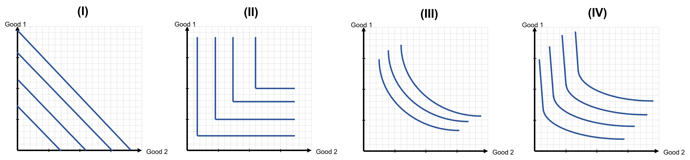
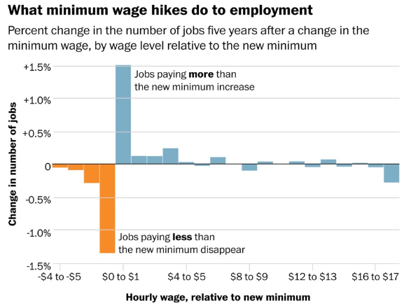
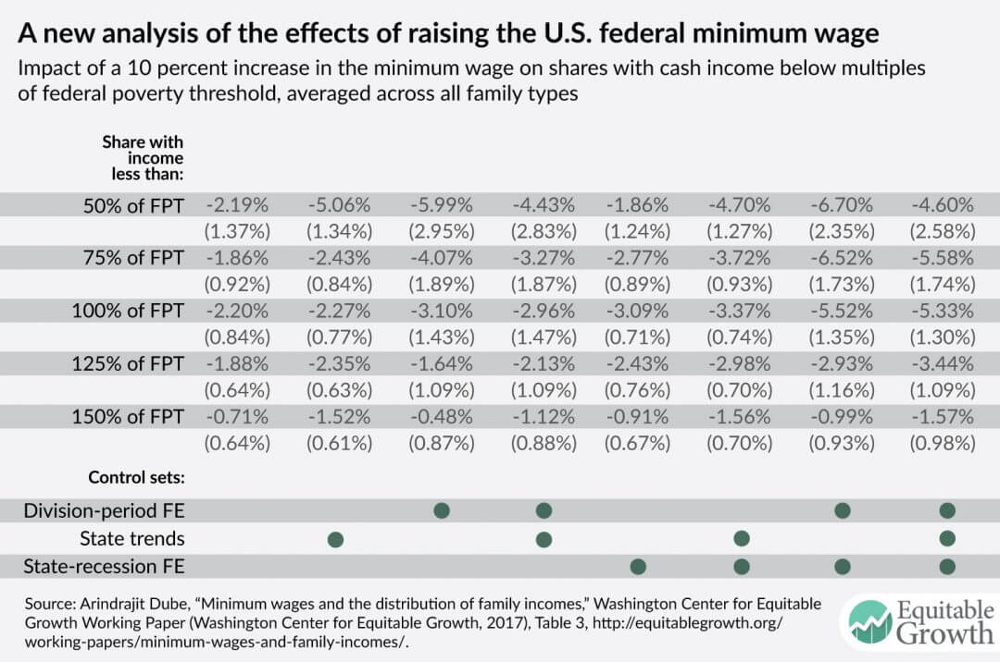

```{r setup, include=FALSE}
knitr::opts_chunk$set(
	cache = TRUE, 
	echo = FALSE, 
	warning = FALSE,
	message = FALSE,
	fig.align = 'center',
	out.width = '100%',
	dpi=300
	)
```

```{r libs, cache=FALSE, message=FALSE}
library(data.table)
library(ggplot2)
library(forcats)
library(kableExtra)
```


\fancyhf{}
\begin{center}
    \Large
    \textbf{
    \textit{SS201: Principles of Economics} \\ 
    AY 23-2 \\ 
    }
    Lesson 8: Economic Welfare and Government Intervention
\end{center}
\fancyfoot[C]{\thepage}

# Review {#sec:review}

Indicate the answer choice that best completes the statement or answers the question.

```{r util, out.width='100%', fig.align='center'}

```

1. Which set of indifference curves above reflect two goods that are perfect substitutes?
    a. I
    b. II
    c. III
    d. IV

\vspace{0.5cm}

2. Using the same figure as in question 1, what set of indifference curves reflect goods that are perfect complements?
    a. IV
    b. II
    c. III
    d. I

\vspace{0.5cm}

3. Goods that are inelastic have elasticities that range between: 
    a. 1 < $\epsilon$ < $\infty$
    b. $- \infty$ < $\epsilon$ < 0
    c. 0 < $\epsilon$ < 1
    d. 1 < $\epsilon$ < 2

\vspace{0.5cm}

4. The sign of a cross-price elasticity for goods that are substitutes will be: 
    a. Positive
    b. Negative
    c. Ambiguous. Depends on the two goods.
    d. Does not exist. We cannot determine elasticities between two goods. 

\vspace{0.5cm}

\pagebreak

\pagebreak

# Bottom Line Up Front {#sec:bluf}
Consumer and producer surplus are terms that help us understand market efficiency and a group’s overall economic well-being. Price floors and ceilings are policy initiatives that, when binding, make free markets less efficient and reduce economic well-being. Depending on who or what group the government is trying to help, policy initiatives such as the minimum wage or rent controls may hurt overall economic well-being for the benefit of select individuals.

# Welfare Economics {#sec:welfare}

\hspace{0.5cm}  \begin{minipage}[t]{0.55\textwidth}
    \vspace{0pt}
Andy Dufresne really likes listening to opera music. Suppose that the market for opera music records is modeled by the equations below:
    
$$Q_D = 100-5P$$
$$Q_S = -10+P$$
\end{minipage}
\hfill
\begin{minipage}[t]{0.35\textwidth}
    \vspace{0pt}
    \centering
    \includegraphics[width=\linewidth]{img/andy.jpg}
\end{minipage}

\vspace{1cm}

1. Graph the market below, solve for equilibrium price, and quantity and shade in producer and consumer surplus.

```{r g1, out.width='50%', fig.align='left'}
knitr::include_graphics("img/grid.png")
```

2. Which group, consumers or producers, fairs better within this market? \vspace{3cm}

\pagebreak

# Rent Controls {#sec:pc}

\hspace{0.5cm}  \begin{minipage}[t]{0.55\textwidth}
    \vspace{0pt}
Brooks Hatlen just got released from prision. To help transitioning prisoners, the state introduced a rent control policy which states that landlords can't charge over \$600 per month for apartments. Suppose the market supply and demand are modeled by the equations below:

$$Q_D = 1300-P$$

$$Q_S = -300+P$$
\end{minipage}
\hfill
\begin{minipage}[t]{0.35\textwidth}
    \vspace{0pt}
    \centering
    \includegraphics[width=\linewidth]{img/brooks.jpg}
\end{minipage}

\vspace{1cm}

1. Graph the market below, solve for equilibrium price, quantity, and shade in producer and consumer surplus.

```{r g2, out.width='50%', fig.align='left'}
knitr::include_graphics("img/grid.png")
```

2. Now draw in the rent control. Is it binding? Does it create a shortage or surplus? Solve for the equilibrium price and quantity of aparments that will be provided at this price. Is this a price floor or ceiling?  \vspace{3cm}

\pagebreak

# Minimum Wage {#sec:pf}

\hspace{0.5cm}  \begin{minipage}[t]{0.55\textwidth}
    \vspace{0pt}
Tommy Williams just got out of jail and recently received his GED. He takes up a job at a local paper mill where the market equilibrium wage is given below:
    
$$Q_{LD}= \frac{-400}{3}W+2600$$
$$Q_{LS} = \frac{400}{3}W-600$$
\end{minipage}
\hfill
\begin{minipage}[t]{0.35\textwidth}
    \vspace{0pt}
    \centering
    \includegraphics[width=\linewidth]{img/tommy.jpg}
\end{minipage}

\vspace{1cm}

1. Graph the market below, solve for equilibrium price, quantity, and shade in producer and consumer surplus.

```{r g3, out.width='50%', fig.align='left'}
knitr::include_graphics("img/grid.png")
```

2. b.	Maine (the state our movie takes place in), just implemented a minimum wage of $15. Is it binding? Does it create a labor shortage or surplus? Solve for the actual employment (labor supply) at this price. Is this a price floor or ceiling?  \vspace{3cm}

\pagebreak

# Does the model hold? {#sec:mw}

## Jobs
```{r mw_pov, out.width='80%', fig.align='center'}

```


## Worker Welfare
```{r mw_j, out.width='80%', fig.align='center'}

```


